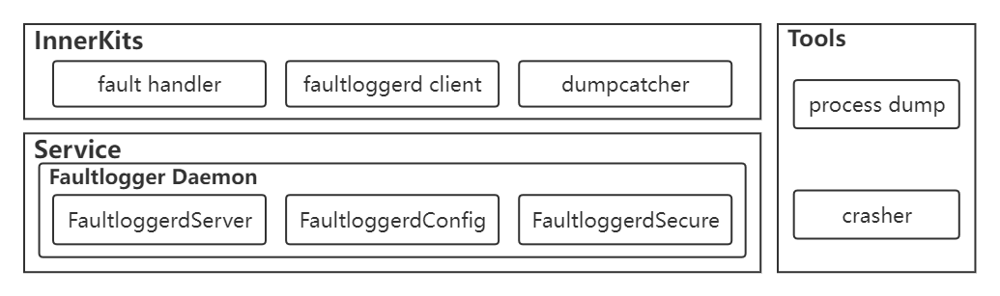
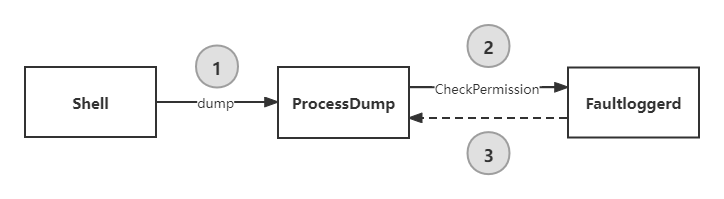

# FaultLoggerd组件

-   简介
-   架构
-   目录
-   使用说明
    -   DumpCatcher
    -   ProcessDump
-   处理流程
    -   DumpCatcher SDK接口处理流程
    -   ProcessDump命令行处理流程
    -   进程崩溃处理流程
-   相关仓

## 简介

Faultloggerd部件是OpenHarmony中C/C++运行时崩溃临时日志的生成及管理模块。系统开发者可以在预设的路径下找到崩溃日志，定位相关问题。

## 架构



* FaultHandler（SignalHandler）：信号处理器，接收系统异常信号，触发抓取进程异常时的现场信息。

> 目前主要支持对以下异常信号的处理：

| 信号值 | 信号      | 解释            | 触发原因                                                     |
| ------ | --------- | --------------- | ------------------------------------------------------------ |
| 4      | SIGILL    | 非法指令        | 执行了非法指令，通常是因为可执行文件本身出现错误，或者试图执行数据段，堆栈溢出时也有可能产生这个信号。 |
| 5      | SIGTRAP   | 断点或陷阱异常  | 由断点指令或其它trap指令产生。                               |
| 6      | SIGABRT   | abort发出的信号 | 调用abort函数生成的信号。                                    |
| 7      | SIGBUS    | 非法内存访问    | 非法地址，包括内存地址对齐（alignment）出错。比如访问一个四个字长的整数，但其地址不是4的倍数。它与SIGSEGV的区别在于后者是由于对合法存储地址的非法访问触发的（如访问不属于自己存储空间或只读存储空间）。 |
| 8      | SIGFPE    | 浮点异常        | 在发生致命的算术运算错误时发出，不仅包括浮点运算错误，还包括溢出及除数为0等其它所有的算术的错误。 |
| 11     | SIGSEGV   | 无效内存访问    | 试图访问未分配给自己的内存，或试图往没有写权限的内存地址写数据。 |
| 16     | SIGSTKFLT | 栈溢出          | 堆栈溢出。                                                   |
| 31     | SIGSYS    | 系统调用异常    | 非法的系统调用。                                             |

* DumpCatcher：堆栈信息抓取工具库，提供了抓取指定进程和线程的堆栈栈信息的能力。
* FaultloggerdClient：崩溃临时日志管理客户端，接收申请文件描述符、堆栈导出等请求。
* ProcessDump：进程信息抓取二进制工具，通过命令行方式提供抓取指定进程、线程堆栈信息的能力。
* crasher：崩溃构造器，提供了崩溃构造和模拟能力。
* FaultloggerdServer：核心服务处理模块，接收并处理客户端的请求。
* FaultloggerdSecure：权限校验模块，对运行时崩溃日志生成和抓取提供权限管理和校验能力。
* FaultloggerdConfig：崩溃临时日志管理模块。

## 目录

```txt
faultloggerd/
├── OAT.xml
├── common                                 # 公共定义
├── faultloggerd.gni
├── interfaces                             # 接口存放目录
│   └── innerkits
│       ├── dump_catcher                   # 抓取调用栈基础库
│       ├── faultloggerd_client            # 崩溃临时日志管理服务客户端接口
│       └── signal_handler                 # 异常信号处理器
├── ohos.build
├── services                               # 崩溃临时日志管理服务
│   ├── BUILD.gn
│   ├── config                             # 启动配置
│   ├── fault_logger_config.cpp            # 日志文件管理
│   ├── fault_logger_config.h              # 日志文件管理
│   ├── fault_logger_daemon.cpp            # Faultloggerd 服务提供
│   ├── fault_logger_daemon.h              # Faultloggerd 服务提供
│   ├── fault_logger_secure.cpp            # 权限管理与校验
│   ├── fault_logger_secure.h              # 权限管理与校验
│   ├── main.cpp
│   └── test
├── test                                   # 测试目录
│   ├── BUILD.gn
│   ├── fuzztest                           # 模糊测试
│   ├── performancetest                    # 性能测试
│   └── systemtest                         # 系统功能测试
└── tools                                  # 工具
    ├── crasher_c                          # 崩溃构造工具（C） 
    ├── crasher_cpp                        # 崩溃构造工具（C++）
    └── process_dump                       # 进程信息抓取工具
```

## 使用说明

### DumpCatcher

DumpCatcher是指提供给第三方应用使用的抓取调用栈基础库，其中包含了打印指定进程（或线程）的栈信息的接口函数。

接口类名：`DfxDumpCatcher`

接口方法名：`bool DumpCatch(const int pid, const int tid, std::string& msg);`

接口参数说明：

* 接口返回值：
  * `true`：回栈成功，回栈信息存储在`msg`字符串对象中；
  * `false`：回栈失败。
* 输入参数：
  * `pid`：希望回栈的进程号，如果需要回栈进程中的所有线程，则`tid`设定为`0`；
  * `tid`：希望回栈的线程号；
* 输出参数：
  * `msg`：如果回栈成功，则通过`msg`输出回栈后的信息。

> 注意：此接口需要调用者是管理员（system，root）用户，或者只抓取自己用户拥有的进程信息。抓取非本用户组进程调用栈时还需具备读取对方`/proc/pid/maps`及ptrace到对方进程的权限。

样例代码：

* dump_catcher_demo.h

```c++
#ifndef DUMP_CATCHER_DEMO_H
#define DUMP_CATCHER_DEMO_H

#include <inttypes.h>

#define NOINLINE __attribute__((noinline))

#define GEN_TEST_FUNCTION(FuncNumA, FuncNumB)          \
    __attribute__((noinline)) int TestFunc##FuncNumA() \
    {                                                  \
        return TestFunc##FuncNumB();                   \
    }

// test functions for callstack depth test
int TestFunc0(void);
int TestFunc1(void);
int TestFunc2(void);
int TestFunc3(void);
int TestFunc4(void);
int TestFunc5(void);
int TestFunc6(void);
int TestFunc7(void);
int TestFunc8(void);
int TestFunc9(void);
int TestFunc10(void);

#endif // DUMP_CATCHER_DEMO_H
```

  * dump_catcher_demo.cpp

```c++
#include "dump_catcher_dump.h"

#include <iostream>
#include <string>
#include <unistd.h>
#include "dfx_dump_catcher.h"
using namespace std;

NOINLINE int TestFunc10(void)
{
    OHOS::HiviewDFX::DfxDumpCatcher dumplog;
    string msg = "";
    bool ret = dumplog.DumpCatch(getpid(), gettid(), msg);
    if (ret) {
        cout << msg << endl;
    }
    return 0;
}

// auto gen function
GEN_TEST_FUNCTION(0, 1)
GEN_TEST_FUNCTION(1, 2)
GEN_TEST_FUNCTION(2, 3)
GEN_TEST_FUNCTION(3, 4)
GEN_TEST_FUNCTION(4, 5)
GEN_TEST_FUNCTION(5, 6)
GEN_TEST_FUNCTION(6, 7)
GEN_TEST_FUNCTION(7, 8)
GEN_TEST_FUNCTION(8, 9)
GEN_TEST_FUNCTION(9, 10)

int main(int argc, char *argv[])
{
    TestFunc0();
    return 0;
}
```

* BUILD.gn：

```gn
import("//base/hiviewdfx/faultloggerd/faultloggerd.gni")
import("//build/ohos.gni")

config("dumpcatcherdemo_config") {
  visibility = [ ":*" ]

  include_dirs = [
    ".",
    "//utils/native/base/include",
    "//base/hiviewdfx/faultloggerd/interfaces/innerkits/dump_catcher/include/",
  ]
}

ohos_executable("dumpcatcherdemo") {
  sources = [ "dump_catcher_demo.cpp" ]

  configs = [ ":dumpcatcherdemo_config" ]

  deps = [ 
    "//base/hiviewdfx/faultloggerd/interfaces/innerkits/dump_catcher:lib_dfx_dump_catcher",
    "//utils/native/base:utils",
  ]

  external_deps = [ "hilog_native:libhilog" ]

  install_enable = true
  part_name = "faultloggerd"
  subsystem_name = "hiviewdfx"
}
```

* 执行结果：

```txt
# ./dumpcatcherdemo
#00 pc 0000000000000981(00000000004a8981) /data/test/dumpcatcherdemo
#01 pc 0000000000000a6d(00000000004a8a6d) /data/test/dumpcatcherdemo
#02 pc 0000000000000a63(00000000004a8a63) /data/test/dumpcatcherdemo
#03 pc 0000000000000a59(00000000004a8a59) /data/test/dumpcatcherdemo
#04 pc 0000000000000a4f(00000000004a8a4f) /data/test/dumpcatcherdemo
#05 pc 0000000000000a45(00000000004a8a45) /data/test/dumpcatcherdemo
#06 pc 0000000000000a3b(00000000004a8a3b) /data/test/dumpcatcherdemo
#07 pc 0000000000000a31(00000000004a8a31) /data/test/dumpcatcherdemo
#08 pc 0000000000000a27(00000000004a8a27) /data/test/dumpcatcherdemo
#09 pc 0000000000000a1d(00000000004a8a1d) /data/test/dumpcatcherdemo
#10 pc 0000000000000a13(00000000004a8a13) /data/test/dumpcatcherdemo
#11 pc 0000000000000a77(00000000004a8a77) /data/test/dumpcatcherdemo
#12 pc 00000000000c2b08(00000000b6fafb08) /system/lib/ld-musl-arm.so.1(__libc_start_main+116)
#13 pc 0000000000000938(00000000004a8938) /data/test/dumpcatcherdemo
#14 pc 00000000000008c4(00000000004a88c4) /data/test/dumpcatcherdemo
```

### ProcessDump

ProcessDump是指提供给用户的一个抓取调用栈命令行工具，该工具通过`-p`、`-t`参数指定进程和线程，命令执行后在命令行窗口打印指定的进程的线程栈信息。

工具名称：`processdump`

位置：`/system/bin`

参数说明：

* `-p [pid]`：打印指定进程下面的所有线程栈信息；
* `-p [pid] -t [tid]`：打印指定进程下面的指定线程信息。

返回打印说明：如果栈信息解析成功，则将信息显示到标准输出。

> 注意：使用此接口需要调用者是管理员（system，root）用户。

范例：查询hiview主线程当前调用栈

```txt
# ps -A | grep hiview
  114 ?        00:00:00 hiview
# processdump -p 114 -t 114
Tid:114, Name:hiview
#00 pc 0000000000089824(00000000b6f44824) /system/lib/ld-musl-arm.so.1(ioctl+68)
#01 pc 000000000002a709(00000000b6c56709) /system/lib/libipc_core.z.so(_ZN4OHOS15BinderConnector11WriteBinderEmPv+16)
#02 pc 000000000002ba75(00000000b6c57a75) /system/lib/libipc_core.z.so(_ZN4OHOS13BinderInvoker18TransactWithDriverEb+224)
#03 pc 000000000002bb37(00000000b6c57b37) /system/lib/libipc_core.z.so(_ZN4OHOS13BinderInvoker13StartWorkLoopEv+22)
#04 pc 000000000002c211(00000000b6c58211) /system/lib/libipc_core.z.so(_ZN4OHOS13BinderInvoker10JoinThreadEb+36)
#05 pc 0000000000038d07(00000000004bcd07) /system/bin/hiview(_ZNSt3__h6vectorINS_9sub_matchINS_11__wrap_iterIPKcEEEENS_9allocatorIS6_EEE8__appendEj+596)
#06 pc 0000000000028655(00000000004ac655) /system/bin/hiview
#07 pc 00000000000c2b08(00000000b6f7db08) /system/lib/ld-musl-arm.so.1(__libc_start_main+116)
#08 pc 00000000000285f4(00000000004ac5f4) /system/bin/hiview
#09 pc 0000000000028580(00000000004ac580) /system/bin/hiview
```

## 处理流程

### DumpCatcher SDK接口处理流程


1. 进程A调用`DumpCatcher`库提供的`DumpCatch()`接口，申请dump指定进程和线程的堆栈信息；
2. `DumpCatcher`接收到进程A的dump请求后，运行`ProcessDump`程序开始准备dump堆栈信息；
3. 在dump堆栈信息之前先通过`Faultloggerd`校验用户权限；
4. 返回权限校验结果，满足权限则返回文件描述符，将回栈结果返回给`DumpCatcher`。

### ProcessDump命令行处理流程



1. Shell通过命令行指令`processdump -p [pid] -t [tid]`申请dump指定进程和线程的堆栈信息；
2. 在dump堆栈信息之前先通过`Faultloggerd`校验用户权限；
3. 返回权限校验结果，满足权限则返回文件描述符，将回栈结果写入标准输出。

### 进程崩溃处理流程


1. 进程B通过安装信号处理器，通过`DFX_SignalHandler`函数检测进程崩溃异常信号；
2. `SignalHandler`检测到异常信号后Fork出子进程，并运行`ProcessDump`程序开始dump崩溃进程和线程的堆栈信息；
3. `ProcessDump`程序在读取异常堆栈信息后将日志写入到`Faultloggerd`中的临时存储目录；
4. `Faultloggerd`根据需要将故障通过`hiview`提供的`AddFaultLog()`接口上报给`hiview`进行后续处理。


## 相关仓

[DFX子系统](https://gitee.com/openharmony/docs/blob/master/zh-cn/readme/DFX%E5%AD%90%E7%B3%BB%E7%BB%9F.md)

[hiviewdfx\_hiview](https://gitee.com/openharmony/hiviewdfx_hiview/blob/master/README_zh.md)

[hiviewdfx\_hilog](https://gitee.com/openharmony/hiviewdfx_hilog/blob/master/README_zh.md)

[hiviewdfx\_hiappevent](https://gitee.com/openharmony/hiviewdfx_hiappevent/blob/master/README_zh.md)

[hiviewdfx\_hisysevent](https://gitee.com/openharmony/hiviewdfx_hisysevent/blob/master/README_zh.md)

**hiviewdfx\_faultloggerd**

[hiviewdfx\_hilog\_lite](https://gitee.com/openharmony/hiviewdfx_hilog_lite/blob/master/README_zh.md)

[hiviewdfx\_hievent\_lite](https://gitee.com/openharmony/hiviewdfx_hievent_lite/blob/master/README_zh.md)

[hiviewdfx\_hiview\_lite](https://gitee.com/openharmony/hiviewdfx_hiview_lite/blob/master/README_zh.md)

