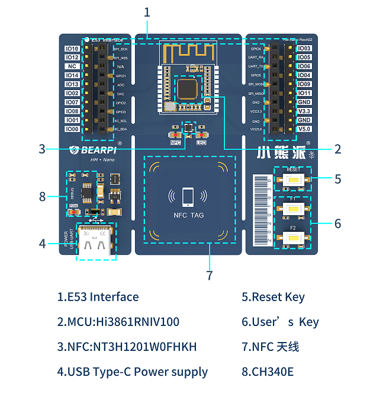

## 一、BearPi-HM Nano 开发板介绍

小熊派·季[（BearPi-HM Nano）](https://item.taobao.com/item.htm?id=633296694816)是一款由小熊派专为OpenHarmony系统打造的开发板，如下图所示

* 采用IoTCluB的E53接口标准，可接入所有的[E53案例扩展板](https://shop336827451.taobao.com/category-1488778768.htm)。
* 主控为WiFi SoC Hi3861，160MHz主频，SRAM 352KB、ROM 288KB、2M Flash。
* 板载NFC Forum Type 2 Tag芯片及天线，可实现OpenHarmony“碰一碰”功能。
* 一根TypeC USB线，即可实现供电、下载、调试等多种功能。

## 二、快速上手（十分钟上手）

以下教程将教您快速的体OpenHarmony的源码`[获取]`、`[编译]`、`[烧录]`。

* [BearPi-HM_Nano十分钟上手](BearPi-HM_Nano十分钟上手.md)

## 三、BearPi-HM_Nano 案例开发

BearPi-HM Nano提供多个案例，案例以A、B、C、D进行不同类别进行分级，方便初学者由浅入深逐步学习。您拿到工程后经过简单的编程和下载即可看到实验现象。下面依次对A/B/C/D类进行介绍：

* `A1 - A99`：内核类
* `B1 - B99`：基础外设类
* `C1 - C99`：E53传感器类
* `D1 - D99`：物联网类

例程列表如下所示：

| 编号 | 类别   | 例程名           | 说明                                                         |
| ---- | ------ | ---------------- | ------------------------------------------------------------ |
| A1   | 内核   | thread           |   [任务交替打印](/src/vendor/bearpi/bearpi_hm_nano/demo/A1_kernal_thread/README.md)  |
| A2   | 内核   | timer            |  [定时器  ](/src/vendor/bearpi/bearpi_hm_nano/demo/A2_kernel_timer/README.md)                                                      |
| A3   | 内核   | event            |   [事件](/src/vendor/bearpi/bearpi_hm_nano/demo/A3_kernel_event/README.md)|
| A4   | 内核   | mutex            |   [互斥锁](/src/vendor/bearpi/bearpi_hm_nano/demo/A4_kernel_mutex/README.md)|
| A5   | 内核   | semp             |   [信号量](/src/vendor/bearpi/bearpi_hm_nano/demo/A5_kernel_semaphore/README.md)|
| A6   | 内核   | message           |    [消息队列](/src/vendor/bearpi/bearpi_hm_nano/demo/A6_kernel_message/README.md)|
| B1   | 基础   | led_blink        |   [红色 LED 不间断烁](/src/vendor/bearpi/bearpi_hm_nano/demo/B1_basic_led_blink/README.md)|
| B2   | 基础   | button           |   [按键控制LED灯亮灭](/src/vendor/bearpi/bearpi_hm_nano/demo/B2_basic_button/README.md)|
| B3   | 基础   | pwm_led          |   [红色 LED 呼吸灯](/src/vendor/bearpi/bearpi_hm_nano/demo/B3_basic_pwm_led/README.md)|
| B4   | 基础   | adc_mq2          |   [ADC读取电压](/src/vendor/bearpi/bearpi_hm_nano/demo/B4_basic_adc/README.md)|
| B5   | 基础   | i2c_bh1750       |   [I2C读取NFC标签](/src/vendor/bearpi/bearpi_hm_nano/demo/B5_basic_i2c_nfc/README.md)|
| B6   | 基础   | basic_uart       |   [UART自发自收](/src/vendor/bearpi/bearpi_hm_nano/demo/B6_basic_uart/README.md)|
| C1   | E53传感器   | e53_sf1_example        |       [驱动烟雾传感器 MQ2](/src/vendor/bearpi/bearpi_hm_nano/demo/C1_e53_sf1_mq2/README.md)|
| C2   | E53传感器   | e53_ia1_example              |   [驱动温湿度传感器 SHT30](/src/vendor/bearpi/bearpi_hm_nano/demo/C2_e53_ia1_temp_humi_pls/README.md)|
| C3   | E53传感器   | e53_sc1_example             |   [驱动光强传感器 BH1750](/src/vendor/bearpi/bearpi_hm_nano/demo/C3_e53_sc1_pls/README.md)|
| C4   | E53传感器   | e53_sc2_example        |   [驱动 6 轴陀螺仪 MPU6050](/src/vendor/bearpi/bearpi_hm_nano/demo/C4_e53_sc2_axis/README.md)|
| C5   | E53传感器   | e53_is1_example              |   [驱动人体红外传感器](/src/vendor/bearpi/bearpi_hm_nano/demo/C5_e53_is1_infrared/README.md)|
| D1   | 物联网 | iot_wifi_ap       |   [Wifi热点创建](/src/vendor/bearpi/bearpi_hm_nano/demo/D1_iot_wifi_ap/README.md)|
| D2   | 物联网 | iot_wifi_sta_connect     |   [Wifi联网](/src/vendor/bearpi/bearpi_hm_nano/demo/D2_iot_wifi_sta_connect/README.md)|
| D3   | 物联网 | udp_client       |   [使用 Socket 实现 UDP 客户端](/src/vendor/bearpi/bearpi_hm_nano/demo/D3_iot_udp_client/README.md)|
| D4   | 物联网 | tcp_server       |   [使用 Socket 实现 TCP 服务端](/src/vendor/bearpi/bearpi_hm_nano/demo/D4_iot_tcp_server/README.md)|
| D5   | 物联网 | iot_mqtt             |   [使用 Paho-MQTT 软件包实现 MQTT 协议通信](/src/vendor/bearpi/bearpi_hm_nano/demo/D5_iot_mqtt/README.md)|
| D6   | 物联网 | iot_cloud_oc_sample     |  [接入华为IoT 云平台](/src/vendor/bearpi/bearpi_hm_nano/demo/D6_iot_cloud_oc/README.md)|
| D7   | 物联网 | iot_cloud_oc_smoke         |   [基于华为IoT平台的智慧烟感案例](/src/vendor/bearpi/bearpi_hm_nano/demo/D7_iot_cloud_oc_smoke/README.md)|  
| D8   | 物联网 | iot_cloud_oc_light         |   [基于华为IoT平台的智慧路灯案例](/src/vendor/bearpi/bearpi_hm_nano/demo/D8_iot_cloud_oc_light/README.md)|    
| D9   | 物联网 | iot_cloud_oc_manhole_cover         |   [基于华为IoT平台的智慧井盖案例](/src/vendor/bearpi/bearpi_hm_nano/demo/D9_iot_cloud_oc_manhole_cover/README.md)|  
| D10   | 物联网 | iot_cloud_oc_infrared         |   [基于华为IoT平台的智慧人体感应案例](/src/vendor/bearpi/bearpi_hm_nano/demo/D10_iot_cloud_oc_infrared/README.md)|  
| D11   | 物联网 | iot_cloud_oc_agriculture         |   [基于华为IoT平台的智慧农业案例](/src/vendor/bearpi/bearpi_hm_nano/demo/D11_iot_cloud_oc_agriculture/README.md)| 
| D12   | 物联网 | iot_cloud_oc_gps         |   [基于华为IoT平台的智慧物流案例](/src/vendor/bearpi/bearpi_hm_nano/demo/D12_iot_cloud_oc_gps/README.md)|    
||||

## 四、联系我们

