# Hihope-hispark_pegasus-十分钟上手

## 1.  IDE工具介绍

HUAWEI DevEco Device Tool（以下简称DevEco Device Tool）是OpenHarmony面向智能设备开发者提供的一站式集成开发环境，支持OpenHarmony的组件按需定制，支持代码编辑、编译、烧录和调试等功能，支持C/C++语言，以插件的形式部署在Visual Studio Code上。

DevEco Device Tool采用Windows+Ubuntu混合开发环境，在Windows上主要进行代码开发、代码调试、镜像烧录等操作，在Ubuntu环境实现源码编译。其具有以下特点：

- 支持代码查找、代码高亮、代码自动补齐、代码输入提示、代码检查等，开发者可以轻松、高效编码。
- 支持丰富的芯片和开发板，包括基于华为海思芯片的Hi3516DV300/Hi3861V100/Hi3751V350/BearPi-HM Nano/hispark_pegasus开发板，以及三方厂商的Neptune/RK3568/Bearpi-HM Micro/hispark_pegasus开发板。
- 支持自动检测各芯片/开发板依赖的工具链是否完备，并提供一键下载和安装缺失工具链。
- 支持多人共享开发模式，采用基于Remote-SSH模式实现多人共享远程开发，实现一个团队公用一台服务器进行编译、烧录。
- 支持源码级调试能力，提供查看内存、变量、调用栈、寄存器、反汇编等调试信息。

DevEco Device Tool工具主要分为如下4个功能区域。

：基本功能区 ：DevEco Device Tool菜单栏，提供基本的工程创建、源码导入、工程配置等功能。

：开发板任务区：在工程界面，提供开发板相关操作任务，如源码的编译、镜像的烧录、Monitor串口工具等。

：代码编辑器：提供代码的查看、编写和调试等开发功能。

：输出控制区：提供日志打印、调试指令输入、命令行指令输入等。

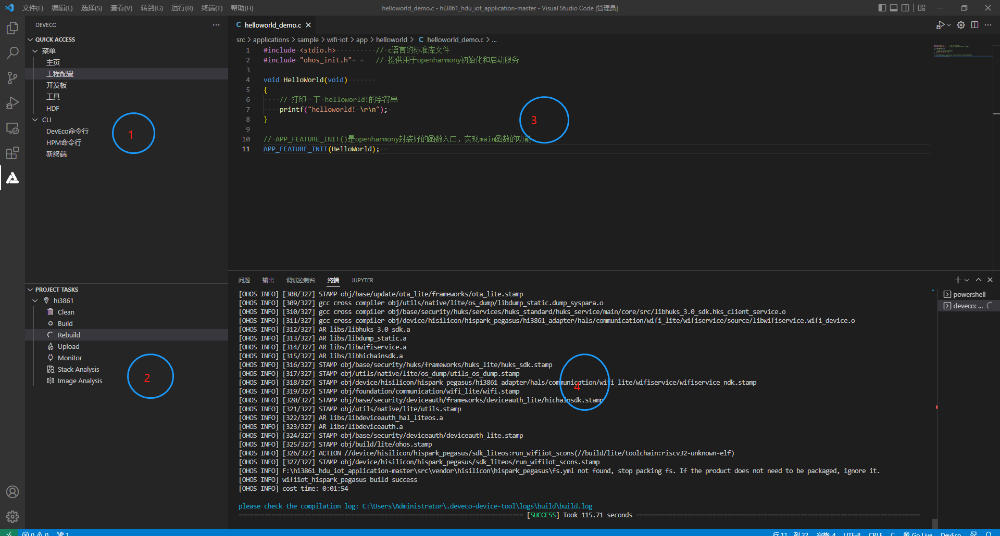

## 2. DecEco Device Tool下载和安装
* 步骤一：下载devicetool-windows-tool-3.1.0.400.zip版，下载网址：https://device.harmonyos.com/cn/develop/ide#download

* 步骤二：解压DevEco Device Tool压缩包，双击安装包程序，点击"下一步"进行安装（如果之前有安装过，会弹出先卸载之前版本在安装，请按照要求先卸载）；

  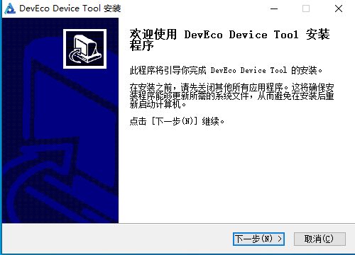

* 步骤三：设置DevEco Device Tool的安装路径，请注意安路径不能包含中文字符，同时建议不要安装到C盘目录，点击"下一步"。

  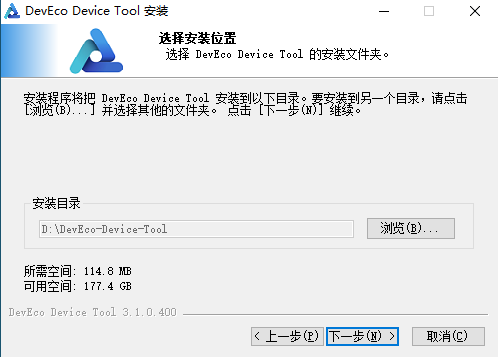

* 步骤四：根据安装向导提示，安装依赖软件python以及vscode，显示OK后，点击安装。

  

* 步骤五：等待DevEco Device Tool安装向导自动安装DevEco Device Tool插件，直至安装完成，点击"完成",关闭DevEco Device Tool安装向导。

  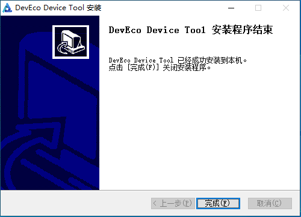

* 步骤六：打开Visual Studio Code，进入DevEco Decive Tool工具界面。

  

* 步骤七：下载简体中文语言包，用户可以在VSCode工具商店安装"chinese(Simplified)(简体中文)Language Pack for Visual Studio Code"插件，将VSCode设置为中文模式。

  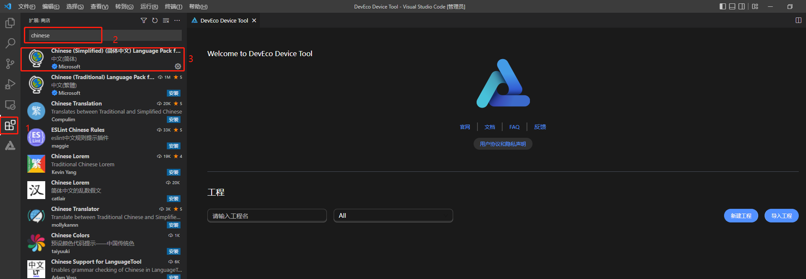

## 3. SDK下载

* 步骤一：下载Hi3861 Openharmony SDK下载网址：https://gitee.com/HiSpark/hi3861_hdu_iot_application

  

  下载方式2种：

  * 方式一：直接在web页面上下载zip压缩包

    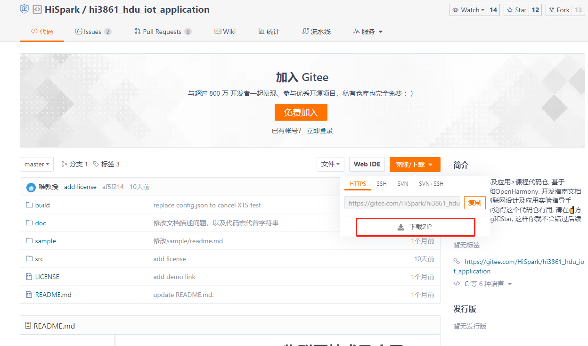

  * 方式二：如果用户已经安装git工具（git工具安装和使用请自行百度），可以通过git clone命令下载，命令如下：
  
    ```
    git clone https://gitee.com/HiSpark/hi3861_hdu_iot_application.git
    ```

    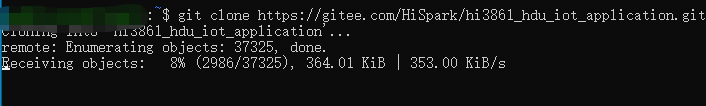

    <font color='RedOrange'>**注意：由于windows自身限制，路径不能超过260个字符，在git下载和解压Hi3861 SDK代码时尽量放在D盘或者其他盘根目录下，防止导致的编译错误问题。**</font>

## 4. 开发工具下载

* 开发工具下载网址：https://hispark.obs.cn-east-3.myhuaweicloud.com/DevTools_Hi3861V100_v1.0.zip

  

* 下载完成后解压，解压完成后的文件目录结构如下所示：

  

## 5. 工程管理

* 步骤一：打开VSCode，打开DevEco Device Tool主页，点击“导入工程”

  

* 步骤二：在导入工程弹窗中选择Hi3861 SDK目录，点击“导入”。（如果采用zip包下载，SDK名称为hi3861_hdu_iot_application-master，如果采用git下载SDK名称为hi3861_hdu_iot_application，此处以采用zip下载为例）

  

* 步骤三：在后续导入工程弹窗，SOC栏选择Hi3861，开发板栏选择hi3861，框架栏选择hb，之后点击“导入”，等待导入成功即可。

  

  <font color='RedOrange'>**注意：如果待打开目录之前已成功导入，则再次导入时会导入失败，并提示“当前工程已经创建过，请直接导入”。**</font>

* 步骤四：代码导入成功后，即工程创建成功，之后可使用该IDE 实现代码开发、一键编译、一键烧写等功能。

  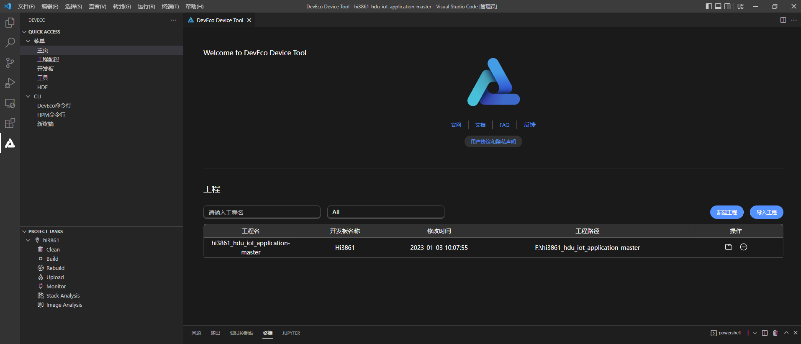

* 步骤五：代码导入成功后，后续可在DevEco Device Tool工具主页直接打开已导入成功的工程。

  

## 6. 编译运行

* 步骤一：配置开发工具路径，点击左侧的“工程配置”，在右侧窗口找到“compiler_bin_path”，选择到之前下载的开发工具。

  

  <font color='RedOrange'>**注意工具目录层级，选择到最内层，例如下图”。**</font>

  

* 步骤二：配置完成后，点击左侧“build”，开始编译。

  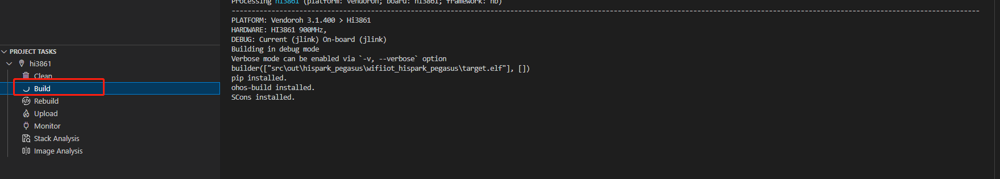
  
  初次编译会解压编译工具，时间较长。等待编译完成即可。
  
  

## 7. 代码烧录
### 7.1 串口驱动安装


* 步骤一：先使用配套的Type-C数据线，将开发板与电脑的USB口进行直连，


* 步骤二：安装CH340G驱动，打开DevTools_Hi3861V100_v1.0/usb_serial_driver文件夹。

    

* 步骤三：双击CH341SER.EXE驱动，进入安装界面，点击安装按钮即可，驱动安装成功后，再点击确定按钮。

  

    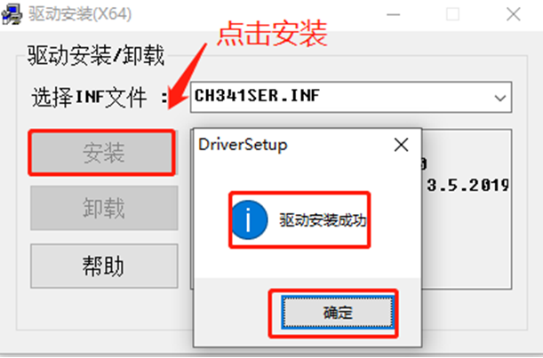

* 步骤四：打开Windows的设备管理器，查看串口设备，若未出现CH340串口设备，请检查驱动是否安装正常。

    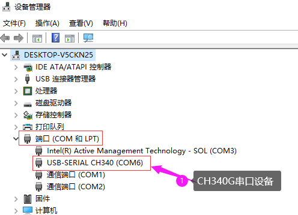

### 7.2 串口烧录
* 步骤一：当前DevEco Device Tool工具支持Hi3861单板一键烧录功能。需要连接开发板，配置开发板对应的串口，在编译结束后，进行烧录。点击左侧“工程配置”，找到“upload_port”选项，选择开发板对应的烧录串口（<font color='RedOrange'>**注意：如果正在使用Monitor功能，请先“ctrl+c”关闭Monitor，才能正常烧，否则串口占用无法烧录成功**</font>）。

  

* 步骤二：点击左下角“upload”按键，等待提示（出现Connecting，please reset device...），手动进行开发板复位（按下开发板reset键）。

  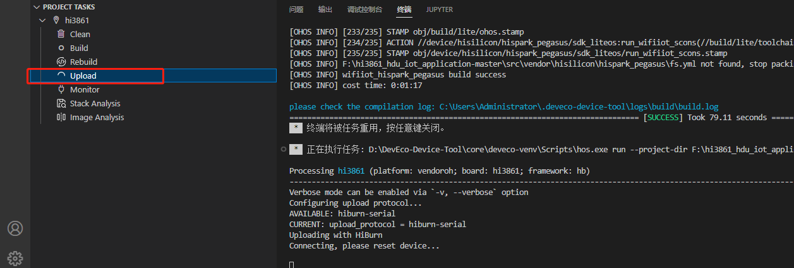

* 步骤三：等待烧录完成，大约30s左右，烧录成功。

  

### 7.3 Monitor 串口打印

* 步骤一：烧录完成后，可以通过Monitor界面查看串口打印，配置Monitor串口，如下图所示。（<font color='RedOrange'>**注意：如果正在使用Monitor功能，请先“ctrl+c”关闭Monitor，才能正常烧录，否则串口占用无法烧录成功**</font>）

  

* 步骤二：配置完Monitor串口后，直接点击monitor按钮，复位开发板，查看板端打印信，可以看到“sdk ver:Hi3861V100R001C00SPC025 2020-09-03 18:10:00”等字样。

  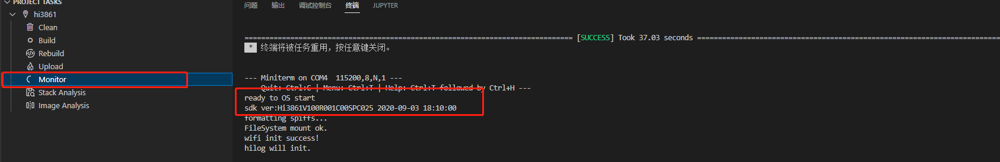

## 8. 栈分析、镜像分析

​		DevEco Device Tool通过集成stack Analysis栈分析工具和Image Analysis镜像分析工具，用于开发过程中的内存不足、内存溢出等问题进行分析，帮助开发者更加精确的分析、分析问题。

* Stack Analysis栈分析工具是基于静态二进制分析手段，提供任务栈开销估算值和函数调用关系图示，为栈内存使用、分析、优化、问题定位等开发场景提供较为准确的静态内存分析数据参考。

  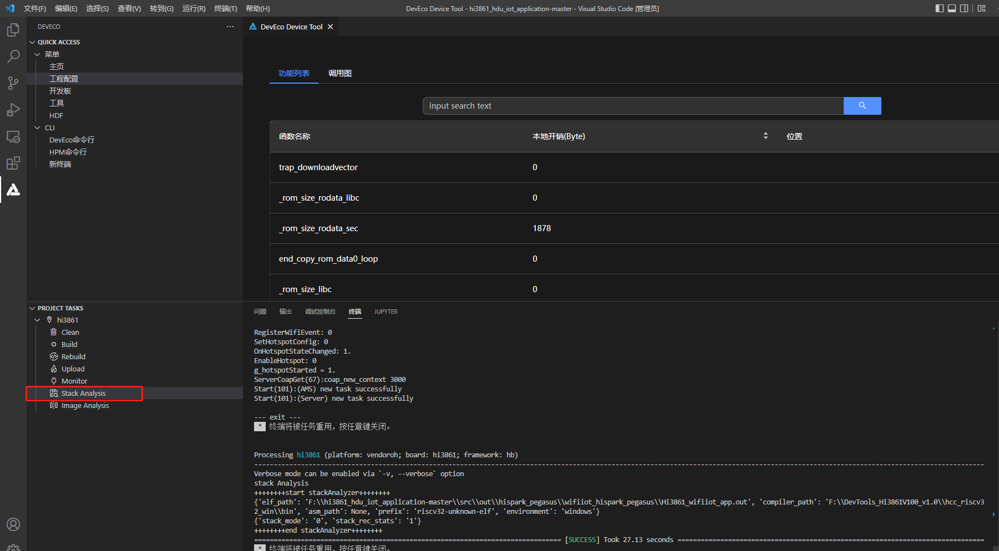

* Image Analysis镜像分析工具对工程构建出的elf文件进行内存占用分析，支持开发者快速评估内存段、符号表使用情况。

​	工程编译完成后，点击左下角“stack Analysis”，进行栈分析。

​    点击左下角“Image Analysis”，进行镜像分析。

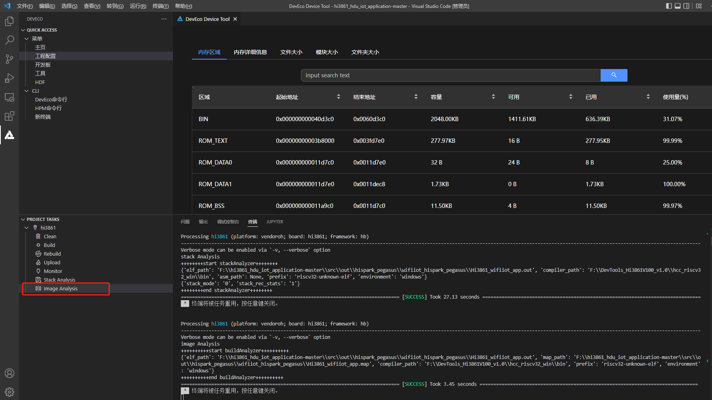
