# 1 芯片和硬件介绍

## 1.1 SOC技术

System On Chip (SoC) 片上系统，即将完成特定业务功能的整个电子系统全部集成到一个芯片内部，基于SoC开发的系统具有很高的系统集成度。

一个完整的SOC芯片，根据不同业务领域的需求，可以集成多个CPU，多个存储器，多个外设模块，然后通过系统总线将这些器件和模块连接起来。

下图为基于海思RISC-V微处理器核的单CPU Soc系统架构，ITCM和DTCM为紧耦合存储器，可以存放指令和数据，CPU也可以通过总线访问存储总线上的存储资源。通过外设总线访问丰富的外设模块，对其进行控制和调度，以实现特定的业务功能。

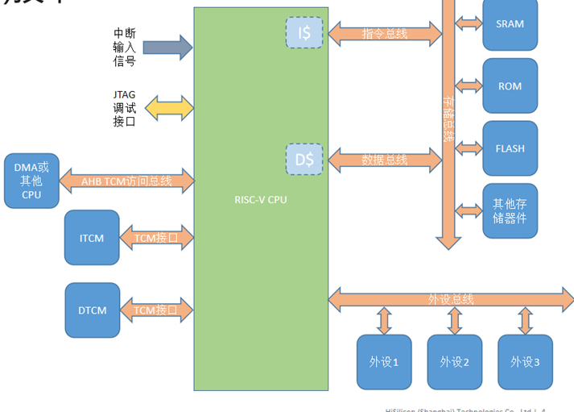

## 1.2 SOC总线

SoC系统可以抽象为CPU、存储器系统和外设系统3部分。存储系统为CPU提供程序和数据，外设提供CPU与外部的交互功能。

通过标准总线以特定的总线架构将CPU、存储系统、外设系统连接在一起。使用标准总线的好处是，各个组件开发的时候只需要遵循标准总线协议设计交互接口，而不需要跟各个组件对齐交互接口。

只要是符合标准总线协议要求的组件，就能对接起来，进行数据交互，有助于工作解耦、模块继承、模块移植。

总线的控制信号决定请求的开始、结束和信息交互的握手。

总线的地址信号用于选择需要访问的器件，通过地址划分给不同器件分配不同的地址区间，解码器就可以将不同地址的访问分配到相应的器件上，实现按地址访问指定目标的要求。

总线数据信号用于数据的交互，包括写数据和读数据。

## 1.3 海思SOC芯片Hi3861V100介绍

### 1.3.1 芯片规格及竞争力

具体参考 [产品简介](../../../../../doc/manual/Hi3861V100 产品简介.pdf)：

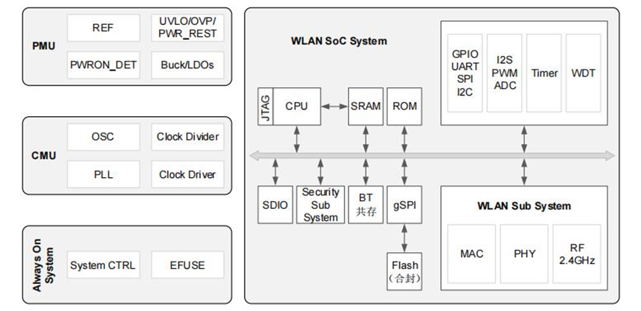            

### 1.3.2 芯片外设接口

SDIO：SDIO是SD型的扩展接口，除了可以接SD卡外，还可以接支持SDIO接口的设备。

UART：UART是一种通用串行数据总线，用于异步通信，把并行输入信号转成串行输出信号。该总线双向通信，可以实现全双工传输和接收。

SPI：SPI接口是在CPU和外围低速器件之间进行同步串行数据传输，为全双工通信，数据传输速度总体来说比I2C总线要快，速度可达到几Mbps。 

I2C：I2C总线是由Philips公司开发的一种简单、双向二线制同步串行总线。它只需要两根线即可在连接于总线上的器件之间传送信息。

GPIO：GPIO，通用输入输出简称，在嵌入式系统中，用于控制许多结构简单的外部设备或者电路。

### 1.3.3 芯片的应用场景

物联网通信中WiFi的基本应用模式和场景

WiFi在物联网通信中广泛应用于家庭、学校、网吧、楼宇等场景，又可以将WiFi应用分为室内WiFi和室外WiFi等。

室内WiFi：

* 一般工作在2.4GHz频段

*  采用低功耗室内放置型AP

* 单个室内型AP的覆盖半径一般为30~100米

* 每个AP支持并发30个用户

 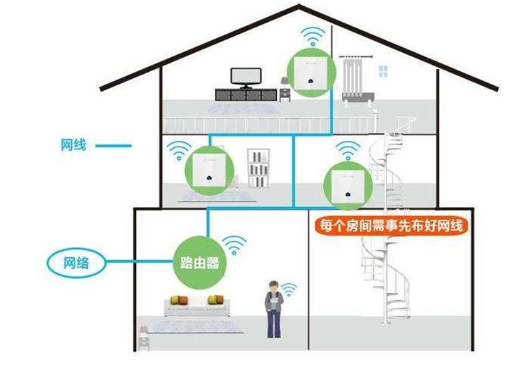

室外WiFi：

* 一般采用2.4GHz频段

* 最大发射功率可调

* 可采用定向天线或者全向天线

* 安装于室外，即可完成室外热点的WiFi覆盖，也可覆盖室内热点

 

### 1.3.4  芯片特性

参考[Hi3861V100 WiFi芯片用户指南](../../../../../doc/manual/Hi3861V100／Hi3861LV100／Hi3881V100 WiFi芯片 用户指南.pdf)。该文档详细介绍了WiFi特性、寄存器地址、描述、安全子系统外围设备等开发板硬件介绍

### 1.3.5 主开发板介绍

Hi3861/Hi3881是一款高度集成的2.4GHzWiFi 芯片，集成IEEE802.11b/g/n基带和RF（Radio Frequency）电路，包括功率放大器PA（Power Amplifier）、低噪声放大器LNA（Low Noise Amplifier）、RF balun、天线开关以及电源管理模块等。Hi3861/Hi3881 WiFi基带实现正交频分复用（OFDM）技术，并向下兼容直接序列扩频（DSSS）、补码键控（CCK）技术，支持 IEEE 802.11b/g/n协议。支持20MHz标准带宽和5MHz/10MHz 窄带宽，提供最大72.2Mbit/s物理层速率。

Hi3861/Hi3881芯片集成高性能32bit微处理器；提供SPI（Synchronous Peripheral Interface）、UART（Universal Asynchronous Receiver & Transmitter）、I2C（The InterIntegrated Circuit）、I2S（Inter-IC Sound）、PWM（Pulse-Width Modulation）、GPIO（General Purpose Input/Output）以及多路ADC（Analog to Digital Converter）模拟输入等丰富的外设接口，同时支持 SDIO2.0（Secure DigitalInput/Output）接口，时钟最高 支持 50MHz；支持 Huawei LiteOS和OpenHarmony鸿蒙操作系统，第三方组件，并配套提供开放、易用的开发和调试环境。芯片内置SRAM（Static Random Access Memory）和Flash，可独立运行，并支持在Flash上运行程序。

Hi3881 系列产品型号包括 Hi3881V100。芯片作为从机，通过 SDIO 接口连接到主芯片运行。

### 1.3.6 微处理器一体化板外设硬件实验简介

#### 1.3.6.1 PWM_交通灯实验

本实验主要是运用Hi3861控制GPIO电平高低控制灯的亮灭，同时通过PWM控制蜂鸣器鸣响。

#### 1.3.6.2 I2C_NFC碰一碰实验

本实验主要是运用Hi3861 I2C通信，将数据写入到NFC寄存器中，并使用手机与NFC模块通信。

#### 1.3.6.3 I2C_RTC时钟实验

本实验主要是运用Hi3861 I2C通信，制作万年历，同时实现在Hi3861掉电条件下，万年历时钟可以继续运行。

#### 1.3.6.4 I2S_智能语音实验

本实验主要实现Hi3861和es8311外设通过i2s通讯方式实现原始pcm音频输入（ADC），经过es8311的DAC处理后输出数字量音频发送给Hi3861进行存储，然后Hi3861再将数字量音频读取出来发送给es8311进行ADC处理后给喇叭进行播放。

#### 1.3.6.5 SPI_陀螺仪实验

本实验主要是运用Hi3861 SPI通信，通过SPI获取陀螺仪数据并将数据写入到支持SPI通信的Flash芯片中，保存数据。

#### 1.3.6.6 I2C_温湿度实验

本实验主要是运用Hi3861 I2C通信，实时获取周围温湿度。

#### 1.3.6.7 ADC_实验

本实验实现了将模拟信号转换为数字信号，同时实现交通灯板上的红灯无级调光,并将占空比显示在OLED屏幕上。

#### 1.3.6.8 IO_键盘矩阵实验

本实验主要是运用Hi3861 控制GPIO口输入输出，并通过获取GPIO口值，确定按键的值。

### 1.3.7 调试器

openOCD（Open On-Chip Debugger）是一个开源的片上调试器，旨在提供针对嵌入式设备的调试、系统编程和边界扫描功能。它分为JTAG模式和SWD模式。调试器硬件图如下图所示。

JTAG是一种国际标准测试协议（IEEE 1149.1兼容），主要用于芯片内部测试。标准的JTAG接口是4线：TMS、TCK、TDI、TDO，分别为模式选择、时钟、数据输入和数据输出线。（20个引脚）

具有JTAG口的芯片都有如下JTAG引脚定义：

TCK——测试时钟输入；

TDI——测试数据输入，数据通过TDI输入JTAG口；

TDO——测试数据输出，数据通过TDO从JTAG口输出；

TMS——测试模式选择，TMS用来设置JTAG口处于某种特定的测试模式。

SWD（serial wire debug，串行调试），与JATG区别的另一种调试方式。标准接口为双线，有四到五个引脚。双线接SWDIO，SWCLK即是SWD的接线方式。（或者通过引脚接SWDIO，SWCLK，VCC，GND，最多再接一个复位引脚RST）。

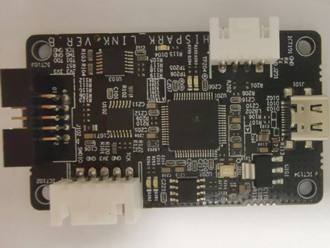

# 2.  开发环境搭建

HUAWEI DevEco Device Tool（以下简称DevEco Device Tool）是OpenHarmony面向智能设备开发者提供的一站式集成开发环境，支持OpenHarmony的组件按需定制，支持代码编辑、编译、烧录和调试等功能，支持C/C++语言，以插件的形式部署在Visual Studio Code上。

DevEco Device Tool采用Windows+Ubuntu混合开发环境，在Windows上主要进行代码开发、代码调试、镜像烧录等操作，在Ubuntu环境实现源码编译。其具有以下特点：

- 支持代码查找、代码高亮、代码自动补齐、代码输入提示、代码检查等，开发者可以轻松、高效编码。
- 支持丰富的芯片和开发板，包括基于华为海思芯片的Hi3516DV300/Hi3861V100/Hi3751V350/BearPi-HM Nano开发板，以及三方厂商的Neptune/RK3568/Bearpi-HM Micro开发板。
- 支持自动检测各芯片/开发板依赖的工具链是否完备，并提供一键下载和安装缺失工具链。
- 支持多人共享开发模式，采用基于Remote-SSH模式实现多人共享远程开发，实现一个团队公用一台服务器进行编译、烧录。
- 支持源码级调试能力，提供查看内存、变量、调用栈、寄存器、反汇编等调试信息。

DevEco Device Tool工具主要分为如下4个功能区域。

：基本功能区 ：DevEco Device Tool菜单栏，提供基本的工程创建、源码导入、工程配置等功能。

：开发板任务区：在工程界面，提供开发板相关操作任务，如源码的编译、镜像的烧录、Monitor串口工具等。

：代码编辑器：提供代码的查看、编写和调试等开发功能。

：输出控制区：提供日志打印、调试指令输入、命令行指令输入等。


## 2 .1 DecEco Device Tool下载和安装

* 步骤一：下载devicetool-windows-tool-3.1.0.500.zip版，下载网址：https://device.harmonyos.com/cn/develop/ide#download

* 步骤二：解压DevEco Device Tool压缩包，双击安装包程序，点击"下一步"进行安装（如果之前有安装过，会弹出先卸载之前版本在安装，请按照要求先卸载）；

  

* 步骤三：设置DevEco Device Tool的安装路径，请注意安路径不能包含中文字符，同时建议不要安装到C盘目录，点击"下一步"。

  

* 步骤四：根据安装向导提示，安装依赖软件python以及vscode，显示OK后，点击安装。

  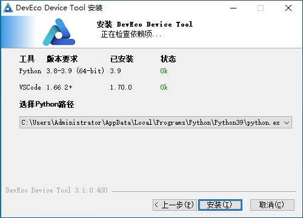

* 步骤五：等待DevEco Device Tool安装向导自动安装DevEco Device Tool插件，直至安装完成，点击"完成",关闭DevEco Device Tool安装向导。

  

* 步骤六：打开Visual Studio Code，进入DevEco Decive Tool工具界面。

  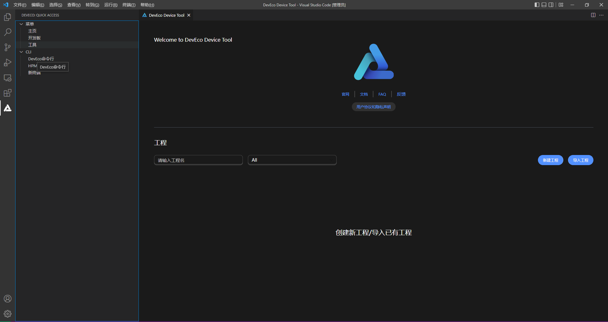

* 步骤七：下载简体中文语言包，用户可以在VSCode工具商店安装"chinese(Simplified)(简体中文)Language Pack for Visual Studio Code"插件，将VSCode设置为中文模式。

  

## 2.2 SDK下载

* 步骤一：下载Hi3861 Openharmony SDK下载网址：https://gitee.com/HiSpark/hi3861_hdu_iot_application

  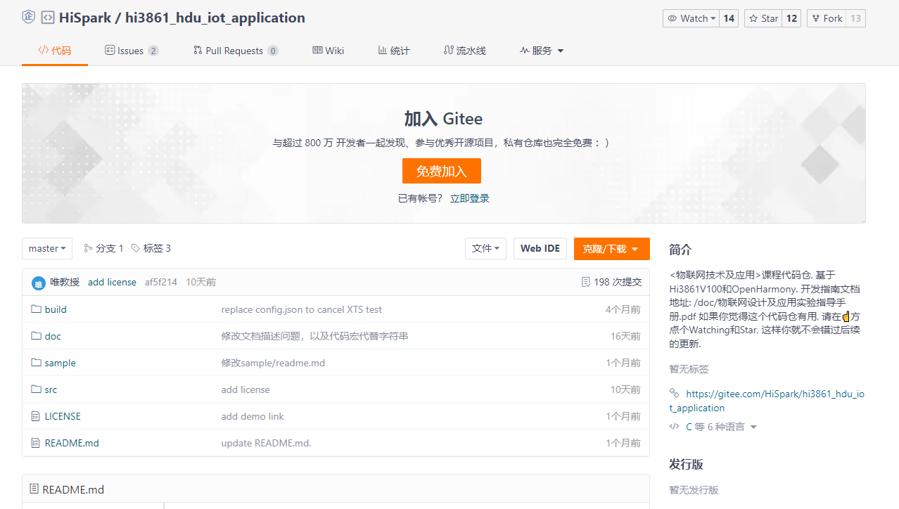

  下载方式2种：

  * 方式一：直接在web页面上下载zip压缩包

    

  * 方式二：如果用户已经安装git工具（git工具安装和使用请自行百度），可以通过git clone命令下载，命令如下：

    ```
    git clone https://gitee.com/HiSpark/hi3861_hdu_iot_application.git
    ```

    

    <font color='RedOrange'>**注意：由于windows自身限制，路径不能超过260个字符，在git下载和解压Hi3861 SDK代码时尽量放在D盘或者其他盘根目录下，防止导致的编译错误问题。**</font>

## 2.3 开发工具下载

* 开发工具下载网址：https://hispark.obs.cn-east-3.myhuaweicloud.com/DevTools_Hi3861V100_v1.0.zip

  

* 下载完成后解压，解压完成后的文件目录结构如下所示：

  

## 2.4 工程管理

* 步骤一：打开VSCode，打开DevEco Device Tool主页，点击“导入工程”

  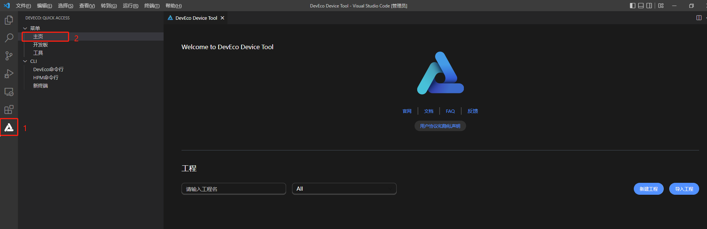

* 步骤二：在导入工程弹窗中选择Hi3861 SDK目录，点击“导入”。（如果采用zip包下载，SDK名称为hi3861_hdu_iot_application-master，如果采用git下载SDK名称为hi3861_hdu_iot_application，此处以采用zip下载为例）

  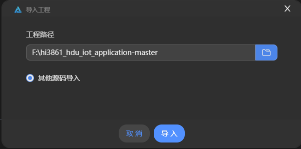

* 步骤三：在后续导入工程弹窗，SOC栏选择Hi3861，开发板栏选择hi3861，框架栏选择hb，之后点击“导入”，等待导入成功即可。

  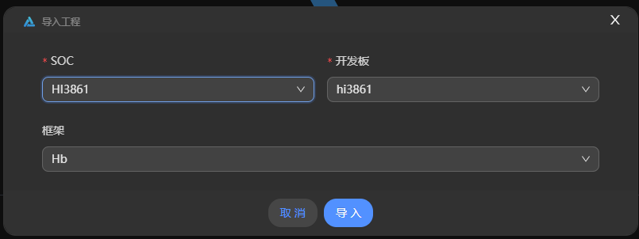

  <font color='RedOrange'>**注意：如果待打开目录之前已成功导入，则再次导入时会导入失败，并提示“当前工程已经创建过，请直接导入”。**</font>

* 步骤四：代码导入成功后，即工程创建成功，之后可使用该IDE 实现代码开发、一键编译、一键烧写等功能。

  

* 步骤五：代码导入成功后，后续可在DevEco Device Tool工具主页直接打开已导入成功的工程。

  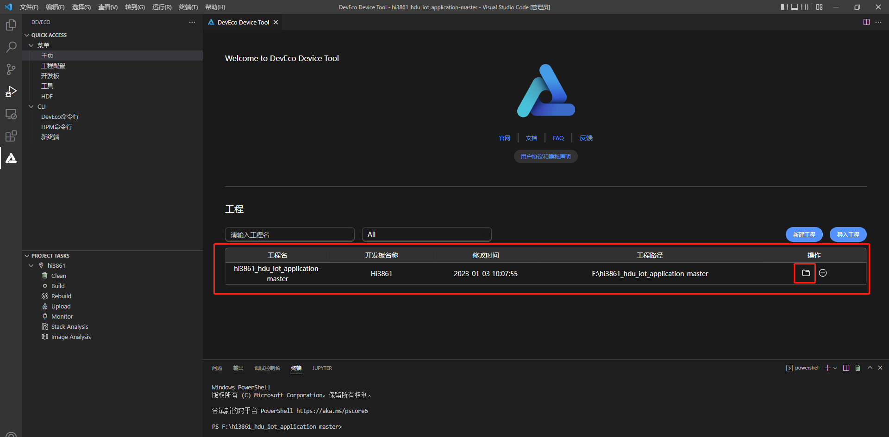

## 2.5 编译运行

* 步骤一：配置开发工具路径，点击左侧的“工程配置”，在右侧窗口找到“compiler_bin_path”，选择到之前下载的开发工具。

  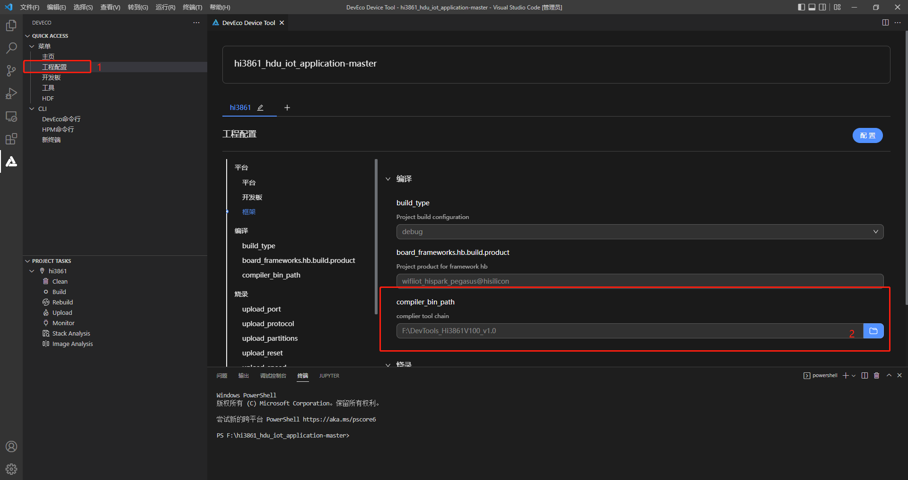

  <font color='RedOrange'>**注意工具目录层级，选择到最内层，例如下图”。**</font>

  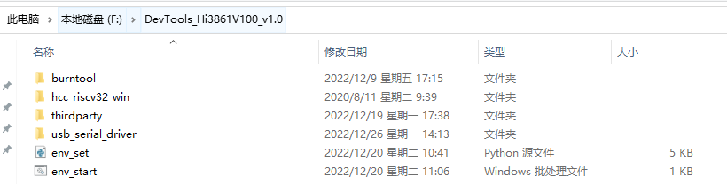

* 步骤二：配置完成后，点击左侧“build”，开始编译。

  

  初次编译会解压编译工具，时间较长。等待编译完成即可。

  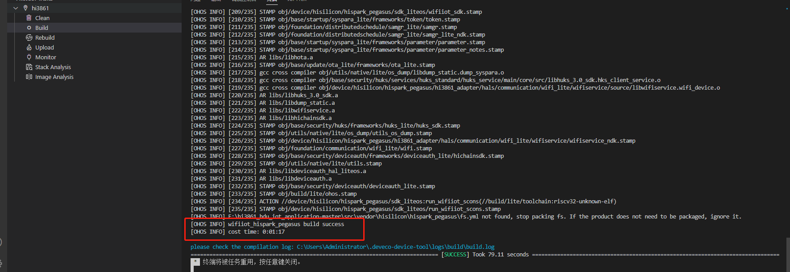

## 2.6 代码烧录

### 2.6.1 串口驱动安装


* 步骤一：先使用配套的Type-C数据线，将开发板与电脑的USB口进行直连，


* 步骤二：安装CH340G驱动，打开DevTools_Hi3861V100_v1.0/usb_serial_driver文件夹。

  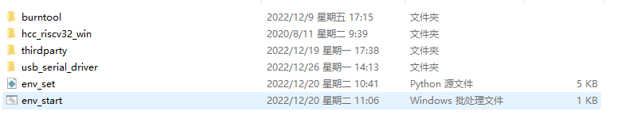

* 步骤三：双击CH341SER.EXE驱动，进入安装界面，点击安装按钮即可，驱动安装成功后，再点击确定按钮。

  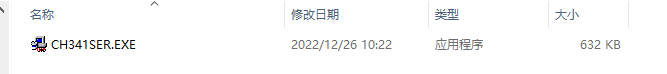

  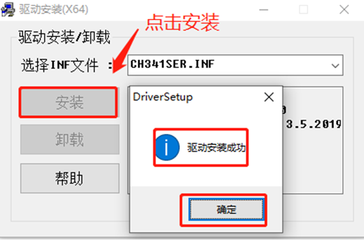

* 步骤四：打开Windows的设备管理器，查看串口设备，若未出现CH340串口设备，请检查驱动是否安装正常。

  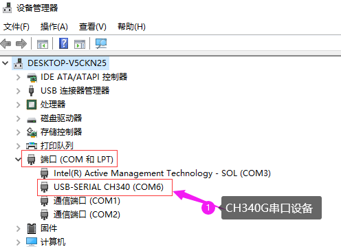

### 2.6.2 串口烧录

* 步骤一：当前DevEco Device Tool工具支持Hi3861单板一键烧录功能。需要连接开发板，配置开发板对应的串口，在编译结束后，进行烧录。点击左侧“工程配置”，找到“upload_port”选项，选择开发板对应的烧录串口（<font color='RedOrange'>**注意：如果正在使用Monitor功能，请先“ctrl+c”关闭Monitor，才能正常烧，否则串口占用无法烧录成功**</font>）。

  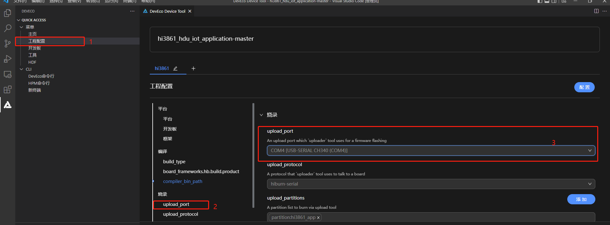

* 步骤二：点击左下角“upload”按键，等待提示（出现Connecting，please reset device...），手动进行开发板复位（按下开发板reset键）。

  

* 步骤三：等待烧录完成，大约30s左右，烧录成功。

  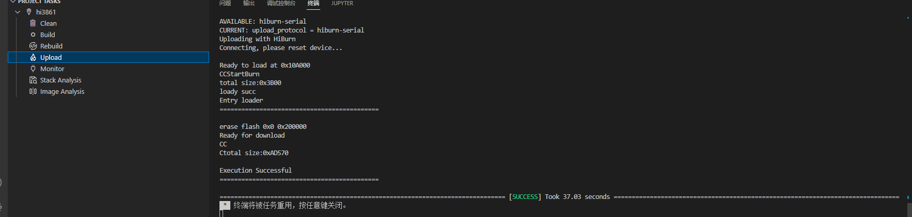

## 2.7 Monitor 串口打印

* 步骤一：烧录完成后，可以通过Monitor界面查看串口打印，配置Monitor串口，如下图所示。（<font color='RedOrange'>**注意：如果正在使用Monitor功能，请先“ctrl+c”关闭Monitor，才能正常烧录，否则串口占用无法烧录成功**</font>）

  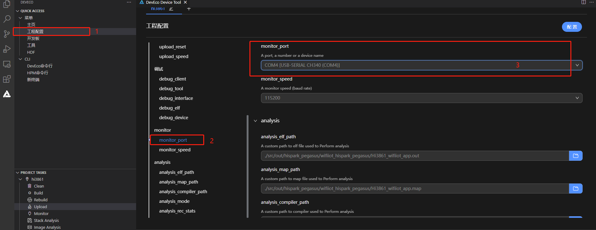

* 步骤二：配置完Monitor串口后，直接点击monitor按钮，复位开发板，查看板端打印信，可以看到“sdk ver:Hi3861V100R001C00SPC025 2020-09-03 18:10:00”等字样。

  

## 2.8 栈分析、镜像分析

​		DevEco Device Tool通过集成stack Analysis栈分析工具和Image Analysis镜像分析工具，用于开发过程中的内存不足、内存溢出等问题进行分析，帮助开发者更加精确的分析、分析问题。

* Stack Analysis栈分析工具是基于静态二进制分析手段，提供任务栈开销估算值和函数调用关系图示，为栈内存使用、分析、优化、问题定位等开发场景提供较为准确的静态内存分析数据参考。

  

* Image Analysis镜像分析工具对工程构建出的elf文件进行内存占用分析，支持开发者快速评估内存段、符号表使用情况。

​	工程编译完成后，点击左下角“stack Analysis”，进行栈分析。

​    点击左下角“Image Analysis”，进行镜像分析。


## 2.9 运行第一个程序“helloworld”

* 步骤一：hi3861_hdu_iot_application/src/vendor/hisilicon/hispark_pegasus/demo/helloworld_demo文件夹复制到hi3861_hdu_iot_application/src/applications/sample/wifi-iot/app/目录下。
* 步骤二：修改applications/sample/wifi-iot/app/目录下的BUILD.gn，在features字段中添加helloworld_demo:helloworld。注：第一个helloworld_demo指的是需要编译的工程目录，第二个helloworld指的是applications/sample/wifi-iot/app/helloworld_demo/BUILD.gn文件中的静态库，名称为helloworld。


```c
import("//build/lite/config/component/lite_component.gni")

lite_component("app") {
  features = [ "helloworld_demo:helloworld", ]
}
```

* 步骤三：修改hi3861_hdu_iot_application/src/device/hisilicon/hispark_pegasus/sdk_liteos/build/config/usr_config.mk文件。在这个配置文件中打开I2C驱动宏。搜索字段CONFIG_I2C_SUPPORT ，并打开I2C。配置如下：

  ```
  # CONFIG_I2C_SUPPORT is not set
  CONFIG_I2C_SUPPORT=y
  ```

* 步骤四：点击DevEco Device Tool工具“Rebuild”按键，具体编译步骤参考“2.5章节 编译运行”。


- 步骤五：点击DevEco Device Tool工具“Upload”按键，等待提示（出现Connecting，please reset device...），手动进行开发板复位（按下开发板reset键），将程序烧录到开发板中。具体烧录步骤参考“2.6章节 代码烧录”。

  

* 步骤六：软件烧录成功后，按一下开发板的RESET按键复位开发板，（注意：j4 LED跳线帽需要接上，其他的实验不需要插跳线帽），此时开发板的系统会运行起来。运行结果：在OLED屏正中央(第3行，5列开始)，显示一个“Hello World”，主板上的LED灯间隔1s交替闪烁。hello_world烧录效果如下图所示。

  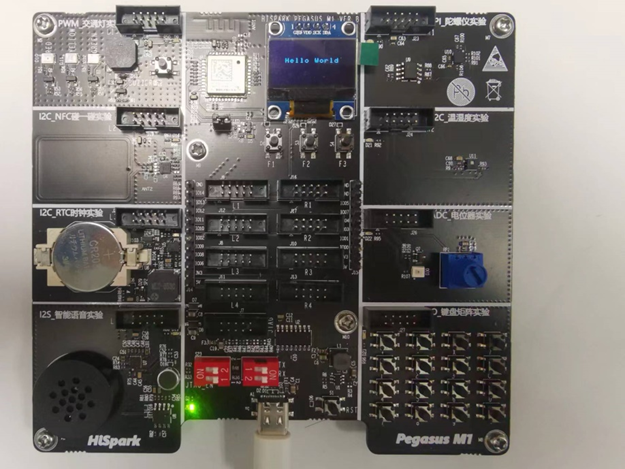

# 3 Bootloader启动与运行

## 3.1 Risc-v boot 启动介绍

Hi3861 的引导程序分为两部分，一部分在芯片出厂时已经固定在 ROM。这部分代码主要实现的功能是：芯片上电后，如果没有被打断（没有执行烧录过程）会检验 flashboot，检验成功后跳转执行flashboot 代码；如果被打断（复位操作并执行烧录过程），下载 loaderboot完后校验成功则跳转执行loaderboot 。再下载其他镜像（burn、boot、signed）并烧录到 flash,结束后，按复位键，芯片启动。

​               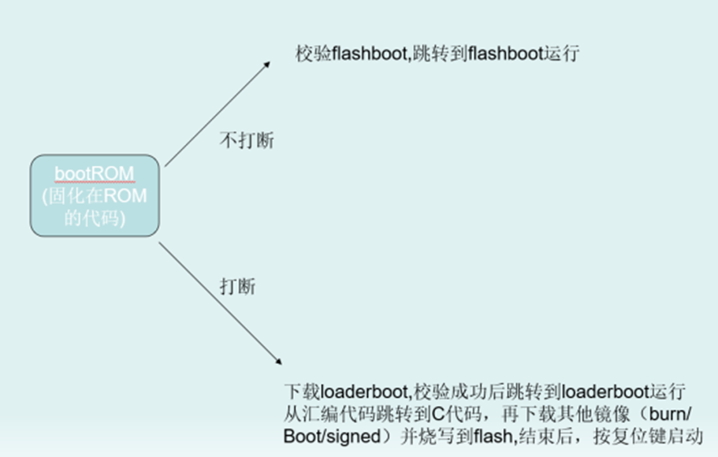                

## 3.2 Loaderboot 启动过程

Loaderboot 启动过程：路径： . /boot/loaderboot/startup/riscv_init.S

 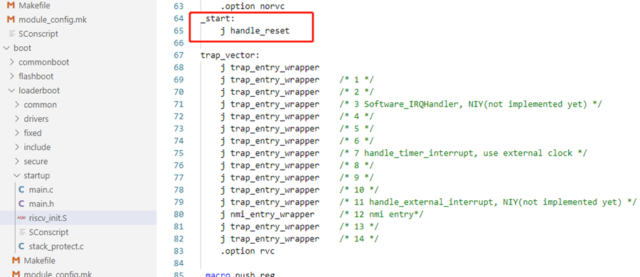

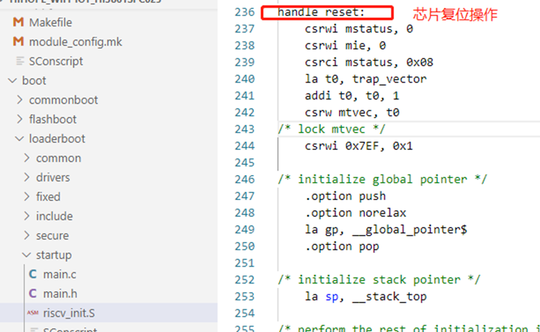

Loaderboot 跳转到 C 代码：

 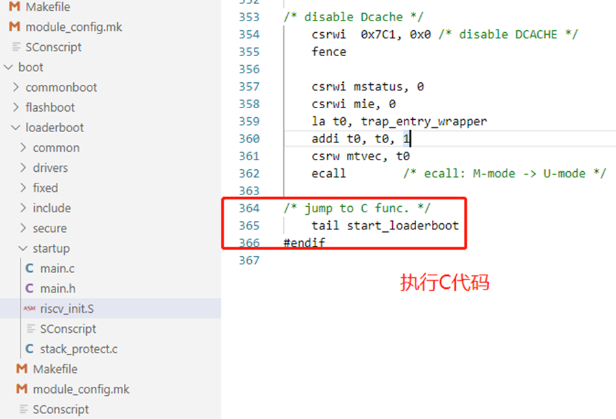

 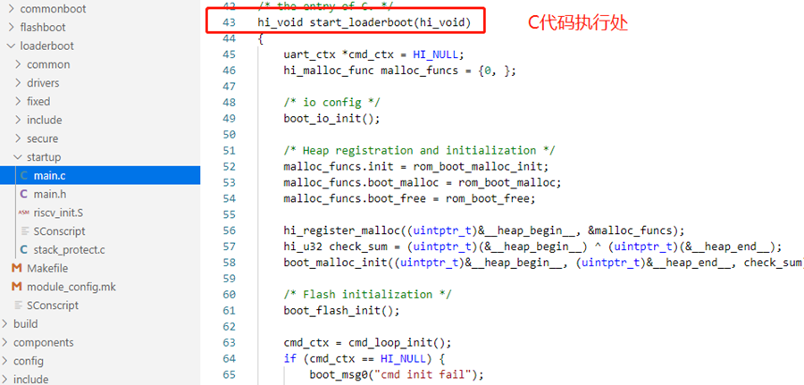

## 3.3 Flashboot 代码介绍

Flashboot 的执行逻辑与上述的 loaderboot 执行逻辑一致。路径：./ boot/Flashboot/startup/ riscv_init.S。

Flashboot 跳转到 C 代码：

​                        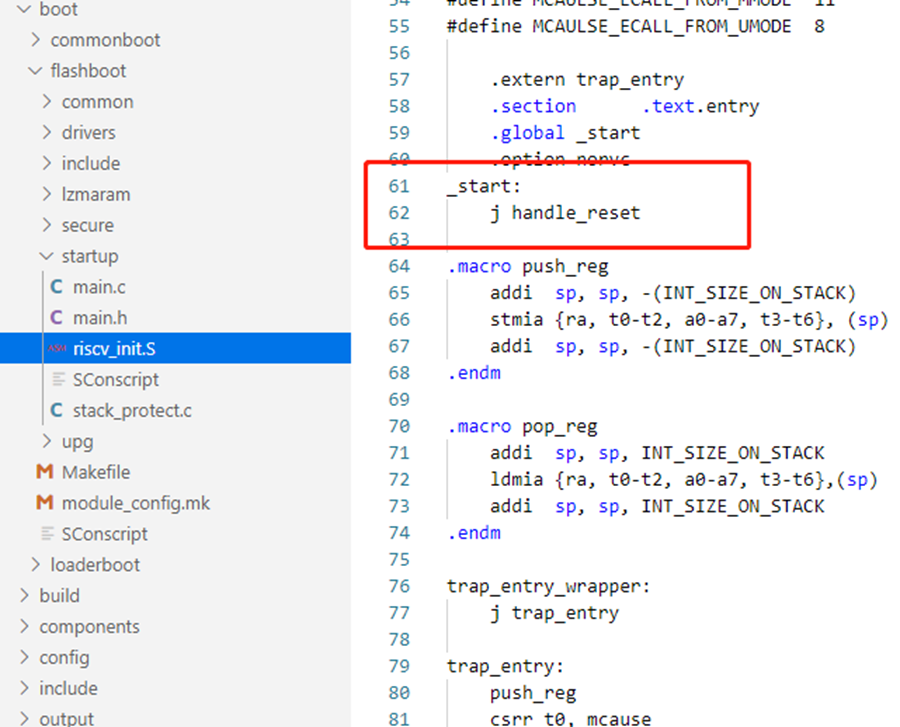

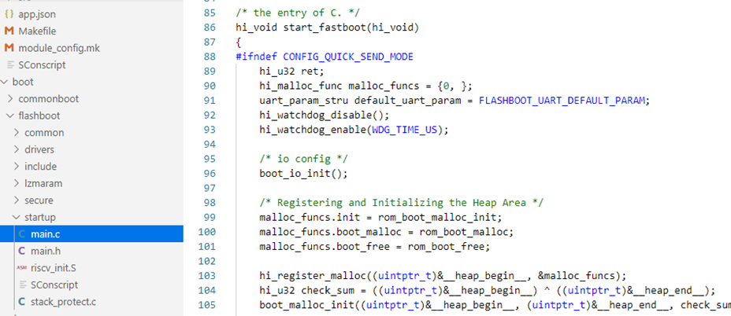

# 4 微处理器系统技术及其应用实验

## 4.1 中断机理认知实验

### 4.1.1 实验目的

本实验内容：主要实现中断机理认知与定时器中断实验案例。

中断是指CPU暂停执行当前程序，转而执行新程序的过程。中断相关的硬件可以划分为3类：

●设备：发起中断的源，当设备需要请求CPU时，产生一个中断信号，该信号连接至中断控制器。

●中断控制器：接收中断输入并上报给CPU。可以设置中断源的优先级、触发方式、打开和关闭等操作。

●CPU软中断： 由CPU软件发起的中断，一般用于操作系统的模式和线程切换。

使用场景：

当有中断请求产生时，CPU暂停当前的任务，转而去响应外设请求。用户通过中断申请，注册中断处理程序，可以指定CPU响应中断请求时所执行的具体操作。

表1-1 知识点

| API介绍                                                      | 说明                 |
| ------------------------------------------------------------ | -------------------- |
| HI_EXTERN hi_xtal_clock  hi_get_xtal_clock(hi_void);         | 获取硬件晶振时钟频率 |
| hi_u32 hi_int_lock(hi_void)；                                | 关闭所有中断         |
| hi_u32  hi_irq_request(hi_u32 vector, hi_u32 flags, irq_routine routine, hi_u32 param); | 注册中断             |

### 4.1.2 实验要求

1.软件要求：软件要求：VSCode，hi3861_hdu_iot_application(如果采用zip包下载，SDK名称为hi3861_hdu_iot_application-master，如果采用git下载SDK名称为hi3861_hdu_iot_application，此处以采用git下载为例）；

2.硬件要求：微处理器一体化板。硬件要求如下图所示。

​                               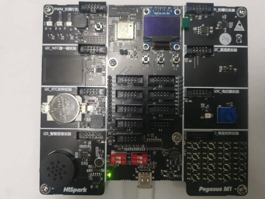

### 4.1.3 实验流程

* 步骤一：hi3861_hdu_iot_application/src/vendor/hisilicon/hispark_M1/demo/interrupt_demo文件夹复制到hi3861_hdu_iot_application/src/applications/sample/wifi-iot/app/目录下。

* 步骤二：修改applications/sample/wifi-iot/app/目录下的BUILD.gn，在features字段中添加interrupt_demo:interrupt_demo。注：第一个interrupt_demo指的是需要编译的工程目录，第二个interrupt_demo指的是applications/sample/wifi-iot/app/interrupt_demo/BUILD.gn文件中的静态库，名称为interrupt_demo。

```
import("//build/lite/config/component/lite_component.gni")

lite_component("app") {
  features = [ "interrupt_demo:interrupt_demo", ]
}
```

* 步骤三：原理：中断是指CPU暂停执行当前程序，转而执行新程序的过程。中断相关的硬件可以划分为3类：

  ●设备：发起中断的源，当设备需要请求CPU时，产生一个中断信号，该信号连接至中断控制器。

  ●中断控制器：接收中断输入并上报给CPU。可以设置中断源的优先级、触发方式、打开和关闭等操作。

  ●CPU软中断： 由CPU软件发起的中断，一般用于操作系统的模式和线程切换。

  使用场景：

  当有中断请求产生时，CPU暂停当前的任务，转而去响应外设请求。用户通过中断申请，注册中断处理程序，可以指定CPU响应中断请求时所执行的具体操作。代码如下：

```c
1 /*
2  * Copyright (c) 2022 HiSilicon (Shanghai) Technologies CO., LIMITED.
3  * Licensed under the Apache License, Version 2.0 (the "License");
4  * you may not use this file except in compliance with the License.
5  * You may obtain a copy of the License at
6  *
7  *     http://www.apache.org/licenses/LICENSE-2.0
8  *
9  * Unless required by applicable law or agreed to in writing, software
10  * distributed under the License is distributed on an "AS IS" BASIS,
11  * WITHOUT WARRANTIES OR CONDITIONS OF ANY KIND, either express or implied.
12  * See the License for the specific language governing permissions and
13  * limitations under the License.
14  */
15 
16 #include <hi_isr.h>
17 #include <hi_early_debug.h>
18 #include <hi_types_base.h>
19 #include <hi_errno.h>
20 #include <hi3861.h>
21 #include <hi_task.h>
22 #include <hi_clock.h>
23 #include "ohos_init.h"
24 #include "cmsis_os2.h"
25 #include "iot_watchdog.h"
26 
27 #define SHIFT_BYTE              (8)
28 #define TIMER_INTERVAL          (3000)
29 #define STACK_SIZE              (1024)
30 #define TIMER_BASE_ADDRESS      (0x40050000)
31 #define TIMER_OFFSET            (0x14)
32 #define TIMER_ID                (2)
33 #define TIMER_FREQ_24M          (24 * 1)
34 #define TIMER_FREQ_40M          (40 * 1)
35 
36 #define TIMER_REGISTER          (0x40010030)
37 
38 // 定时器寄存器
39 // Timer register
40 #define TEST_TIMER_CONTROLREG   (0x008)
41 #define TEST_TIMER_LOADCOUNT    (0x000)
42 #define TEST_TIMER_EOI          (0x00C)
43 #define TEST_TIMER_INTSTATUS    (0x010)
44 
45 unsigned int g_timer_cnt_cb = 0;
46 unsigned int tmp = 0;
47 unsigned int uvIntSave;
48 
49 // 定时器计数，到达后触发中断函数
50 // Timer count, trigger interrupt function upon arrival
51 void timer2_isr_trigger(unsigned char id, unsigned int period)
52 {
53     unsigned int temp;
54     unsigned short reg_val;
55     reg_val = 0;
56     hi_reg_read16(TIMER_REGISTER, reg_val);     // 读取定时器2寄存器
57                                                 // Read Timer 2 Register
58     reg_val |= (1 << SHIFT_BYTE);               // 寄存器赋值
59                                                 // register assignment
60     hi_reg_write16(TIMER_REGISTER, reg_val);    // 写入寄存器
61                                                 // Write register
62     hi_reg_write32(TIMER_BASE_ADDRESS + id * TIMER_OFFSET + TEST_TIMER_CONTROLREG, 0);  // 取消使能
63     hi_reg_write32(TIMER_BASE_ADDRESS + id * TIMER_OFFSET + TEST_TIMER_LOADCOUNT, period);   // 设置间隔初始值
64     
65     /*
66      * 时钟模式: 32bit [bit 1 设置为 1]
67      * 时钟滴答 1/1 时钟频率 [bit 3 设置为 0, bit 2 设置为 0]
68      * 时钟循环 [bit 1 设置为 1]
69      * Clock mode: 32bit [bit 1 is set to 1]
70      * Clock ticks 1/1 clock frequency [bit 3 is set to 0, bit 2 is set to 0]
71      * Clock cycle [bit 1 is set to 1]
72     */
73     temp = (1U << 0) | (1U << 1);       // 1: 可循环, 0: 使能
74                                         // 1: Circulable, 0: enable
75     hi_reg_write32(TIMER_BASE_ADDRESS + id * TIMER_OFFSET + TEST_TIMER_CONTROLREG, temp);
76     g_timer_cnt_cb = 0;                 // 清除寄存器
77                                         // Clear register
78     printf("The clock is over\r\n");
79 }
80 
81 // 清除中断
82 // Clear Interrupt
83 void timer_clear(unsigned char id)
84 {
85     hi_u32 reg_val = 0;
86     hi_reg_read32(TIMER_BASE_ADDRESS + id * TIMER_OFFSET + TEST_TIMER_EOI, reg_val);
87     if (reg_val != HI_ERR_SUCCESS) {
88         printf("clear timer interrupt failed, reg_val=%d\r\n", reg_val);
89     }
90 }
91 
92 // 时间中断函数
93 // Time interrupt function
94 void timer2_irq_handle(unsigned int irqv)
95 {
96     (void)irqv;
97     g_timer_cnt_cb++;
98     dprintf("\n into the func timer2_irq_handle\n");
99     timer_clear(TIMER_ID);  // 清中断
100                             // close the interrupt
101 }
102 
103 // 获取晶振频率
104 // get the frequence of XTAL
105 unsigned int GetXTALClock(void)
106 {
107     unsigned int xtal = 0;
108     unsigned int timer_freq = 0;
109     xtal = hi_get_xtal_clock(); // 获取外部晶振频率
110                                 // get the frequence of extern XTAL
111     if (xtal == HI_XTAL_CLOCK_24M) {
112         timer_freq = TIMER_FREQ_24M;
113     } else if (xtal == HI_XTAL_CLOCK_40M) {
114         timer_freq = TIMER_FREQ_40M;
115     } else if (xtal == HI_XTAL_CLOCK_MAX) {
116         timer_freq = TIMER_FREQ_40M;
117         printf("Crystal frequency invalid\r\n");
118     }
119     return timer_freq;
120 }
121 
122 // 计时器中断回调函数
123 // the callback function of timer interruption
124 void TimerIrqTask(void)
125 {
126     unsigned int irq_idx = TIMER_2_IRQ;
127     unsigned int timer_freq;
128     timer_freq = GetXTALClock();
129     timer2_isr_trigger(TIMER_ID, timer_freq);   // 开启计时器1s后触发中断
130                                                 // Trigger the interrupt 1 s after starting the timer
131     uvIntSave = hi_int_lock();                  // 关闭所有中断
132                                                 // Turn off all interrupts
133     // 注册中断函数
134     // Register interrupt function
135     unsigned int ret = hi_irq_request(TIMER_2_IRQ, HI_IRQ_FLAG_PRI1, timer2_irq_handle, 0);
136     if (ret != HI_ERR_SUCCESS) {
137         printf("request example irq fail:%x\n", ret);
138         return;
139     }
140     if (g_timer_cnt_cb != 0) {
141         dprintf("\n [hi_int_lock] failed\n");
142     }
143     dprintf("\n [hi_int_lock] success\n\n -Restore the state before shutting down the interrupt-\n");
144     hi_int_restore(uvIntSave);  // 中断前完成相关处理
145                                 // Complete relevant processing before interruption
146     if (g_timer_cnt_cb != 0) {
147         dprintf("\n [hi_int_restore] failed, timer cnt cb = %d\n", g_timer_cnt_cb);
148     }
149 
150     tmp = g_timer_cnt_cb;
151     ret = hi_irq_enable(irq_idx);   // 使能中断
152                                     // Enable interrupt
153     if (ret != HI_ERR_SUCCESS) {
154         dprintf("failed to hi_irq_enable func ,ret = 0x%x\r\n", ret);
155     }
156     hi_sleep(TIMER_INTERVAL);       // 进入3s的中断函数
157                                     // Interrupt function entering 3s
158 
159     if (g_timer_cnt_cb > tmp) {
160         dprintf("[timer2_irq_handle]success, timer cnt cb=%d\r\n", g_timer_cnt_cb);
161     } else {
162         dprintf("[timer2_irq_handle]failed, timer cnt cb=%d\r\n", g_timer_cnt_cb);
163     }
164     tmp = g_timer_cnt_cb;
165     hi_irq_disable(irq_idx);    // 关闭中断
166                                 // close the interrupt
167     if (g_timer_cnt_cb == tmp) {
168         dprintf("[hi_irq_disable]success\r\n");
169     } else {
170         dprintf("[hi_irq_disable]failed, timer cnt cb=%d\r\n", g_timer_cnt_cb);
171     }
172     hi_irq_free(irq_idx);   // 释放中断
173                             // relase the interrupt
174 }
175 
176 void ExampleTimerIrqEntry(void)
177 {
178     IoTWatchDogDisable();
179     osThreadAttr_t attr;
180     attr.name = "TimerIrqTask";
181     attr.attr_bits = 0U;
182     attr.cb_mem = NULL;
183     attr.cb_size = 0U;
184     attr.stack_mem = NULL;
185     attr.stack_size = STACK_SIZE;
186     attr.priority = osPriorityNormal;
187 
188     // 创建一个线程，并注册一个回调函数 TimerThread，控制红色LED灯每隔1秒钟闪烁一次
189     // Create a thread, register a callback function TimerThread, and control the red LED to flash once every 1 second
190     if (osThreadNew((osThreadFunc_t)TimerIrqTask, NULL, &attr) == NULL) {
191         printf("[TimerIrqTask] osThreadNew Falied to create TimerIrqTask!\n");
192     }
193 }
194 
195 APP_FEATURE_INIT(ExampleTimerIrqEntry);
```

- 步骤四：点击DevEco Device Tool工具“Rebuild”按键，具体编译步骤参考“2.5章节 编译运行”。


- 步骤五：点击DevEco Device Tool工具“Upload”按键，等待提示（出现Connecting，please reset device...），手动进行开发板复位（按下开发板reset键），将程序烧录到开发板中。具体烧录步骤参考“2.6章节 代码烧录”。

  

### 4.1.4 实验结果

* 软件烧录成功后，使用串口工具连接好小车的串口（<font color='RedOrange'>**注意：这里以sscom为例，该工具需要自己百度下载，也可以使用Monitor工具，参考“2.7 章节 Monitor串口打印”**</font>)，按一下开发板的RESET按键复位开发板，可以从串口工具看到。

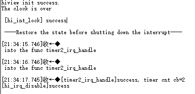

### 4.1.5 扩展实验

* 本实验通过使用软中断的实验，请学生做如下实验：

  * 1、通过软中断实现红灯亮的时候，转而执行黄灯亮。

    提示：红灯：GPIO 9 ，黄灯：GPIO 5。

## 4.2 ADC采样与PWM输出控制实验（电位器）

### 4.2.1 实验目的

本实验内容：将模拟信号转换为数字信号，同时实现交通灯板上的红灯无级调光。电位器芯片手册（编号：C330454）获取：https://so.szlcsc.com/global.html?k=C330454&hot-key=LM358DR2G，点击数据手册进行下载。

### 4.2.2 实验要求

1.软件要求：VSCode，hi3861_hdu_iot_application(如果采用zip包下载，SDK名称为hi3861_hdu_iot_application-master，如果采用git下载SDK名称为hi3861_hdu_iot_application，此处以采用git下载为例）；

2.硬件要求：微处理器一体化板；接线：R3-R3。硬件搭建如下图所示。

 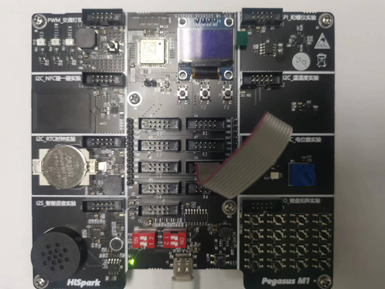

### 4.2.3 接口说明

#### 4.2.3.1 AdcRead()

| **定义：**   | unsigned int AdcRead(IotAdcChannelIndex   channel, unsigned const short *data, IotAdcEquModelSel equModel,   IotAdcCurBais curBais, unsigned const short rstCnt); |
| ------------ | ------------------------------------------------------------ |
| **功能：**   | 根据输入参数从指定的ADC通道读取一段采样数据                  |
| **参数：**   | channel：表示指定的ADC通道   <br/>data：表示指向存储读取数据的地址的指针   <br/>eqmodel表示方程模型                <br/>curBais表示模拟功率控制模式   <br/>rstCnt表示从重置到转换开始的时间计数(一次计数是334ns，其值需在0~0xFF0之间) |
| **返回值：** | IOT_SUCCESS：ADC数据读取成功    IOT_FAILURE：ADC数据读取失败 |
| **依赖：**   | ./iot_adc.h                                                  |

### 4.2.4 实验流程

* 步骤一：hi3861_hdu_iot_application/src/vendor/hisilicon/hispark_pegasus/demo/rotation_demo文件夹复制到hi3861_hdu_iot_application/src/applications/sample/wifi-iot/app/目录下。

* 步骤二：修改applications/sample/wifi-iot/app/目录下的BUILD.gn，在features字段中添加rotation_demo:rotationDemo。注：第一个rotation_demo指的是需要编译的工程目录，第二个rotationDemo指的是applications/sample/wifi-iot/app/rotation_demo/BUILD.gn文件中的静态库，名称为lth1550_control。

```c
import("//build/lite/config/component/lite_component.gni")

lite_component("app") {
  features = [ "rotation:rotationDemo", ]
}
```

步骤三：原理：ADC即模拟-数字转换器，可以将连续变化的模拟信号转换为数字信号，进而使用数字电路进行处理，称之为数字信号处理。GPIO 7读取ADC值控制GPIO 10红灯无极调光。

```
1  /*
2   * Copyright (c) 2022 HiSilicon (Shanghai) Technologies CO., LIMITED.
3   * Licensed under the Apache License, Version 2.0 (the "License");
4   * you may not use this file except in compliance with the License.
5   * You may obtain a copy of the License at
6   *
7   *     http://www.apache.org/licenses/LICENSE-2.0
8   *
9   * Unless required by applicable law or agreed to in writing, software
10  * distributed under the License is distributed on an "AS IS" BASIS,
11  * WITHOUT WARRANTIES OR CONDITIONS OF ANY KIND, either express or implied.
12  * See the License for the specific language governing permissions and
13  * limitations under the License.
14  */
15 
16 #include <stdio.h>
17 #include <hi_adc.h>
18 #include <hi_gpio.h>
19 #include <hi_io.h>
20 #include <hi_stdlib.h>
21 #include <hi_pwm.h>
22 #include "ohos_init.h"
23 #include "cmsis_os2.h"
24 #include "iot_gpio_ex.h"
25 #include "iot_gpio.h"
26 #include "ssd1306.h"
27 #include "iot_adc.h"
28 #include "iot_i2c.h"
29 
30 #define ADC_LENGTH    (20)
31 #define VLT_MIN    (100)
32 #define ADC_READ_DATA    (110)
33 #define IOT_PWM_PORT_PWM1   1
34 #define IOT_FREQ            4000
35 #define IOT_DUTY            50
36 #define IOT_I2C_IDX_BAUDRATE (400 * 1000)
37 #define SSD1306_I2C_IDX 0
38 
39 void rotation_gpio_init(void)
40 {
41     /*
42      * 设置GPIO13的管脚复用关系为I2C0_SDA
43      * Set the pin reuse relationship of GPIO13 to I2C0_ SDA
44      */
45     IoSetFunc(IOT_IO_NAME_GPIO_13, IOT_IO_FUNC_GPIO_13_I2C0_SDA);
46     IoSetFunc(IOT_IO_NAME_GPIO_14, IOT_IO_FUNC_GPIO_14_I2C0_SCL);
47     /*
48      * 设置GPIO14的管脚复用关系为I2C0_SCL
49      * Set the pin reuse relationship of GPIO14 to I2C0_ SCL
50      */
51         IoTI2cInit(SSD1306_I2C_IDX, IOT_I2C_IDX_BAUDRATE);
52     /*
53      * 设置I2C设备0的波特率为400k
54      * Set the baud rate of I2C device 0 to 400k
55      */
56     IoTI2cSetBaudrate(SSD1306_I2C_IDX, IOT_I2C_IDX_BAUDRATE);
57     IoTGpioInit(IOT_IO_NAME_GPIO_10);
58     IoSetFunc(IOT_IO_NAME_GPIO_10, IOT_IO_FUNC_GPIO_10_PWM1_OUT);
59     IoTGpioSetDir(IOT_IO_NAME_GPIO_10, IOT_GPIO_DIR_OUT);
60     // 初始化PWM1 Initialize PWM1
61     IoTPwmInit(IOT_PWM_PORT_PWM1);
62     IoSetFunc(IOT_IO_NAME_GPIO_7, IOT_IO_FUNC_GPIO_7_GPIO);
63     IoTGpioSetDir(IOT_IO_NAME_GPIO_7, IOT_GPIO_DIR_IN);
64     IoSetPull(IOT_IO_NAME_GPIO_7, IOT_IO_PULL_UP);
65 }
66 
67 void all_light_out(void)
68 {
69     IoTPwmStart(IOT_PWM_PORT_PWM1, IOT_DUTY, IOT_FREQ);
70 }
71 
72 /**
73  * @bref The numerical change of the process from dark (weak light) to daytime (strong light) in LED environment,
74  * 1920 is the maximum range
75  * @param unsigned short data
76 */
77 void sensor_all_light_dark_to_bright(unsigned short data)
78 {
79     unsigned short pstr = data / 1875.0 * 100; // 1875.0为ADC读取最大值，*100为了保证数据在0-99之间
80     IoTPwmStart(IOT_PWM_PORT_PWM1, pstr, IOT_FREQ);
81 }
82 
83 
84 /**
85  * @berf Electrodeless dimming
86  * @param void
87 */
88 void colorful_light_stepless_dimming(void)
89 {
90     int ret = 0;
91     float voltage;
92     unsigned short data = 0;
93     unsigned char vstr[64] = {0}; // 64为大小
94     unsigned char ratio[64] = {0}; // 64为大小
95     ret = AdcRead(IOT_ADC_CHANNEL_3, &data, IOT_ADC_EQU_MODEL_4, IOT_ADC_CUR_BAIS_DEFAULT, 0xFF);
96     if (ret != HI_ERR_SUCCESS) {
97         printf("ADC Read Fail\n");
98         return HI_NULL;
99     }
100    voltage = (float)data * 1.8 * 4 / 4096.0;  /* vlt * 1.8 * 4 / 4096.0 is to convert codeword to voltage */
101    printf("data: %hu, voltage = %0.f\n", data, voltage);
102    float pstr = data / 1875.0 * 100; // 1875.0为ADC读取最大值，*100为了保证数据在0-99之间
103    ssd1306_SetCursor(10, 8); // 10为X轴坐标，8为Y轴坐标
104    ret = snprintf_s(ratio, sizeof(ratio), sizeof(ratio), "voltage: %.1f V", voltage);
105    if (ret == 0) {
106        printf("voltage failed\r\n");
107    }
108    ssd1306_DrawString(ratio, Font_7x10, White);
109    ssd1306_SetCursor(0, 40); // 横坐标为0，纵坐标为40
110    ret = snprintf_s(vstr, sizeof(vstr), sizeof(vstr), "Duty cycle: %0.f", pstr);
111    if (ret == 0) {
112        printf("Duty cycle failed\r\n");
113    }
114    ssd1306_DrawString(vstr, Font_7x10, White);
115    ssd1306_UpdateScreen();
116    if (data > ADC_READ_DATA) {
117        ssd1306_Fill(Black);
118        sensor_all_light_dark_to_bright(data);
119    }
120}
121
122/*
123Use the key to control the brightness of the white light
124*/
125void brightness_control_sample(void)
126{
127    rotation_gpio_init();
128    ssd1306_Init();
129    ssd1306_Fill(Black);
130    all_light_out();
131    while (1) {
132        colorful_light_stepless_dimming();
133        TaskMsleep(100); // 延时100ms
134    }
135}
136
137void app_demo_rotation_task(void)
138{
139    osThreadAttr_t attr;
140    IoTWatchDogDisable();
141    attr.name = "brightnessTask";
142    attr.attr_bits = 0U;
143    attr.cb_mem = NULL;
144    attr.cb_size = 0U;
145    attr.stack_mem = NULL;
146    attr.stack_size = 5 * 1024; // 堆栈大小5*1024，stack size 5*1024
147    attr.priority = osPriorityNormal;
148
149    if (osThreadNew((osThreadFunc_t)brightness_control_sample, NULL, &attr) == NULL) {
150        printf("[brightnessTask] Failed to create LSM6DSTask!\n");
151    }
152}
153
154APP_FEATURE_INIT(app_demo_rotation_task);
```

- 步骤四：点击DevEco Device Tool工具“Rebuild”按键，具体编译步骤参考“2.5章节 编译运行”。

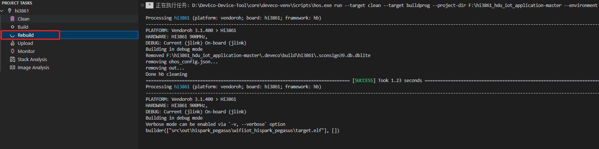

- 步骤五：点击DevEco Device Tool工具“Upload”按键，等待提示（出现Connecting，please reset device...），手动进行开发板复位（按下开发板reset键），将程序烧录到开发板中。具体烧录步骤参考“2.6章节 代码烧录”。

  

### 4.2.5 实验结果

* 软件烧录成功后，使用串口工具连接好M1的串口（<font color='RedOrange'>**注意：这里以sscom为例，该工具需要自己百度下载，也可以使用Monitor工具，参考“2.7 章节 Monitor串口打印”**</font>)，按一下开发板的RESET按键复位开发板，烧录完成后，调节电位器模块可以看到电压值和占空比的变化。

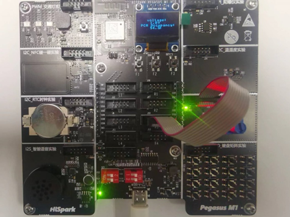

### 4.2.6 扩展实验

* 本实验学习了通过使用主芯片的ADC功能，实现对红外对管的驱动，请学生做如下实验：

  * 1.同时将三个灯，通过旋钮调亮或者变暗。
  * 2.通过旋钮控制蜂鸣器的频率，发送不同的声音。

## 4.3 键盘输入与显示输出实验

## 4.3.1 实验目的

本实验内容：在使用矩阵键盘实现简易计算器效果，通过在矩阵键盘上按键输入数字的加减乘除，把运算结果输出到OLED显示屏上显示。 

### 4.3.2 实验要求

1.软件要求：VSCode，hi3861_hdu_iot_application(如果采用zip包下载，SDK名称为hi3861_hdu_iot_application-master，如果采用git下载SDK名称为hi3861_hdu_iot_application，此处以采用git下载为例）；

2.硬件要求：微处理器一体化板；接线：R4-R4。硬件要求如下图所示。

 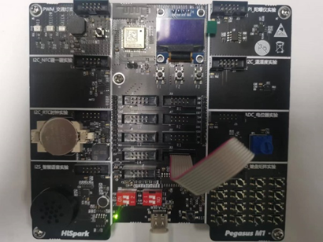

3.矩阵键盘在外设扩展板上的连线如下：

行：矩阵键盘上的R1、R2、R3、R4依次连接外设扩展板p19上的IO06、IO07、IO08、IO09;

列：矩阵键盘上的C1、C2、C3、C4依次连接外设扩展板p19上的IO00、IO01、IO02、IO10；

|        | GPIO 0 | GPIO 1 | GPIO 2 | GPIO 10 |
| ------ | ------ | ------ | ------ | ------- |
| GPIO 6 | +      | -      | *      | /       |
| GPIO 7 | 1      | 2      | 3      | C       |
| GPIO 8 | 4      | 5      | 6      | 0       |
| GPIO 9 | 7      | 8      | 9      | =       |

### 4.3.3 接口说明

#### 4.3.3.1 IoTGpioInit()

| **定义：**   | unsigned   int IoTGpioInit(unsigned int id);              |
| ------------ | --------------------------------------------------------- |
| **功能：**   | 初始化指定的IO                                            |
| **参数：**   | id:指定的IO号                                             |
| **返回值：** | IOT_SUCCESS：初始化成功    <br/>IOT_FAILURE:初始化失败    |
| **依赖：**   | //base/iot_hardware/peripheral/interfaces/kits/iot_gpio.h |

#### 4.3.3.2 IoSetFunc()

| **定义：**   | unsigned   int IoSetFunc(unsigned int id, unsigned char val); |
| ------------ | ------------------------------------------------------------ |
| **功能：**   | 配置指定IO的复用功能                                         |
| **参数：**   | id:指定的IO号    <br/>val:配置的复用功能                     |
| **返回值：** | IOT_SUCCESS：配置成功    <br/>IOT_FAILURE:配置失败           |
| **依赖：**   | ./iot_gpio_ex.h                                              |

#### 4.3.3.3 IoTGpioSetDir()

| **定义：**   | unsigned   int IoTGpioSetDir(unsigned int id, IotGpioDir dir); |
| ------------ | ------------------------------------------------------------ |
| **功能：**   | 设置指定IO的管脚方向                                         |
| **参数：**   | id:指定的IO号     <br/>dir:GPIO管脚方向(IOT_GPIO_DIR_IN、IOT_GPIO_DIR_OUT) |
| **返回值：** | IOT_SUCCESS：设置成功    <br/>IOT_FAILURE：设置失败          |
| **依赖：**   | //base/iot_hardware/peripheral/interfaces/kits/iot_gpio.h    |

#### 4.3.3.4 IoTGpioSetOutputVal()

| **定义：**   | unsigned   int IoTGpioSetOutputVal(unsigned int id, IotGpioValue val); |
| ------------ | ------------------------------------------------------------ |
| **功能：**   | 设置指定IO的输出电平                                         |
| **参数：**   | id:指定的IO号     <br/>val:GPIO管脚的输出电平（IOT_GPIO_VALUE0、IOT_GPIO_VALUE1） |
| **返回值：** | IOT_SUCCESS：设置成功    <br/>IOT_FAILURE：设置失败          |
| **依赖：**   | //base/iot_hardware/peripheral/interfaces/kits/iot_gpio.h    |

### 4.3.4 实验流程

* 步骤一：hi3861_hdu_iot_application/src/vendor/hisilicon/hispark_pegasus/demo/MatrixKeyboard_demo文件夹复制到hi3861_hdu_iot_application/src/applications/sample/wifi-iot/app/目录下。

* 步骤二：修改applications/sample/wifi-iot/app/目录下的BUILD.gn，在features字段中添加MatrixKeyboard_demo:matrix_keyboard。注：第一个MatrixKeyboard_demo指的是需要编译的工程目录，第二个matrix_keyboard指的是applications/sample/wifi-iot/app/MatrixKeyboard_demo/BUILD.gn文件中的静态库，名称为matrix_keyboard。

```c
import("//build/lite/config/component/lite_component.gni")
lite_component("app") {
  features = [ "MatrixKeyboard_demo:matrix_keyboard", ]
}
```

* 步骤三：矩阵键盘原理：阵键盘本质是使用8个io口来进行16个按键的控制读取，可以减小io口的使用，用4条I/O线作为行线，4条I/O线作为列线组成的键盘。在行线和列线的每个交叉点上，设置一个按键。而这样的按键中按键的个数是4 X 4个。


```
1  /*
2   * Copyright (c) 2022 HiSilicon (Shanghai) Technologies CO., LIMITED.
3   * Licensed under the Apache License, Version 2.0 (the "License");
4   * you may not use this file except in compliance with the License.
5   * You may obtain a copy of the License at
6   *
7   *     http://www.apache.org/licenses/LICENSE-2.0
8   *
9   * Unless required by applicable law or agreed to in writing, software
10  * distributed under the License is distributed on an "AS IS" BASIS,
11  * WITHOUT WARRANTIES OR CONDITIONS OF ANY KIND, either express or implied.
12  * See the License for the specific language governing permissions and
13  * limitations under the License.
14  */
15 
16 #include <stdlib.h>
17 #include <stdio.h>
18 #include <hi_io.h>
19 #include <hi_gpio.h>
20 #include <hi_task.h>
21 #include <hi_time.h>
22 #include <hi_early_debug.h>
23 #include <math.h>
24 #include <ohos_init.h>
25 #include <cmsis_os2.h>
26 #include "iot_gpio.h"
27 #include "iot_gpio_ex.h"
28 #include "ssd1306.h"
29 #include "iot_i2c.h"
30 
31 #define ROW         (1)
32 #define COLUMN      (2)
33 #define MAX_SUM      (10)
34 #define IOT_I2C_IDX_BAUDRATE (400 * 1000)
35 #define SSD1306_I2C_IDX 0
36 
37 static unsigned int num_count = 0;
38 unsigned int  sum = 0;
39 unsigned int sum_count = 0;
40 unsigned int sum_count_2 = 0;
41 unsigned int cnt_sum_1 = 0;
42 char display_char[30] = { 0 }; // 30代表大小
43 unsigned int cnt_sum_2 = 0;
44 unsigned int cnt_sum_3 = 0;
45 unsigned char multiply = 0;
46 unsigned char divide = 0;
47 unsigned int addition = 0;
48 
49 /* 行 */
50 IotGpioValue gpio_6_val = IOT_GPIO_VALUE0, gpio_7_val = IOT_GPIO_VALUE0;
51 IotGpioValue gpio_8_val = IOT_GPIO_VALUE0, gpio_9_val = IOT_GPIO_VALUE0;
52 /* 列 */
53 IotGpioValue gpio_0_val = IOT_GPIO_VALUE0, gpio_1_val = IOT_GPIO_VALUE0;
54 IotGpioValue gpio_2_val = IOT_GPIO_VALUE0, gpio_10_val = IOT_GPIO_VALUE0;
55 
56 unsigned char l = 0, h = 0;
57 
58 const unsigned char headSize[] = {64, 64};
59 
60 /**
61  * 汉字字模在线： https://www.23bei.com/tool-223.html
62  * 数据排列：从左到右从上到下
63  * 取模方式：横向8位左高位
64  * 字体总类：[HZK1212宋体]
65 **/
66 void TempHumChinese(void)
67 {
68     const uint32_t W = 16;
69     uint8_t fonts[][32] = {
70         {
71             /* -- ID:0,字符:"计",ASCII编码:BCC6,对应字:宽x高=16x16,画布:宽W=16 高H=16,共32字节 */
72             0x00, 0x40, 0x20, 0x40, 0x10, 0x40, 0x10, 0x40, 0x00, 0x40, 0x00, 0x44, 0xF7, 0xFE, 0x10, 0x40,
73             0x10, 0x40, 0x10, 0x40, 0x10, 0x40, 0x12, 0x40, 0x14, 0x40, 0x18, 0x40, 0x10, 0x40, 0x00, 0x40,
74         }, {
75             /* -- ID:1,字符:"算",ASCII编码:CBE3,对应字:宽x高=16x16,画布:宽W=16 高H=16,共32字节 */
76             0x20, 0x80, 0x3E, 0xFC, 0x49, 0x20, 0x9F, 0xF0, 0x10, 0x10, 0x1F, 0xF0, 0x10, 0x10, 0x1F, 0xF0,
77             0x10, 0x10, 0x1F, 0xF0, 0x08, 0x24, 0xFF, 0xFE, 0x08, 0x20, 0x08, 0x20, 0x10, 0x20, 0x20, 0x20,
78         }, {
79             /* -- ID:2,字符:"器",ASCII编码:C6F7,对应字:宽x高=16x16,画布:宽W=16 高H=16,共32字节 */
80             0x3E, 0xF8, 0x22, 0x88, 0x22, 0x88, 0x22, 0x88, 0x3E, 0xF8, 0x01, 0x20, 0x01, 0x14, 0xFF, 0xFE,
81             0x02, 0x80, 0x0C, 0x60, 0x30, 0x18, 0xFE, 0xFE, 0x22, 0x88, 0x22, 0x88, 0x22, 0x88, 0x3E, 0xF8
82         }
83     };
84     for (size_t i = 0; i < sizeof(fonts) / sizeof(fonts[0]); i++) {
85         ssd1306_DrawRegion((i + 1) * W, 0, W, fonts[i], sizeof(fonts[0])); // x轴坐标i + 2*w，y轴坐标3，宽度为16
86     }
87     ssd1306_UpdateScreen();
88 }
89 
90 void keyboard_gpio_config(unsigned char mode)
91 {
92     IoSetFunc(IOT_IO_NAME_GPIO_6, IOT_IO_FUNC_GPIO_6_GPIO);
93     IoSetFunc(IOT_IO_NAME_GPIO_7, IOT_IO_FUNC_GPIO_7_GPIO);
94     IoSetFunc(IOT_IO_NAME_GPIO_8, IOT_IO_FUNC_GPIO_8_GPIO);
95     IoSetFunc(IOT_IO_NAME_GPIO_9, IOT_IO_FUNC_GPIO_9_GPIO);
96 
97     IoSetFunc(IOT_IO_NAME_GPIO_0, IOT_IO_FUNC_GPIO_0_GPIO);
98     IoSetFunc(IOT_IO_NAME_GPIO_1, IOT_IO_FUNC_GPIO_1_GPIO);
99     IoSetFunc(IOT_IO_NAME_GPIO_2, IOT_IO_FUNC_GPIO_2_GPIO);
100    IoSetFunc(IOT_IO_NAME_GPIO_10, IOT_IO_FUNC_GPIO_10_GPIO);
101    /* 初始化行输入，列输出 */
102    if (mode == HI_TRUE) {
103        IoTGpioSetDir(IOT_IO_NAME_GPIO_6, IOT_GPIO_DIR_IN);
104        IoTGpioSetDir(IOT_IO_NAME_GPIO_7, IOT_GPIO_DIR_IN);
105        IoTGpioSetDir(IOT_IO_NAME_GPIO_8, IOT_GPIO_DIR_IN);
106        IoTGpioSetDir(IOT_IO_NAME_GPIO_9, IOT_GPIO_DIR_IN);
107
108        IoTGpioSetDir(IOT_IO_NAME_GPIO_0, HI_GPIO_DIR_OUT);
109        IoTGpioSetDir(IOT_IO_NAME_GPIO_1, HI_GPIO_DIR_OUT);
110        IoTGpioSetDir(IOT_IO_NAME_GPIO_2, HI_GPIO_DIR_OUT);
111        IoTGpioSetDir(IOT_IO_NAME_GPIO_10, HI_GPIO_DIR_OUT);
112    } else {
113        IoTGpioSetDir(IOT_IO_NAME_GPIO_6, HI_GPIO_DIR_OUT);
114        IoTGpioSetDir(IOT_IO_NAME_GPIO_7, HI_GPIO_DIR_OUT);
115        IoTGpioSetDir(IOT_IO_NAME_GPIO_8, HI_GPIO_DIR_OUT);
116        IoTGpioSetDir(IOT_IO_NAME_GPIO_9, HI_GPIO_DIR_OUT);
117
118        IoTGpioSetDir(IOT_IO_NAME_GPIO_0, IOT_GPIO_DIR_IN);
119        IoTGpioSetDir(IOT_IO_NAME_GPIO_1, IOT_GPIO_DIR_IN);
120        IoTGpioSetDir(IOT_IO_NAME_GPIO_2, IOT_GPIO_DIR_IN);
121        IoTGpioSetDir(IOT_IO_NAME_GPIO_10, IOT_GPIO_DIR_IN);
122    }
123}
124void gpio_init(void)
125{
126    IoTGpioSetOutputVal(IOT_IO_NAME_GPIO_6, IOT_GPIO_VALUE0);
127    IoTGpioSetOutputVal(IOT_IO_NAME_GPIO_7, IOT_GPIO_VALUE0);
128    IoTGpioSetOutputVal(IOT_IO_NAME_GPIO_8, IOT_GPIO_VALUE0);
129    IoTGpioSetOutputVal(IOT_IO_NAME_GPIO_9, IOT_GPIO_VALUE0);
130    
131    IoTGpioSetOutputVal(IOT_IO_NAME_GPIO_0,  IOT_GPIO_VALUE0);
132    IoTGpioSetOutputVal(IOT_IO_NAME_GPIO_1,  IOT_GPIO_VALUE0);
133    IoTGpioSetOutputVal(IOT_IO_NAME_GPIO_2,  IOT_GPIO_VALUE0);
134    IoTGpioSetOutputVal(IOT_IO_NAME_GPIO_10, IOT_GPIO_VALUE0);
135}
136/* 行扫描 */
137void row_scan_output(void)
138{
139    // 行输出置低
140    IoTGpioSetOutputVal(IOT_IO_NAME_GPIO_6, IOT_GPIO_VALUE0);
141    IoTGpioSetOutputVal(IOT_IO_NAME_GPIO_7, IOT_GPIO_VALUE0);
142    IoTGpioSetOutputVal(IOT_IO_NAME_GPIO_8, IOT_GPIO_VALUE0);
143    IoTGpioSetOutputVal(IOT_IO_NAME_GPIO_9, IOT_GPIO_VALUE0);
144    
145    // 列输出置高
146    IoTGpioSetOutputVal(IOT_IO_NAME_GPIO_0,  IOT_GPIO_VALUE1);
147    IoTGpioSetOutputVal(IOT_IO_NAME_GPIO_1,  IOT_GPIO_VALUE1);
148    IoTGpioSetOutputVal(IOT_IO_NAME_GPIO_2,  IOT_GPIO_VALUE1);
149    IoTGpioSetOutputVal(IOT_IO_NAME_GPIO_10, IOT_GPIO_VALUE1);
150}
151/* 列扫描 */
152void column_scan_output (void)
153{
154    // 行输出置高
155    IoTGpioSetOutputVal(IOT_IO_NAME_GPIO_6, IOT_GPIO_VALUE1);
156    IoTGpioSetOutputVal(IOT_IO_NAME_GPIO_7, IOT_GPIO_VALUE1);
157    IoTGpioSetOutputVal(IOT_IO_NAME_GPIO_8, IOT_GPIO_VALUE1);
158    IoTGpioSetOutputVal(IOT_IO_NAME_GPIO_9, IOT_GPIO_VALUE1);
159
160    // 二次扫描 列输出置低
161    IoTGpioSetOutputVal(IOT_IO_NAME_GPIO_0,  IOT_GPIO_VALUE0);
162    IoTGpioSetOutputVal(IOT_IO_NAME_GPIO_1,  IOT_GPIO_VALUE0);
163    IoTGpioSetOutputVal(IOT_IO_NAME_GPIO_2,  IOT_GPIO_VALUE0);
164    IoTGpioSetOutputVal(IOT_IO_NAME_GPIO_10, IOT_GPIO_VALUE0);
165}
166void get_gpio_input_value(IotGpioValue* val_1, IotGpioValue* val_2, IotGpioValue* val_3,
167                          IotGpioValue* val_4, unsigned char row_column_flag)
168{
169    if (row_column_flag == ROW) {
170        IoTGpioGetInputVal(IOT_IO_NAME_GPIO_6, val_1);
171        IoTGpioGetInputVal(IOT_IO_NAME_GPIO_7, val_2);
172        IoTGpioGetInputVal(IOT_IO_NAME_GPIO_8, val_3);
173        IoTGpioGetInputVal(IOT_IO_NAME_GPIO_9, val_4);
174    }
175    if (row_column_flag == COLUMN) {
176        IoTGpioGetInputVal(IOT_IO_NAME_GPIO_0, val_1);
177        IoTGpioGetInputVal(IOT_IO_NAME_GPIO_1, val_2);
178        IoTGpioGetInputVal(IOT_IO_NAME_GPIO_2, val_3);
179        IoTGpioGetInputVal(IOT_IO_NAME_GPIO_10, val_4);
180    }
181}
182/* 行扫描 */
183void key_press_line_scan(void)
184{
185    if ((gpio_6_val == 1) || (gpio_7_val == 1) || (gpio_8_val == 1) || (gpio_9_val == 1)) { // 检测按下的按键所在行
186        if (gpio_6_val && !gpio_7_val && !gpio_8_val && !gpio_9_val) { // 返回行值
187            h = 1;
188        }
189        if (gpio_7_val && !gpio_6_val && !gpio_8_val && !gpio_9_val) {
190            h = 2; // 代表行按键第2个被按下
191        }
192        if (gpio_8_val && !gpio_6_val && !gpio_7_val && !gpio_9_val) {
193            h = 3; // 代表行按键第3个被按下
194        }
195        if (gpio_9_val && !gpio_6_val && !gpio_7_val && !gpio_8_val) {
196            h = 4; // 代表行按键第4个被按下
197        }
198    } else if (gpio_6_val==0 && gpio_7_val==0 && gpio_8_val==0 && gpio_9_val==0) { // 无按键按下
199        h = 0;
200    }
201}
202/* 列扫描 */
203void key_press_column_scan(void)
204{
205    if ((gpio_0_val==1) || (gpio_1_val==1) || (gpio_2_val==1) || (gpio_10_val==1)) { // 检测按下的按键所在列
206        /* 第一行 */
207        if ((gpio_0_val == 1) && (h == 1)) {
208            l = '+';
209        } else if ((gpio_1_val == 1) && (h == 1)) {
210            l = '-';
211        } else if ((gpio_2_val == 1) && (h == 1)) {
212            l = '*';
213        } else if ((gpio_10_val == 1) && (h == 1)) {
214            l = '/';
215        } else if ((gpio_0_val == 1) && (h == 2)) {  /* 第二行  2*/
216            l = 1;
217        } else if ((gpio_1_val == 1) && (h == 2)) { // 第2行
218            l = 2; // 代表行按键第2个被按下
219        } else if ((gpio_2_val == 1) && (h == 2)) { // 第2行
220            l = 3; // 代表行按键3被按下
221        } else if ((gpio_10_val == 1) && (h == 2)) { // 第2行
222            l = 'C';
223        } else if ((gpio_0_val == 1) && (h == 3)) { /* 第3行 */
224            l = 4; // 代表行按键4被按下
225        } else if ((gpio_1_val == 1) && (h == 3)) { /* 第3行 */
226            l = 5; // 代表行按键5被按下
227        } else if ((gpio_2_val == 1) && (h ==3)) { /* 第3行 */
228            l = 6; // 代表行按键6被按下
229        } else if ((gpio_10_val == 1) && (h == 3)) { /* 第3行 */
230            l = '0';
231        } else if ((gpio_0_val == 1) && (h == 4) && (gpio_6_val != 1)) { /* 第3行 */
232            l = 7; // 代表行按键7被按下
233        } else if ((gpio_1_val == 1) && (h == 4) && (gpio_7_val != 1)) { /* 第3行 */
234            l = 8; // 代表行按键8被按下
235        } else if ((gpio_2_val == 1) && (h == 4) && (gpio_8_val != 1)) { /* 第3行 */
236            l = 9; // 代表行按键9被按下
237        } else if ((gpio_10_val == 1) && (h == 4)) { /* 第3行 */
238            l = '=';
239        }
240    }
241}
242
243// 数字结果
244void num_scan_results(void)
245{
246    int ret = 0;
247    if (num_count < 9) { // 最多9位数字
248        if (l == '0') {
249            l = l - 0x30; // 0x30代表变为字符0
250        }
251        if (sum_count == 0) {
252            sum = sum * 10 + l; // 10代表转换为数字
253            cnt_sum_1 = sum;
254            ret = snprintf_s(display_char, sizeof(display_char), sizeof(display_char), "%u", cnt_sum_1);
255            if (ret == 0) {
256                printf("cnt_sum_1 failed\r\n");
257            }
258            ssd1306_SetCursor(120 - (7 * strlen(display_char)), 20); // x轴坐标为120 - 7 * i，y轴坐标为20
259            ssd1306_DrawString(display_char, Font_7x10, White);
260        } else {
261            cnt_sum_2 = cnt_sum_2 * 10 + l; // 10代表转换为数字
262            ret = snprintf_s(display_char, sizeof(display_char), sizeof(display_char), "%u", cnt_sum_2);
263            if (ret == 0) {
264                printf("cnt_sum_2 failed\r\n");
265            }
266            ssd1306_SetCursor(120 - (7 * strlen(display_char)), 40); // x轴坐标为120 - 7 * i，y轴坐标为40
267            ssd1306_DrawString(display_char, Font_7x10, White);
268        }
269        ssd1306_UpdateScreen();
270        num_count++;
271        if (num_count > MAX_SUM) {
272            num_count = 0;
273        }
274    }
275}
276
277// 运算符
278void operator_scan_results(void)
279{
280    /* 加法 */
281    if (l == '+') {
282        ssd1306_SetCursor(110, 30); // x轴坐标为110，y轴坐标为30
283        ssd1306_DrawString("+", Font_7x10, White);
284        num_count = 0;
285        sum_count = 1;
286        addition = 1;
287    } else if ((l == '-')) {  /* 减法 */
288        ssd1306_SetCursor(110, 30); //  x轴坐标为110，y轴坐标为30
289        ssd1306_DrawString("-", Font_7x10, White);
290        num_count = 0;
291        sum_count = 1;
292        sum_count_2 = 1;
293    } else if (l == '*') { /* 乘法 */
294        ssd1306_SetCursor(110, 30); // x轴坐标为110，y轴坐标为30
295        ssd1306_DrawString("*", Font_7x10, White);
296        num_count = 0;
297        sum_count = 1;
298        multiply = 1;
299    } else if (l == '/') { /* 除法 */
300        ssd1306_SetCursor(110, 30); // x轴坐标为110，y轴坐标为30
301        ssd1306_DrawString("/", Font_7x10, White);
302        num_count = 0;
303        sum_count = 1;
304        divide = 1;
305    }
306}
307
308void Calculation_results(void)
309{
310    int ret = 0;
311    /* 加法结果 */
312    if ((l == '=') && (addition == 1)) {
313        sum_count = 0;
314        addition = 0;
315        cnt_sum_3 = cnt_sum_1 + cnt_sum_2;
316        ret = snprintf_s(display_char, sizeof(display_char), sizeof(display_char), "= %u", cnt_sum_3);
317        if (ret == 0) {
318            printf("cnt_sum_3 failed\r\n");
319        }
320        ssd1306_SetCursor(120 - (7 * strlen(display_char)), 50); // x轴坐标为120 - (7 * strlen(cnt_sum_3))，y轴坐标为50
321        ssd1306_DrawString(display_char, Font_7x10, White);
322    }
323    /* 减法结果 */
324    if ((l == '=') && (sum_count_2 == 1)) {
325        sum_count = 0;
326        sum_count_2 = 0;
327        cnt_sum_3 = cnt_sum_1 - cnt_sum_2;
328        ret = snprintf_s(display_char, sizeof(display_char), sizeof(display_char), "= %u", cnt_sum_3);
329        if (ret == 0) {
330            printf("cnt_sum_3 failed\r\n");
331        }
332        ssd1306_SetCursor(120 - (7 * strlen(display_char)), 50); // x轴坐标为120 - (7 * strlen(cnt_sum_3))，y轴坐标为50
333        ssd1306_DrawString(display_char, Font_7x10, White);
334    }
335    /* 乘法结果 */
336    if ((l == '=') && (multiply == 1)) {
337        sum_count = 0;
338        multiply = 0;
339        cnt_sum_3 = cnt_sum_1 * cnt_sum_2;
340        ret = snprintf_s(display_char, sizeof(display_char), sizeof(display_char), "= %u", cnt_sum_3);
341        if (ret == 0) {
342            printf("cnt_sum_3 failed\r\n");
343        }
344        ssd1306_SetCursor(120 - (7 * strlen(display_char)), 50); // x轴坐标为120 - (7 * strlen(cnt_sum_3))，y轴坐标为50
345        ssd1306_DrawString(display_char, Font_7x10, White);
346    }
347    /* 除法结果 */
348    if ((l == '=') && (divide == 1)) {
349        sum_count = 0;
350        divide = 0;
351        float float_sum = (float)cnt_sum_1 / (float)cnt_sum_2;
352        ret = snprintf_s(display_char, sizeof(display_char), sizeof(display_char), "= %f", float_sum);
353        if (ret == 0) {
354            printf("cnt_sum_3 failed\r\n");
355        }
356        ssd1306_SetCursor(120 - (7 * strlen(display_char)), 50); // x轴坐标为120 - (7 * strlen(cnt_sum_3))，y轴坐标为50
357        ssd1306_DrawString(display_char, Font_7x10, White);
358    }
359}
360
361/* 行列扫描结果 */
362void row_column_scan_results(void)
363{
364    if (l > 0) {
365        if ((l != '*') && (l != 'C') && (l != '+') && (l != '-') && (l != '/') && (l != '=')) {
366            num_scan_results();
367        } else {
368            operator_scan_results();
369            Calculation_results();
370            if (l == 'C') {
371                sum = 0;
372                cnt_sum_1 = 0;
373                cnt_sum_2 = 0;
374                cnt_sum_3 = 0;
375                num_count = 0;
376                sum_count = 0;
377                divide = 0;
378                addition = 0;
379                ssd1306_ClearOLED();
380                TempHumChinese();
381            }
382        }
383        ssd1306_UpdateScreen();
384    }
385}
386
387void OledFGpioInit(void)
388{
389    /*
390     * 初始化I2C设备0，并指定波特率为400k
391     * Initialize I2C device 0 and specify the baud rate as 400k
392     */
393    IoTI2cInit(SSD1306_I2C_IDX, IOT_I2C_IDX_BAUDRATE);
394    /*
395     * 设置I2C设备0的波特率为400k
396     * Set the baud rate of I2C device 0 to 400k
397     */
398    IoTI2cSetBaudrate(SSD1306_I2C_IDX, IOT_I2C_IDX_BAUDRATE);
399    /*
400     * 设置GPIO13的管脚复用关系为I2C0_SDA
401     * Set the pin reuse relationship of GPIO13 to I2C0_ SDA
402     */
403    IoSetFunc(IOT_IO_NAME_GPIO_13, IOT_IO_FUNC_GPIO_13_I2C0_SDA);
404    /*
405     * 设置GPIO14的管脚复用关系为I2C0_SCL
406     * Set the pin reuse relationship of GPIO14 to I2C0_ SCL
407     */
408    IoSetFunc(IOT_IO_NAME_GPIO_14, IOT_IO_FUNC_GPIO_14_I2C0_SCL);
409    ssd1306_Init();
410    ssd1306_ClearOLED();
411}
412
413void key_scan(void)
414{
415    OledFGpioInit();
416    TempHumChinese();
417    while (1) {
418        /* 行 */
419        gpio_6_val = IOT_GPIO_VALUE0, gpio_7_val = IOT_GPIO_VALUE0;
420        gpio_8_val = IOT_GPIO_VALUE0, gpio_9_val = IOT_GPIO_VALUE0;
421        /* 列 */
422        gpio_0_val = IOT_GPIO_VALUE0, gpio_1_val = IOT_GPIO_VALUE0;
423        gpio_2_val = IOT_GPIO_VALUE0, gpio_10_val = IOT_GPIO_VALUE0;
424        l = 0, h = 0;
425        // 支持连按
426        /* gpio init */
427        gpio_init();
428        /* row output/input init */
429        keyboard_gpio_config(HI_TRUE);
430        /* 行扫描 */
431        TaskMsleep(20); // 延时20ms，去抖动
432        row_scan_output();
433        /* 获取按键按下的每行的值 */
434        get_gpio_input_value(&gpio_6_val, &gpio_7_val, &gpio_8_val, &gpio_9_val, ROW);
435        key_press_line_scan();
436        gpio_init();
437        /* row output/input init */
438        keyboard_gpio_config(HI_FALSE);
439        /* 列扫描 */
440        TaskMsleep(20); // 延时20ms，去抖动
441        column_scan_output();
442        /* 获取按键按下的每列的值 */
443        get_gpio_input_value(&gpio_0_val, &gpio_1_val, &gpio_2_val, &gpio_10_val, COLUMN);
444        key_press_column_scan();
445        row_column_scan_results();
446        TaskMsleep(100); // 延时100ms,循环读取
447    }
448}
449
450void keyboard_task(void)
451{
452    osThreadAttr_t attr;
453    IoTWatchDogDisable();
454    attr.name = "keyboardtask";
455    attr.attr_bits = 0U;
456    attr.cb_mem = NULL;
457    attr.cb_size = 0U;
458    attr.stack_mem = NULL;
459    attr.stack_size = 5 * 1024; // 任务栈大小为5 *1024
460    attr.priority = osPriorityNormal;
461    if (osThreadNew((osThreadFunc_t)key_scan, NULL, &attr) == NULL) {
462        printf("[keyboardtask] Failed to create BalanceTask!\n");
463    }
464}
465
466APP_FEATURE_INIT(keyboard_task);
```

- 步骤四：点击DevEco Device Tool工具“Rebuild”按键，具体编译步骤参考“2.5章节 编译运行”。


- 步骤五：点击DevEco Device Tool工具“Upload”按键，等待提示（出现Connecting，please reset device...），手动进行开发板复位（按下开发板reset键），将程序烧录到开发板中。具体烧录步骤参考“2.6章节 代码烧录”。

  

### 4.3.5 实验结果

* 软件烧录成功后，使用串口工具连接好M1的串口（<font color='RedOrange'>**注意：这里以sscom为例，该工具需要自己百度下载，也可以使用Monitor工具，参考“2.7 章节 Monitor串口打印”**</font>)，按一下开发板的RESET按键复位开发板，烧录完成后，调节电位器模块可以看到电压值和占空比的变化。

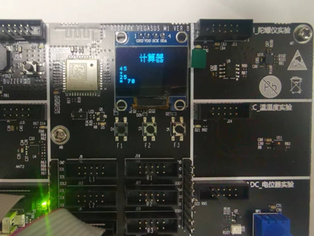

### 4.3.6 扩展实验

 * 1. 实现3级运算，即实现类似a+b*c、a-b/c等运算；

 * 2. 实现上一次运算得出结果后，接着输入数值进行运算，如第一次按键输出ab按下等号“=”后输出结果，接着第一次的运算结果，继续输入“+”、“d”（数值）、“=”，实现在第一次得到的运算结果的基础上加上“d”值，即实现ab+d的结果输出。
## 4.4 定时器与实时电子时钟实验

### 4.4.1 实验目的

​	实现定时器与实时电子时钟实验，单次软件定时器、周期软件计时器使用，使用RTC实时时钟制作“万年历”，断电后万年历自动更新。RTC 芯片手册（编号：C2924605，型号： INS5699S）获取：https://so.szlcsc.com/global.html?k=C2924605&hot-key=LM358DR2G，点击数据手册进行下载。

1.软件要求：VSCode，hi3861_hdu_iot_application(如果采用zip包下载，SDK名称为hi3861_hdu_iot_application-master，如果采用git下载SDK名称为hi3861_hdu_iot_application，此处以采用git下载为例）；

2.硬件要求：M1；接线：L3-L3。硬件搭建如下图所示。

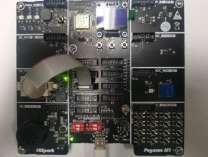

### 4.4.2 接口说明

#### 4.4.2.1 IoTI2cInit()

| **定义：**   | unsigned   int IoTI2cInit(unsigned int id, unsigned int baudrate); |
| ------------ | ------------------------------------------------------------ |
| **功能：**   | 以指定的波特率初始化I2C设备。                                |
| **参数：**   | id:I2C设备ID   <br/>baudrate：指定的I2C波特率                |
| **返回值：** | IOT_SUCCESS：初始化成功    IOT_FAILURE：初始化失败           |
| **依赖：**   | //base/iot_hardware/peripheral/interfaces/kits/iot_i2c.h     |

#### 4.4.2.2 IoTI2cDeinit()

| **定义：**   | unsigned   int IoTI2cDeinit(unsigned int id);            |
| ------------ | -------------------------------------------------------- |
| **功能：**   | 去初始化I2c设备                                          |
| **参数：**   | id：I2C设备ID                                            |
| **返回值：** | IOT_SUCCESS：去初始化成功    IOT_FAILURE：去初始化失败   |
| **依赖：**   | //base/iot_hardware/peripheral/interfaces/kits/iot_i2c.h |

#### 4.4.2.3 IoTI2cWrite()

| 定义：       | unsigned   int IoTI2cWrite(unsigned int id, unsigned short deviceAddr, <br/>const unsigned   char *data, unsigned int dataLen); |
| ------------ | ------------------------------------------------------------ |
| **功能：**   | 将数据写入I2C设备                                            |
| **参数：**   | id：I2C设备id   <br/>deviceAddr：I2C设备地址    <br/>data：指向要写入的数据的指针     <br/>dataLen：指向要写入的数据长度 |
| **返回值：** | IOT_SUCCESS：数据写入成功    IOT_FAILURE：数据写入失败       |
| **依赖：**   | //base/iot_hardware/peripheral/interfaces/kits/iot_i2c.h     |

#### 4.4.3.4 IoTI2cRead()

| **定义：**   | unsigned   int IoTI2cRead(unsigned int id, unsigned short deviceAddr, <br/>unsigned char   *data, unsigned int dataLen); |
| ------------ | ------------------------------------------------------------ |
| **功能：**   | 从I2C设备读取数据                                            |
| **参数：**   | id：I2C设备id       deviceAddr：I2C设备地址    <br/>data：表示指向要读取的数据的指针     dataLen：表示要读取的数据长度 |
| **返回值：** | IOT_SUCCESS：数据读取成功    IOT_FAILURE：数据读取失败       |
| **依赖：**   | //base/iot_hardware/peripheral/interfaces/kits/iot_i2c.h     |

#### 4.4.3.5 IoTI2cSetBaudrate()

| **定义：**   | unsigned   int IoTI2cSetBaudrate(unsigned int id, unsigned int baudrate); |
| ------------ | ------------------------------------------------------------ |
| **功能：**   | 设置I2C设备的波特率                                          |
| **参数：**   | id：I2C设备ID   <br/>baudrate：指定的I2C波特率口             |
| **返回值：** | IOT_SUCCESS：设置成功    IOT_FAILURE：设置失败               |
| **依赖：**   | //base/iot_hardware/peripheral/interfaces/kits/iot_i2c.h     |

### 4.4.4 实验流程

* 步骤一：hi3861_hdu_iot_application/src/vendor/hisilicon/hispark_pegasus/demo/rtc_demo文件夹复制到hi3861_hdu_iot_application/src/applications/sample/wifi-iot/app/目录下。

* 步骤二：修改applications/sample/wifi-iot/app/目录下的BUILD.gn，在features字段中添加rtc_demo:rtc_control。注：第一个rtc_demo指的是需要编译的工程目录，第二个rtc_control指的是applications/sample/wifi-iot/app/rtc_demo/BUILD.gn文件中的静态库，名称为rtc_control。

```
import("//build/lite/config/component/lite_component.gni")

lite_component("app") {
  features = [ "rtc_demo:rtc_control", ]
}
```

* 步骤三： 原理：先通过I2C设置RTC时间，在读取RTC寄存器，并将时间显示在屏幕上。

  ```
  1 /*
  2  * Copyright (c) 2022 HiSilicon (Shanghai) Technologies CO., LIMITED.
  3  * Licensed under the Apache License, Version 2.0 (the "License");
  4  * you may not use this file except in compliance with the License.
  5  * You may obtain a copy of the License at
  6  *
  7  *     http://www.apache.org/licenses/LICENSE-2.0
  8  *
  9  * Unless required by applicable law or agreed to in writing, software
  10  * distributed under the License is distributed on an "AS IS" BASIS,
  11  * WITHOUT WARRANTIES OR CONDITIONS OF ANY KIND, either express or implied.
  12  * See the License for the specific language governing permissions and
  13  * limitations under the License.
  14  */
  15 
  16 #include <stdio.h>
  17 #include <stdint.h>
  18 #include <string.h>
  19 #include <unistd.h>
  20 #include "ohos_init.h"
  21 #include "cmsis_os2.h"
  22 #include "iot_gpio.h"
  23 #include "iot_errno.h"
  24 #include "hi_errno.h"
  25 #include "hi_time.h"
  26 #include "ssd1306_fonts.h"
  27 #include "oled_ssd1306.h"
  28 #include "iot_gpio_ex.h"
  29 #include "iot_i2c.h"
  30 #include "app_demo_rtc.h"
  31 
  32 #define IOT_I2C_IDX_BAUDRATE (400 * 1000)
  33 #define INS5902_I2C_IDX      0
  34 #define DECIMA               10
  35 #define HEX                  16
  36 
  37 int second = 0;
  38 int minute = 0;
  39 int hour = 0;
  40 int day = 0;
  41 int date = 0;
  42 int month = 0;
  43 int year = 0;
  44 
  45 /* gpio init */
  46 void gpio_init(void)
  47 {
  48     // 设置GPIO13的管脚复用关系为I2C0_SDA Set the pin reuse relationship of GPIO13 to I2C0_ SDA
  49     IoSetFunc(IOT_IO_NAME_GPIO_13, IOT_IO_FUNC_GPIO_13_I2C0_SDA);
  50     // 设置GPIO14的管脚复用关系为I2C0_SCL Set the pin reuse relationship of GPIO14 to I2C0_ SCL
  51     IoSetFunc(IOT_IO_NAME_GPIO_14, IOT_IO_FUNC_GPIO_14_I2C0_SCL);
  52 }
  53 
  54 uint32_t ins5902_i2c_write(uint8_t reg_addr, uint8_t high_8, uint8_t low_8, uint8_t reg_len)
  55 {
  56     uint8_t temp1 = 0;
  57     uint8_t temp2 = 0;
  58     temp1 = (high_8 / DECIMA * HEX) + (high_8 % DECIMA); // Hexadecimal to BCD
  59     temp2 = (low_8 / DECIMA * HEX) + (low_8 % DECIMA); // Hexadecimal to BCD
  60     uint8_t buffer[3] = {reg_addr, temp1, temp2};
  61     uint32_t retval = IoTI2cWrite(INS5902_I2C_IDX, INS5902_WRITE_ADDRESS, buffer, reg_len);
  62     if (retval != IOT_SUCCESS) {
  63         printf("IoTI2cWrite(%02X) failed, %0X!\n", buffer[0], retval);
  64         return retval;
  65     }
  66     printf("IoTI2cWrite(%02X)\r\n", buffer[0]);
  67     return IOT_SUCCESS;
  68 }
  69 
  70 
  71 uint32_t ins5902_write(uint8_t reg_addr, uint8_t high_8)
  72 {
  73     uint8_t buffer[2] = {reg_addr, high_8};
  74     uint32_t buffLen = 2;
  75     uint32_t retval = IoTI2cWrite(INS5902_I2C_IDX, INS5902_WRITE_ADDRESS, buffer, buffLen);
  76     if (retval != IOT_SUCCESS) {
  77         printf("IoTI2cWrite(%02X) failed, %0X!\n", buffer[0], retval);
  78         return retval;
  79     }
  80     printf("IoTI2cWrite(%02X)\r\n", buffer[0]);
  81     return IOT_SUCCESS;
  82 }
  83 
  84 uint8_t ins5902_read(uint8_t rtc_reg, uint32_t recv_len, uint8_t *rct_buf)
  85 {
  86     // ins5902_rtc_type read_rtc;
  87     uint8_t recv_data[INS5902_REG_ARRAY_LEN] = { 0 };
  88     /* Request memory space */
  89     memset(rct_buf, 0x00, sizeof(rct_buf));
  90     memset(recv_data, 0x0, sizeof(recv_data));
  91 
  92     uint32_t status = IoTI2cRead(INS5902_I2C_IDX, INS5902_READ_ADDRESS, recv_data, recv_len);
  93     if (status != HI_ERR_SUCCESS) {
  94         printf("===== Error: ins5902 sencor I2C read status = 0x%x! =====\r\n", status);
  95         return status;
  96     }
  97     switch (rtc_reg) {
  98         case RTC_SECOND:
  99             rct_buf[0] = recv_data[0];
  100             break;
  101         case RTC_MINUTE:
  102             rct_buf[0] = recv_data[0];
  103             break;
  104         case RTC_HOUR:
  105             rct_buf[0] = recv_data[0];
  106             break;
  107         case RTC_DAY :
  108             rct_buf[0] = recv_data[0];
  109             break;
  110         case RTC_DATE:
  111             rct_buf[0] = recv_data[0];
  112             break;
  113         case RTC_MONTH:
  114             rct_buf[0] = recv_data[0];
  115             break;
  116         case RTC_YEAR:
  117             rct_buf[0] = recv_data[0];
  118             break;
  119         default:
  120             break;
  121     }
  122     return rct_buf[0];
  123 }
  124 /* rtc timer setting */
  125 void rct_set_init(void)
  126 {
  127     uint32_t ret;
  128     ins5902_rtc_type rct_time_set = { 0 };
  129     rct_time_set.rtc_second[0] = 30; // 30代表秒 30 represents seconds
  130     rct_time_set.rtc_minue[0] = 05; // 05代表分钟 05 for minutes
  131     rct_time_set.rtc_hour[0] = 17; // 17代表小时 17 represents hours
  132     rct_time_set.rtc_day[0] = 5; // 5代表周6 5 represents week 6
  133     rct_time_set.rtc_date[0] = 4; // 4代表号 4 Representative No
  134     rct_time_set.rtc_month[0] = 6; // 6代表月 6 representative months
  135     rct_time_set.rtc_year[0] = 22; // 22代表年 22 Representative year
  136     // set second
  137     ret = ins5902_i2c_write(RTC_SECOND, rct_time_set.rtc_second[0], NULL, SEND_SET_REG_LEN);
  138     if (ret != HI_ERR_SUCCESS) {
  139         printf("Failed to second cmd\r\n");
  140     }
  141     hi_udelay(DELAY_TIME);
  142     // set minute
  143     ret = ins5902_i2c_write(RTC_MINUTE, rct_time_set.rtc_minue[0], NULL, SEND_SET_REG_LEN);
  144     if (ret != HI_ERR_SUCCESS) {
  145         printf("Failed to minute cmd\r\n");
  146     }
  147     hi_udelay(DELAY_TIME);
  148     // set hour
  149     ret = ins5902_i2c_write(RTC_HOUR, rct_time_set.rtc_hour[0], NULL, SEND_SET_REG_LEN);
  150     if (ret != HI_ERR_SUCCESS) {
  151         printf("Failed to hour cmd\r\n");
  152     }
  153     hi_udelay(DELAY_TIME);
  154     // set day
  155     ret = ins5902_i2c_write(RTC_DAY, rct_time_set.rtc_day[0], NULL, SEND_SET_REG_LEN);
  156     if (ret != HI_ERR_SUCCESS) {
  157         printf("Failed to day cmd\r\n");
  158     }
  159     hi_udelay(DELAY_TIME);
  160     // set date
  161     ret = ins5902_i2c_write(RTC_DATE, rct_time_set.rtc_date[0], NULL, SEND_SET_REG_LEN);
  162     if (ret != HI_ERR_SUCCESS) {
  163         printf("Failed to date cmd\r\n");
  164     }
  165     hi_udelay(DELAY_TIME);
  166     // set month
  167     ret = ins5902_i2c_write(RTC_MONTH, rct_time_set.rtc_month[0], NULL, SEND_SET_REG_LEN);
  168     if (ret != HI_ERR_SUCCESS) {
  169         printf("Failed to month cmd\r\n");
  170     }
  171     hi_udelay(DELAY_TIME);
  172     // set year
  173     ret = ins5902_i2c_write(RTC_YEAR, rct_time_set.rtc_year[0], NULL, SEND_SET_REG_LEN);
  174     if (ret != HI_ERR_SUCCESS) {
  175         printf("Failed to year cmd\r\n");
  176     }
  177     hi_udelay(DELAY_TIME);
  178 }
  179 
  180 uint8_t GetWeek(uint8_t weekdata)
  181 {
  182     uint8_t res = 0;
  183     if (weekdata == 40) { // The read register value is 40, representing week 6
  184         res = 6;
  185     } else if (weekdata == 20) { // The read register value is 20, representing week 5
  186         res = 5;
  187     } else if (weekdata == 10) { // The read register value is 10, representing week 4
  188         res = 4;
  189     } else if (weekdata == 8) { // The read register value is 8, representing week 3
  190         res = 3;
  191     } else if (weekdata == 4) { // The read register value is 4, representing week 2
  192         res = 2;
  193     } else if (weekdata == 2) { // The read register value is 2, representing week 1
  194         res = 1;
  195     } else if (weekdata == 1) { // The read register value is 1, representing week 7
  196         res = 7;
  197     }
  198     return res;
  199 }
  200 
  201 void GetSecond(void)
  202 {
  203     uint8_t rct_read_data[RTC_REG_TIME_BUF] = { 0 };
  204     ins5902_rtc_type rtc_data = { 0 };
  205     static char line[SSD1306_LEN] = { 0 };
  206     ins5902_i2c_write(RTC_SECOND_REGISTER, NULL, NULL, SEND_READ_DATA_LEN);
  207     ins5902_read(RTC_SECOND, SEND_READ_DATA_LEN, rct_read_data);
  208     if (rtc_data.rtc_second[0] != rct_read_data[0]) {
  209         rtc_data.rtc_second[0] = rct_read_data[0];
  210         second = rct_read_data[0] / HEX * DECIMA + rct_read_data[0] % HEX;
  211         int ret = snprintf(line, sizeof(line), "%d", second);
  212         /* 需要显示的字符串长度为2和1 */
  213         /* The length of the string to be displayed is 2 and 1 */
  214         if (ret != 2 && ret != 1) {
  215             printf("failed\r\n");
  216         }
  217         if (second >= RTC_OLED_DATA) {
  218             /* 在OLED屏幕的第48列6行显示1行 */
  219             /* Display 1 row in the 48th column and 6 rows of the OLED screen */
  220             OledShowString(48, 6, line, 1);
  221         } else {
  222             OledShowString(48, 6, "0", 1); // Display 1 row in the 48th column and 6 rows of the OLED screen
  223             OledShowString(56, 6, line, 1); // Display 1 row in the 56th column and 6 rows of the OLED screen
  224         }
  225         OledShowString(64, 6, " ", 1); // Display 1 row in the 64th column and 6 rows of the OLED screen
  226     }
  227     TaskMsleep(DELAY_TIME);
  228 }
  229 
  230 void GetMinute(void)
  231 {
  232     uint8_t rct_read_data[RTC_REG_TIME_BUF] = { 0 };
  233     ins5902_rtc_type rtc_data = { 0 };
  234     static char line[SSD1306_LEN] = { 0 };
  235     ins5902_i2c_write(RTC_MINUTE_REGISTER, NULL, NULL, SEND_READ_DATA_LEN);
  236     ins5902_read(RTC_MINUTE, SEND_READ_DATA_LEN, rct_read_data);
  237     if (rtc_data.rtc_minue[0] != rct_read_data[0]) {
  238         rtc_data.rtc_minue[0] = rct_read_data[0];
  239         minute = rct_read_data[0] / HEX * DECIMA + rct_read_data[0] % HEX;
  240         int ret = snprintf(line, sizeof(line), "%d", minute);
  241         /* 需要显示的字符串长度为2和1 */
  242         /* The length of the string to be displayed is 2 and 1 */
  243         if (ret != 1 && ret != 2) {
  244             printf("failed\r\n");
  245         }
  246         if (minute >= RTC_OLED_DATA) {
  247             OledShowString(24, 6, line, 1); // Display 1 row in the 24th column and 6 rows of the OLED screen
  248             OledShowString(40, 6, ":", 1); // Display 1 row in the 40th column and 6 rows of the OLED screen
  249         } else {
  250             OledShowString(24, 6, "0", 1); // Display 1 row in the 24th column and 6 rows of the OLED screen
  251             OledShowString(32, 6, line, 1); // Display 1 row in the 32th column and 6 rows of the OLED screen
  252             OledShowString(40, 6, ":", 1); // Display 1 row in the 40th column and 6 rows of the OLED screen
  253         }
  254         OledShowString(56, 6, "0", 1); // Display 1 row in the 56th column and 6 rows of the OLED screen
  255     }
  256 }
  257 
  258 void GetHour(void)
  259 {
  260     uint8_t rct_read_data[RTC_REG_TIME_BUF] = { 0 };
  261     ins5902_rtc_type rtc_data = { 0 };
  262     static char line[SSD1306_LEN] = { 0 };
  263     ins5902_i2c_write(RTC_HOUR_REGISTER, NULL, NULL, SEND_READ_DATA_LEN);
  264     ins5902_read(RTC_HOUR, SEND_READ_DATA_LEN, rct_read_data);
  265     if (rtc_data.rtc_hour[0] != rct_read_data[0]) {
  266         rtc_data.rtc_hour[0] = rct_read_data[0];
  267         hour = rct_read_data[0] / HEX * DECIMA + rct_read_data[0] % HEX;
  268         int ret = snprintf(line, sizeof(line), "%d", hour);
  269         /* 需要显示的字符串长度为2和1 */
  270         /* The length of the string to be displayed is 2 and 1 */
  271         if (ret != 2 && ret != 1) {
  272             printf("failed\r\n");
  273         }
  274         if (hour >= RTC_OLED_DATA) {
  275             OledShowString(0, 6, line, 1); // Display 1 row in the 0th column and 6 rows of the OLED screen
  276             OledShowString(16, 6, ":", 1); // Display 1 row in the 16th column and 6 rows of the OLED screen
  277         } else {
  278             OledShowString(0, 6, "0", 1); // Display 1 row in the 0th column and 6 rows of the OLED screen
  279             OledShowString(8, 6, line, 1); // Display 1 row in the 8th column and 6 rows of the OLED screen
  280             OledShowString(16, 6, ":", 1); // Display 1 row in the 16th column and 6 rows of the OLED screen
  281         }
  282         OledShowString(64, 6, " ", 1); // Display 1 row in the 64th column and 6 rows of the OLED screen
  283     }
  284 }
  285 
  286 void GetDay(void)
  287 {
  288     uint8_t rct_read_data[RTC_REG_TIME_BUF] = { 0 };
  289     ins5902_rtc_type rtc_data = { 0 };
  290     static char line[SSD1306_LEN] = { 0 };
  291     ins5902_i2c_write(RTC_DAY_REGISTER, NULL, NULL, SEND_READ_DATA_LEN);
  292     ins5902_read(RTC_DAY, SEND_READ_DATA_LEN, rct_read_data);
  293     if (rtc_data.rtc_day[0] != rct_read_data[0]) {
  294         rtc_data.rtc_day[0] = rct_read_data[0];
  295         day = rct_read_data[0] / HEX * DECIMA + rct_read_data[0] % HEX;
  296         day = GetWeek(day);
  297         int ret = snprintf(line, sizeof(line), "%d", day);
  298         /* 需要显示的字符串长度为2和1 */
  299         /* The length of the string to be displayed is 2 and 1 */
  300         if (ret != 2 && ret != 1) {
  301             printf("failed\r\n");
  302         }
  303         OledShowString(72, 6, "week:", 1); // Display 1 row in the 72th column and 6 rows of the OLED screen
  304         OledShowString(112, 6, line, 1); // Display 1 row in the 112th column and 6 rows of the OLED screen
  305     }
  306 }
  307 
  308 void GetDate(void)
  309 {
  310     uint8_t rct_read_data[RTC_REG_TIME_BUF] = { 0 };
  311     ins5902_rtc_type rtc_data = { 0 };
  312     static char line[SSD1306_LEN] = { 0 };
  313     ins5902_i2c_write(RTC_DATE_REGISTER, NULL, NULL, SEND_READ_DATA_LEN);
  314     ins5902_read(RTC_DATE, SEND_READ_DATA_LEN, rct_read_data);
  315     if (rtc_data.rtc_date[0] != rct_read_data[0]) {
  316         rtc_data.rtc_date[0] = rct_read_data[0];
  317         date = rct_read_data[0] / HEX * DECIMA + rct_read_data[0] % HEX;
  318         int ret = snprintf(line, sizeof(line), "%d", date);
  319         /* 需要显示的字符串长度为2和1 */
  320         /* The length of the string to be displayed is 2 and 1 */
  321         if (ret != 2 && ret != 1) {
  322             printf("failed\r\n");
  323         }
  324         if (date >= RTC_OLED_DATA) {
  325             OledShowString(89, 4, line, 1); // Display 1 row in the 89th column and 4 rows of the OLED screen
  326         } else {
  327             OledShowString(89, 4, "0", 1); // Display 1 row in the 89th column and 4 rows of the OLED screen
  328             OledShowString(97, 4, line, 1); // Display 1 row in the 97th column and 4 rows of the OLED screen
  329         }
  330             OledShowString(105, 4, " ", 1); // Display 1 row in the 105th column and 4 rows of the OLED screen
  331     }
  332 }
  333 
  334 void GetMonth(void)
  335 {
  336     uint8_t rct_read_data[RTC_REG_TIME_BUF] = { 0 };
  337     ins5902_rtc_type rtc_data = { 0 };
  338     static char line[SSD1306_LEN] = { 0 };
  339     ins5902_i2c_write(RTC_MONTH_REGISTER, NULL, NULL, SEND_READ_DATA_LEN);
  340     ins5902_read(RTC_MONTH, SEND_READ_DATA_LEN, rct_read_data);
  341     if (rtc_data.rtc_month[0] != rct_read_data[0]) {
  342         rtc_data.rtc_month[0] = rct_read_data[0];
  343         month = rct_read_data[0] / HEX * DECIMA + rct_read_data[0] % HEX;
  344         int ret = snprintf(line, sizeof(line), "%d", month);
  345         /* 需要显示的字符串长度为2和1 */
  346         /* The length of the string to be displayed is 2 and 1 */
  347         if (ret != 2) {
  348             printf("failed\r\n");
  349         }
  350         if (month >= RTC_OLED_DATA) {
  351             OledShowString(65, 4, line, 1); // Display 1 row in the 65th column and 4 rows of the OLED screen
  352             OledShowString(81, 4, "-", 1); // Display 1 row in the 81th column and 4 rows of the OLED screen
  353         } else {
  354             OledShowString(65, 4, "0", 1); // Display 1 row in the 65th column and 4 rows of the OLED screen
  355             OledShowString(73, 4, line, 1); // Display 1 row in the 73th column and 4 rows of the OLED screen
  356             OledShowString(81, 4, "-", 1); // Display 1 row in the 81th column and 4 rows of the OLED screen
  357         }
  358     }
  359 }
  360 
  361 void GetYear(void)
  362 {
  363     uint8_t rct_read_data[RTC_REG_TIME_BUF] = { 0 };
  364     ins5902_rtc_type rtc_data = { 0 };
  365     static char line[SSD1306_LEN] = { 0 };
  366     ins5902_i2c_write(RTC_YEAR_REGISTER, NULL, NULL, SEND_READ_DATA_LEN);
  367     ins5902_read(RTC_YEAR, SEND_READ_DATA_LEN, rct_read_data);
  368     if (rtc_data.rtc_year[0] != rct_read_data[0]) {
  369         rtc_data.rtc_year[0] = rct_read_data[0];
  370         year = rct_read_data[0] / HEX * DECIMA + rct_read_data[0] % HEX;
  371         int ret = snprintf(line, sizeof(line), "%d", year);
  372         if (ret != 2) { // 需要显示的字符串长度为2
  373             printf("failed\r\n");
  374         }
  375         OledShowString(25, 4, "20", 1); // Display 1 row in the 25th column and 4 rows of the OLED screen
  376         OledShowString(41, 4, line, 1); // Display 1 row in the 41th column and 4 rows of the OLED screen
  377         OledShowString(57, 4, "-", 1); // Display 1 row in the 57th column and 4 rows of the OLED screen
  378         OledShowString(104, 4, " ", 1); // Display 1 row in the 104th column and 4 rows of the OLED screen
  379     }
  380 }
  381 
  382 /* read rtc time */
  383 void rtc_timer(void)
  384 {
  385     IoSetFunc(IOT_IO_NAME_GPIO_13, IOT_IO_FUNC_GPIO_13_I2C0_SDA);
  386     IoSetFunc(IOT_IO_NAME_GPIO_14, IOT_IO_FUNC_GPIO_14_I2C0_SCL);
  387     IoTI2cInit(INS5902_I2C_IDX, IOT_I2C_IDX_BAUDRATE);
  388     IoTI2cSetBaudrate(INS5902_I2C_IDX, IOT_I2C_IDX_BAUDRATE);
  389     /* ssd1306 config init */
  390     OledInit();
  391     OledFillScreen(0);
  392     rct_set_init(); // Set RTC initial time 1.第一次启动set time, 掉电后自动跑，请不要设置时间
  393     ins5902_write(BATTERY_REGISTER, BATTERY_SWITCH); // 开启电池
  394     while (1) {
  395         /*----------------------second--------------*/
  396         GetSecond();
  397         // /*----------------------minute--------------*/
  398         GetMinute();
  399         /*----------------------hour--------------*/
  400         GetHour();
  401         /*----------------------day-------------*/
  402         GetDay();
  403         /*----------------------date--------------*/
  404         GetDate();
  405         /*----------------------month--------------*/
  406         GetMonth();
  407         /*----------------------year--------------*/
  408         GetYear();
  409     }
  410 }
  411 
  412 static void RTCSampleEntry(void)
  413 {
  414     osThreadAttr_t attr;
  415 
  416     attr.name = "RTCTask";
  417     attr.attr_bits = 0U;
  418     attr.cb_mem = NULL;
  419     attr.cb_size = 0U;
  420     attr.stack_mem = NULL;
  421     attr.stack_size = INS5902_TASK_STAK_SIZE;
  422     attr.priority = INS5902_TASK_PRIORITY;
  423 
  424     if (osThreadNew((osThreadFunc_t)rtc_timer, NULL, &attr) == NULL) {
  425         printf("[LedExample] Failed to create LedTask!\n");
  426     }
  427 }
  428 
  429 APP_FEATURE_INIT(RTCSampleEntry);
  ```

- 步骤四：点击DevEco Device Tool工具“Rebuild”按键，具体编译步骤参考“2.5章节 编译运行”。

  

- 步骤五：点击DevEco Device Tool工具“Upload”按键，等待提示（出现Connecting，please reset device...），手动进行开发板复位（按下开发板reset键），将程序烧录到开发板中。具体烧录步骤参考“2.6章节 代码烧录”。

    

### 4.4.5 实验结果

* 软件烧录成功后，使用串口工具连接好M1的串口（<font color='RedOrange'>**注意：这里以sscom为例，该工具需要自己百度下载，也可以使用Monitor工具，参考“2.7 章节 Monitor串口打印”**</font>)，按一下开发板的RESET按键复位开发板，烧录完成后，OLED屏显示日历和时间，如下图所示。。

  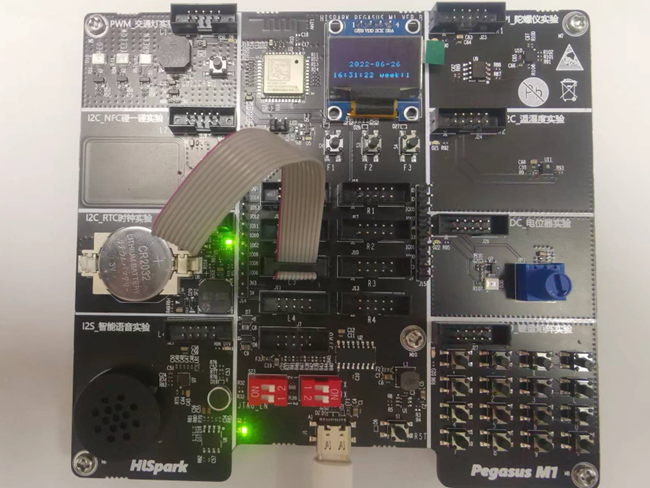

### 4.4.6 扩展实验

   * 1.学生可以使用周期性软件定时器，每隔一秒让LED灯闪烁一次，周而复始；

     2.学生可以使用RTC时钟模块+蜂鸣器模块，制作一个闹钟，比如早上8：00闹铃，晚上18：30闹铃。

## 4.5 交通灯控制系统设计实验

### 4.5.1 实验目的

实现三种交通灯模式，分别为Control Mode，Auto Mode和Human Mode。

Control Mode： 进入Traffic Light demo，初始状态就是Control Mode，是通过右边按键S2来控制红、黄、绿灯的亮灭状态不断切换。按键按下开启蜂鸣器；

Auto Mode： 当按下左键S1时，会从control mode跳到Auto mode，交通灯模式，模仿交通灯，红灯常亮5秒，然后闪烁3秒，后黄灯闪烁3秒，后绿灯常亮5秒，再是绿灯闪烁3秒，如此循环，蜂鸣器开启后会响。最后一行的R，Y，G后面的数字代表倒数的时间，动态显示，时间的单位是秒，R代表红灯，Y代表黄灯，G代表绿灯，B代表的是蜂鸣器，数字“1”代表蜂鸣器打开状态，数字“0”代表蜂鸣器关闭状态。

Human Mode： 当再次按下左键S1时，会从Auto mode跳到Human Mode模式，就是在Auto mode的基础上增加了人为控制，且红灯常亮改为30秒。模仿交通灯，红灯常亮30秒后闪烁3秒，黄灯闪烁3秒，然后绿灯常亮5秒，绿灯闪烁3秒，如此循环。如果按下右键S2，红灯立即快闪3秒，黄灯快闪3秒，进入绿灯常亮5秒，再绿灯闪烁3秒，后进入正常循环。蜂鸣器开启后会响。此时如果再按一下左键S1就会跳到Return Menu界面，选择按下Continue继续demo循环。

### 4.5.2 实验要求

1.软件要求：VSCode，hi3861_hdu_iot_application(如果采用zip包下载，SDK名称为hi3861_hdu_iot_application-master，如果采用git下载SDK名称为hi3861_hdu_iot_application，此处以采用git下载为例）；

2.硬件要求：微处理器一体化板；接线：L1-L1。硬件搭建要求如图所示。

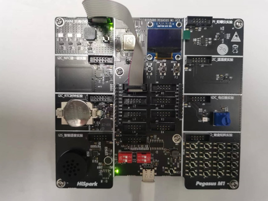

### 4.5.3 接口说明

#### 4.5.3.1 IoTGpioInit()

| **定义：**   | unsigned   int IoTGpioInit(unsigned int id);              |
| ------------ | --------------------------------------------------------- |
| **功能：**   | 初始化指定的IO                                            |
| **参数：**   | id:指定的IO号                                             |
| **返回值：** | IOT_SUCCESS：初始化成功    <br/>IOT_FAILURE:初始化失败    |
| **依赖：**   | //base/iot_hardware/peripheral/interfaces/kits/iot_gpio.h |

#### 4.5.3.2 IoSetFunc()

| **定义：**   | unsigned   int IoSetFunc(unsigned int id, unsigned char val); |
| ------------ | ------------------------------------------------------------ |
| **功能：**   | 配置指定IO的复用功能                                         |
| **参数：**   | id:指定的IO号    <br/>val:配置的复用功能                     |
| **返回值：** | IOT_SUCCESS：配置成功    <br/>IOT_FAILURE:配置失败           |
| **依赖：**   | ./iot_gpio_ex.h                                              |

#### 4.5.3.3 IoTGpioSetDir()

| **定义：**   | unsigned   int IoTGpioSetDir(unsigned int id, IotGpioDir dir); |
| ------------ | ------------------------------------------------------------ |
| **功能：**   | 设置指定IO的管脚方向                                         |
| **参数：**   | id:指定的IO号     <br/>dir:GPIO管脚方向(IOT_GPIO_DIR_IN、IOT_GPIO_DIR_OUT) |
| **返回值：** | IOT_SUCCESS：设置成功    <br/>IOT_FAILURE：设置失败          |
| **依赖：**   | //base/iot_hardware/peripheral/interfaces/kits/iot_gpio.h    |

#### 4.5.3.4 IoTGpioSetOutputVal()

| **定义：**   | unsigned   int IoTGpioSetOutputVal(unsigned int id, IotGpioValue val); |
| ------------ | ------------------------------------------------------------ |
| **功能：**   | 设置指定IO的输出电平                                         |
| **参数：**   | id:指定的IO号     <br/>val:GPIO管脚的输出电平（IOT_GPIO_VALUE0、IOT_GPIO_VALUE1） |
| **返回值：** | IOT_SUCCESS：设置成功    <br/>IOT_FAILURE：设置失败          |
| **依赖：**   | //base/iot_hardware/peripheral/interfaces/kits/iot_gpio.h    |

#### 4.5.3.5 osTimerNew ()

| **定义：** | osTimerId_t   osTimerNew (osTimerFunc_t func, osTimerType_t type, <br/>void *argument, const   osTimerAttr_t *attr); |
| ---------- | ------------------------------------------------------------ |
| **功能：** | 创建并初始化计时器                                           |
| **参数：** | func：指向回调函数的指针   <br/>type：osTimerOnce表示一次触发, osTimerPeriodic表示周期性行为   <br/>argument：计数器回调函数的参数    attr ：定时器属性；NULL：默认值 |
| **返回值** | 创建成功：返回定时器ID   创建失败：返回NULL                  |
| **依赖：** | //third_party/cmsis/CMSIS/RTOS2/Include/cmsis_os2.h          |

#### 4.5.3.6 osTimerGetName ()

| **定义：**   | const char   *osTimerGetName (osTimerId_t timer_id);        |
| ------------ | ----------------------------------------------------------- |
| **功能：**   | 获取定时器的名称                                            |
| **参数：**   | timer_id：定时器ID                                          |
| **返回值：** | 创建成功：将名称返回以null结尾的字符串   创建失败：返回NULL |
| **依赖：**   | //third_party/cmsis/CMSIS/RTOS2/Include/cmsis_os2.h         |

#### 4.5.3.7 osTimerStart ()

| **定义：**   | osStatus_t   osTimerStart (osTimerId_t timer_id, uint32_t ticks); |
| ------------ | ------------------------------------------------------------ |
| **功能：**   | 启动或重新启动定时器                                         |
| **参数：**   | timer_id：定时器ID   <br/>ticks：CMSIS_RTOS_TimeOutValue定时器的“时间刻度”值。 |
| **返回值：** | 返回指示函数执行状态的状态码                                 |
| **依赖：**   | //third_party/cmsis/CMSIS/RTOS2/Include/cmsis_os2.h          |

#### 4.5.3.8 osTimerStop ()

| **定义：**   | osStatus_t   osTimerStop (osTimerId_t timer_id);    |
| ------------ | --------------------------------------------------- |
| **功能：**   | 停止定时器                                          |
| **参数：**   | timer_id：定时器ID                                  |
| **返回值：** | 返回指示函数执行状态的状态码                        |
| **依赖：**   | //third_party/cmsis/CMSIS/RTOS2/Include/cmsis_os2.h |

#### 4.5.3.9 osTimerIsRunning ()

| **定义：**   | uint32_t   osTimerIsRunning (osTimerId_t timer_id); |
| ------------ | --------------------------------------------------- |
| **功能：**   | 检查定时器是否正在运行                              |
| **参数：**   | timer_id：定时器ID                                  |
| **返回值：** | 返回1：正在运行；返回0,：未在运行。                 |
| **依赖：**   | //third_party/cmsis/CMSIS/RTOS2/Include/cmsis_os2.h |

#### 4.5.3.10 osTimerDelete ()

| **定义：**   | osStatus_t   osTimerDelete (osTimerId_t timer_id);  |
| ------------ | --------------------------------------------------- |
| **功能：**   | 删除定时器                                          |
| **参数：**   | timer_id：定时器ID                                  |
| **返回值：** | 返回指示函数执行状态的状态码                        |
| **依赖：**   | //third_party/cmsis/CMSIS/RTOS2/Include/cmsis_os2.h |

### 4.5.4 实验流程

* 步骤一：hi3861_hdu_iot_application/src/vendor/hisilicon/hispark_pegasus/demo/traffic_light_demo文件夹复制到hi3861_hdu_iot_application/src/applications/sample/wifi-iot/app/目录下。

* 步骤二：修改applications/sample/wifi-iot/app/目录下的BUILD.gn，在features字段中添加traffic_light_demo: appDemoTrafficSample。注：第一个traffic_light_demo指的是需要编译的工程目录，第二个traffic_light_demo指的是applications/sample/wifi-iot/app/ traffic_light_demo/BUILD.gn文件中的静态库，名称为appDemoTrafficSample。

```c
import("//build/lite/config/component/lite_component.gni")

lite_component("app") {
  features = [ "traffic_light_demo:appDemoTrafficSample", ]
}
```

* 步骤三：原理：软件定时器使用了系统的一个队列和一个任务资源，软件定时器的触发遵循队列规则，先进先出。定时时间短的定时器总是比定时时间长的靠近队列头，满足优先被触发的准则。
  软件定时器以Tick为基本计时单位，当用户创建并启动一个软件定时器时，LiteOS会根据当前系统Tick时间及用户设置的定时时间间隔确定该定时器的到期Tick时间，并将该定时器控制结构挂入计时全局链表。通过定时器控制每个模式控制红绿黄灯GPIO 10，11，12口电平高低，同时通过GPIO 8按键中断控制pwm蜂鸣器鸣响

```
1  /*
2   * Copyright (c) 2022 HiSilicon (Shanghai) Technologies CO., LIMITED.
3   * Licensed under the Apache License, Version 2.0 (the "License");
4   * you may not use this file except in compliance with the License.
5   * You may obtain a copy of the License at
6   *
7   *     http://www.apache.org/licenses/LICENSE-2.0
8   *
9   * Unless required by applicable law or agreed to in writing, software
10  * distributed under the License is distributed on an "AS IS" BASIS,
11  * WITHOUT WARRANTIES OR CONDITIONS OF ANY KIND, either express or implied.
12  * See the License for the specific language governing permissions and
13  * limitations under the License.
14  */
15 
16 #include <stdio.h>
17 #include <unistd.h>
18 #include "ohos_init.h"
19 #include "cmsis_os2.h"
20 #include "iot_i2c.h"
21 #include "iot_gpio.h"
22 #include "iot_pwm.h"
23 #include "hi_gpio.h"
24 #include "app_demo_multi_sample.h"
25 #include "ssd1306_oled.h"
26 #include "app_demo_traffic_sample.h"
27 
28 #define IOT_GPIO_INDEX_9 9
29 #define IOT_GPIO_INDEX_10 10
30 #define IOT_GPIO_INDEX_11 11
31 #define IOT_GPIO_INDEX_12 12
32 #define PWM_CLK_160M 160000000
33 #define IO_FUNC_GPIO_9_PWM0_OUT 5
34 #define IO_FUNC_GPIO_OUT 0
35 #define HI_FRQ_31   (31)
36 /*
37  * @bref traffic control mode
38  * @param void
39  */
40 void TrafficControlModeSample(void)
41 {
42     IoTPwmInit(0); /* PWM0 */
43     IoSetFunc(IOT_GPIO_INDEX_9, IO_FUNC_GPIO_9_PWM0_OUT); // set Gpio9 PWM
44     IoTGpioSetDir(IOT_GPIO_INDEX_9, IOT_GPIO_DIR_OUT);
45     unsigned char beep = 0;
46 
47     unsigned char currentType = 0;
48     unsigned char currentMode = 0;
49     
50     currentMode = GetKeyStatus(CURRENT_MODE);
51     currentType = GetKeyStatus(CURRENT_TYPE);
52     switch (GetKeyStatus(CURRENT_TYPE)) {
53         case RED_ON:
54             GpioControl(IOT_GPIO_INDEX_10, IOT_GPIO_INDEX_10,
55                         IOT_GPIO_DIR_OUT, IOT_GPIO_VALUE1, IO_FUNC_GPIO_OUT);
56             GpioControl(IOT_GPIO_INDEX_11, IOT_GPIO_INDEX_11,
57                         IOT_GPIO_DIR_OUT, IOT_GPIO_VALUE0, IO_FUNC_GPIO_OUT);
58             break;
59         case YELLOW_ON:
60             GpioControl(IOT_GPIO_INDEX_10, IOT_GPIO_INDEX_10,
61                         IOT_GPIO_DIR_OUT, IOT_GPIO_VALUE0, IO_FUNC_GPIO_OUT);
62             GpioControl(IOT_GPIO_INDEX_12, IOT_GPIO_INDEX_12,
63                         IOT_GPIO_DIR_OUT, IOT_GPIO_VALUE1, IO_FUNC_GPIO_OUT);
64             break;
65         case GREEN_ON:
66             GpioControl(IOT_GPIO_INDEX_12, IOT_GPIO_INDEX_12,
67                         IOT_GPIO_DIR_OUT, IOT_GPIO_VALUE0, IO_FUNC_GPIO_OUT);
68             GpioControl(IOT_GPIO_INDEX_11, IOT_GPIO_INDEX_11,
69                         IOT_GPIO_DIR_OUT, IOT_GPIO_VALUE1, IO_FUNC_GPIO_OUT);
70             break;
71         default:
72             break;
73     }
74 
75     while (1) {
76         if ((currentMode !=  GetKeyStatus(CURRENT_MODE)) || (currentType != GetKeyStatus(CURRENT_TYPE))) {
77             break;
78         }
79         if (GetKeyStatus(OC_BEEP_STATUS) == BEEP_ON) {
80             if (beep == BEEP_OFF) {
81                 beep = BEEP_ON;
82                 IoTPwmStart(HI_PWM0, HI_FRQ_31, PWM_CLK_160M / PWM_FULL_DUTY); /* PWM0 */
83                 hi_udelay(DELAY_1_S);
84             } else {
85                 beep = BEEP_OFF;
86                 IoTPwmStart(HI_PWM0, PWM_LOW_DUTY, PWM_CLK_160M / PWM_FULL_DUTY); /* PWM0 */
87                 hi_udelay(DELAY_1_S);
88             }
89         } else {
90             IoTPwmStart(HI_PWM0, PWM_LOW_DUTY, PWM_FULL_DUTY); /* PWM0 */
91         }
92 
93         TaskMsleep(SLEEP_1_MS); // 1ms
94     }
95 }
96 
97 /* traffic light function handle and  display */
98 void TrafficLightFunc(void)
99 {
100     /* 初始化时屏幕 i2c baudrate setting */
101    IoTI2cInit(IOT_I2C_IDX_0, HI_I2C_IDX_BAUDRATE); /* baudrate: 400kbps */
102    IoTGpioInit(HI_GPIO_13); /* GPIO13 */
103    IoSetFunc(HI_GPIO_13, HI_I2C_SDA_SCL); /* GPIO13 SDA */
104    IoTGpioInit(HI_GPIO_14);  /* GPIO14 */
105    IoSetFunc(HI_GPIO_14, HI_I2C_SDA_SCL); /* GPIO14 SCL */
106
107    TrafficDisplay();
108}
```

- 步骤四：修改hi3861_hdu_iot_application/src/device/hisilicon/hispark_pegasus/sdk_liteos/build/config/usr_config.mk文件。在这个配置文件中打开I2C、PWM驱动宏。搜索字段CONFIG_I2C_SUPPORT、CONFIG_PWM_SUPPORT ，并打开I2C，PWM。配置如下：

  ```
  # CONFIG_PWM_SUPPORT is not set
  CONFIG_PWM_SUPPORT = y
  # CONFIG_I2C_SUPPORT is not set
  CONFIG_I2C_SUPPORT=y
  ```

- 步骤五：点击DevEco Device Tool工具“Rebuild”按键，具体编译步骤参考“2.5章节 编译运行”。

  

- 步骤六：点击DevEco Device Tool工具“Upload”按键，等待提示（出现Connecting，please reset device...），手动进行开发板复位（按下开发板reset键），将程序烧录到开发板中。具体烧录步骤参考“2.6章节 代码烧录”。

  

### 4.5.5 实验结果

* 软件烧录成功后，使用串口工具连接好M1的串口（<font color='RedOrange'>**注意：这里以sscom为例，该工具需要自己百度下载，也可以使用Monitor工具，参考“2.7 章节 Monitor串口打印”**</font>)，按一下开发板的RESET按键复位开发板，烧录完成后，智慧交通灯实验三种模式效果图如下：

* Control Mode模式效果如下图所示。

  

* Auto Mode模式效果如图所示。

  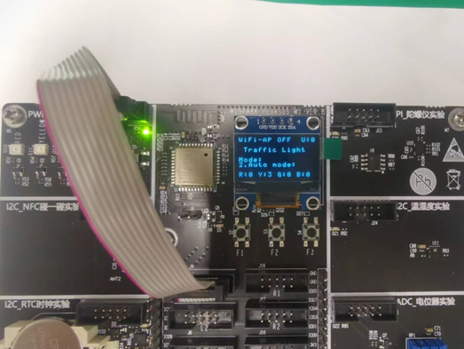

* Human Mode模式效果如下图所示。

  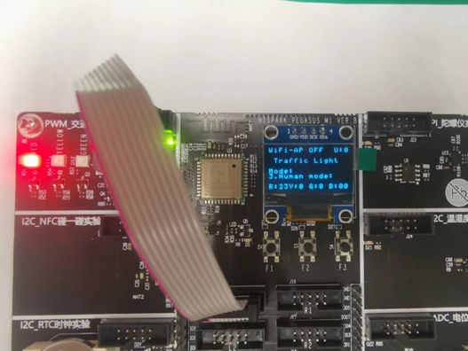

### 4.5.6 扩展实验

   * 学生可以在交通灯基础上，红灯亮则蜂鸣器每隔1s鸣响一次，黄灯亮蜂鸣器持续响，绿灯亮蜂鸣器每隔3s鸣响。

## 4.6 I2S智能语音实验

### 4.6.1 实验目的

​	本实验内容实现了Hi3861和es8311外设通过i2s通讯方式实现原始pcm音频输入（ADC），经过es8311的DAC处理后输出数字量音频发送给Hi3861进行存储，然后Hi3861再将数字量音频读取出来发送给es8311进行ADC处理后给喇叭进行播放了。

| API介绍                                                      | 说明                          |
| ------------------------------------------------------------ | ----------------------------- |
| hi_u32  hi_i2c_init(hi_i2c_idx id, hi_u32 baudrate);         | 用指定的波特速率初始化I2C设备 |
| hi_u32  hi_i2c_set_baudrate(hi_i2c_idx id, hi_u32 baudrate); | 设置波特率                    |
| hi_u32  hi_i2c_write(hi_i2c_idx id, hi_u16 device_addr, const hi_i2c_data *i2c_data); | I2C写入数据                   |
| hi_u32  hi_i2c_read(hi_i2c_idx id, hi_u16 device_addr, const hi_i2c_data *i2c_data); | I2C读出数据                   |
| hi_u32  hi_io_set_func(hi_io_name id, hi_u8 val);            | 配置某个IO口复用功能          |
| hi_u32  hi_gpio_set_ouput_val(hi_gpio_idx id, hi_gpio_value val); | 设置单个GPIO管脚电平状态      |
| hi_u32  hi_i2s_init(const hi_i2s_attribute *i2s_attribute);  | I2S初始化                     |
| hi_u32  hi_i2s_write(hi_u8 *wr_data, hi_u32 wr_len, hi_u32 time_out_ms); | I2S发送接口                   |

### 4.6.2 实验要求

1.软件要求：VSCode，hi3861_hdu_iot_application(如果采用zip包下载，SDK名称为hi3861_hdu_iot_application-master，如果采用git下载SDK名称为hi3861_hdu_iot_application，此处以采用git下载为例）；

2.硬件要求：微处理器一体化板；接线：L4-L4。硬件搭建要求如图所示。

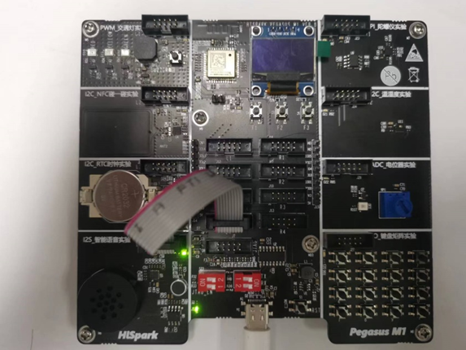

### 4.6.3 实验流程

* 步骤一：hi3861_hdu_iot_application/src/vendor/hisilicon/hispark_pegasus/demo/i2s_demo文件夹复制到hi3861_hdu_iot_application/src/applications/sample/wifi-iot/app/目录下。

* 步骤二：修改applications/sample/wifi-iot/app/目录下的BUILD.gn，在features字段中添加i2s_demo:i2sDemo。注：第一个i2s_demo指的是需要编译的工程目录，第二个i2sDemo指的是applications/sample/wifi-iot/app/i2s_demo/BUILD.gn文件中的静态库，名称为i2sDemo。

```c
import("//build/lite/config/component/lite_component.gni")

lite_component("app") {
  features = [ "i2s_demo:i2sDemo", ]
}
```

* 步骤三：通过hi_i2s_write()函数将经过es8311的DAC处理后输出数字量音频发送给Hi3861进行存储，然后Hi3861再将数字量音频读取出来发送给es8311进行ADC处理后给喇叭进行播放。具体代码实现如下。

  ```
  1  /*
  2   * Copyright (c) 2022 HiSilicon (Shanghai) Technologies CO., LIMITED.
  3   * Licensed under the Apache License, Version 2.0 (the "License");
  4   * you may not use this file except in compliance with the License.
  5   * You may obtain a copy of the License at
  6   *
  7   *     http://www.apache.org/licenses/LICENSE-2.0
  8   *
  9   * Unless required by applicable law or agreed to in writing, software
  10  * distributed under the License is distributed on an "AS IS" BASIS,
  11  * WITHOUT WARRANTIES OR CONDITIONS OF ANY KIND, either express or implied.
  12  * See the License for the specific language governing permissions and
  13  * limitations under the License.
  14  */
  15 
  16 #include <ohos_init.h>
  17 #include <cmsis_os2.h>
  18 #include "hi_io.h"
  19 #include "hi_gpio.h"
  20 #include "iot_gpio.h"
  21 #include "iot_gpio_ex.h"
  22 #include "ssd1306.h"
  23 #include "iot_i2c.h"
  24 #include "app_demo_i2s.h"
  25 
  26 #define IOT_I2C_IDX_BAUDRATE (400 * 1000)
  27 #define SSD1306_I2C_IDX 0
  28 
  29 audio_map g_audio_map[3] = {  /* 2 flash fields */
  30     {0x001A1000, 100*1024}, /* audio file size: 400 * 1024(100K) */
  31     {0x001CE000, 204800},     /* recod size: 200K */
  32     {0x1F0000, 0xC000},
  33 };
  34 
  35 unsigned char es8311_register_buff[] = {
  36     ES8311_RESET_REG00, ES8311_CLK_MANAGER_REG01, ES8311_CLK_MANAGER_REG02, ES8311_CLK_MANAGER_REG03,
  37     ES8311_CLK_MANAGER_REG04, ES8311_CLK_MANAGER_REG05, ES8311_CLK_MANAGER_REG06,
  38     ES8311_CLK_MANAGER_REG07, ES8311_CLK_MANAGER_REG08, ES8311_SDPIN_REG09,
  39     ES8311_SDPOUT_REG0A, ES8311_SYSTEM_REG0B, ES8311_SYSTEM_REG0C, ES8311_SYSTEM_REG0D,
  40     ES8311_SYSTEM_REG0E, ES8311_SYSTEM_REG0F, ES8311_SYSTEM_REG10, ES8311_SYSTEM_REG11,
  41     ES8311_SYSTEM_REG12, ES8311_SYSTEM_REG13, ES8311_SYSTEM_REG14, ES8311_ADC_REG15,
  42     ES8311_ADC_REG16, ES8311_ADC_REG17, ES8311_ADC_REG18, ES8311_ADC_REG19, ES8311_ADC_REG1A,
  43     ES8311_ADC_REG1B, ES8311_ADC_REG1C, ES8311_DAC_REG31, ES8311_DAC_REG32, ES8311_DAC_REG33,
  44     ES8311_DAC_REG34, ES8311_DAC_REG35, ES8311_DAC_REG37, ES8311_GPIO_REG44, ES8311_GP_REG45,
  45     ES8311_CHD1_REGFD, ES8311_CHD2_REGFE, ES8311_CHVER_REGFF, ES8311_MAX_REGISTER,
  46 };
  47 
  48 unsigned int g_audio_event_test;
  49 unsigned int g_audio_task_id_test;
  50 test_audio_attr g_audio_test_demo;
  51 unsigned char g_record_data[AUDIO_RECORD_BUF_SIZE] = { 0 };
  52 
  53 unsigned int es8311_codec_init_test(const hi_codec_attribute *codec_attr)
  54 {
  55     unsigned int ret;
  56     if (codec_attr == HI_NULL) {
  57         return -1;
  58     }
  59     if (ret != HI_ERR_SUCCESS) {
  60         printf("==ERROR== hi_i2c_init, err = %u\n", ret);
  61         return -1;
  62     }
  63     ret = hi_codec_init_test(codec_attr);
  64     if (ret != HI_ERR_SUCCESS) {
  65         printf("==ERROR== Failed to init codec!! err = %u\n", ret);
  66         return -1;
  67     } else {
  68         printf("init codec success!\n");
  69     }
  70     return 0;
  71 }
  72 
  73 unsigned int audio_play_test(unsigned int map_index)
  74 {
  75     unsigned int ret;
  76     unsigned int play_addr = g_audio_map[map_index].flash_start_addr;
  77     unsigned int total_play_len = g_audio_map[map_index].data_len;
  78     unsigned int time_out = HI_SYS_WAIT_FOREVER;
  79 
  80     /* apply memory */
  81     g_audio_test_demo.play_buf = (unsigned char *) hi_malloc(HI_MOD_ID_DRV, AUDIO_PLAY_BUF_SIZE);
  82     if (g_audio_test_demo.play_buf == HI_NULL) {
  83         hi_i2s_deinit();
  84         printf("==ERROR== play buf malloc fail!!!\n");
  85         return -1;
  86     }
  87     memset_s(g_audio_test_demo.play_buf, AUDIO_PLAY_BUF_SIZE, 0, AUDIO_PLAY_BUF_SIZE);
  88 
  89     while (total_play_len > 0) {
  90         hi_u32 send_len = hi_min(total_play_len, AUDIO_PLAY_BUF_SIZE);
  91         ret = hi_flash_read(play_addr, send_len, g_audio_test_demo.play_buf);
  92         if (ret != HI_ERR_SUCCESS) {
  93             printf("==ERROR== hi_flash_read fail, err = %u\n", ret);
  94             return -1;
  95         }
  96 
  97         ret = hi_i2s_write(g_audio_test_demo.play_buf, send_len, time_out);
  98         if (ret != HI_ERR_SUCCESS) {
  99             printf("hi_i2s_write fail, err = %u\n", ret);
  100            return -1;
  101        }
  102
  103        play_addr += send_len;
  104        total_play_len -= send_len;
  105    }
  106
  107    printf("Play over....\n");
  108
  109    hi_free(HI_MOD_ID_DRV, g_audio_test_demo.play_buf);
  110    return 0;
  111}
  112
  113unsigned int audio_record_func_test(unsigned int map_index)
  114{
  115    unsigned int ret;
  116    unsigned int record_addr = g_audio_map[map_index].flash_start_addr;
  117    unsigned int total_record_len = g_audio_map[map_index].data_len;
  118
  119    ret = hi_flash_erase(record_addr, total_record_len);
  120    if (ret != HI_ERR_SUCCESS) {
  121        printf("Failed to erase flash, err = %u\n", ret);
  122        return -1;
  123    }
  124
  125    while (total_record_len > 0) {
  126        unsigned int len = hi_min(AUDIO_RECORD_BUF_SIZE, total_record_len);
  127        ret = hi_i2s_read(g_audio_test_demo.record_buf, len, 400); // 超时400ms
  128        if (ret != HI_ERR_SUCCESS) {
  129            printf("Failed to hi_i2s_read, err = %u\n", ret);
  130            return -1;
  131        }
  132        if (memcpy_s(g_record_data, sizeof(g_record_data), g_audio_test_demo.record_buf, len) != EOK) {
  133            return -1;
  134        }
  135        hi_event_send(g_audio_event_test, AUDIO_RECORD_FINISH_BIT);
  136        record_addr += len;
  137        total_record_len -= len;
  138    }
  139
  140    hi_event_send(g_audio_event_test, ALL_AUDIO_RECORD_FINISH_BIT);
  141    return 0;
  142}
  143
  144void record_n_play_test_task(void)
  145{
  146    unsigned int ret;
  147    unsigned int event_bit = 0;
  148    unsigned int record_addr = g_audio_map[AUDIO_RECORD_AND_PLAY_MODE].flash_start_addr;
  149    unsigned int total_record_len = g_audio_map[AUDIO_RECORD_AND_PLAY_MODE].data_len;
  150    unsigned int len;
  151
  152    while (1) {
  153        hi_event_wait(g_audio_event_test, AUDIO_RECORD_FINISH_BIT | ALL_AUDIO_RECORD_FINISH_BIT, &event_bit,
  154            HI_SYS_WAIT_FOREVER, HI_EVENT_WAITMODE_OR | HI_EVENT_WAITMODE_CLR);
  155        if (event_bit & ALL_AUDIO_RECORD_FINISH_BIT) {
  156            break;
  157        }
  158        len = hi_min(AUDIO_RECORD_BUF_SIZE, total_record_len);
  159
  160        ret = hi_flash_write(record_addr, len, g_record_data, HI_FALSE);
  161        if (ret != HI_ERR_SUCCESS) {
  162            printf("==ERROR== hi_flash_write, err = %u\n", ret);
  163        }
  164        record_addr += len;
  165        total_record_len -= len;
  166    }
  167    ssd1306_ClearOLED();
  168    ssd1306_SetCursor(25, 10); // x轴坐标为25，y轴坐标为10
  169    ssd1306_DrawString("Record success!", Font_7x10, White);
  170    ssd1306_UpdateScreen();
  171    printf("Record success!...\n");
  172    TaskMsleep(1000); /* 1000ms: delay 1s */
  173    audio_play_test(AUDIO_RECORD_AND_PLAY_MODE);
  174    printf("Play record audio success!...\n");
  175    return HI_NULL;
  176}
  177
  178
  179void audio_record_play_test(unsigned int map_index)
  180{
  181    unsigned int ret;
  182    osThreadAttr_t attr;
  183    IoTWatchDogDisable();
  184    attr.name = "I2STask";
  185    attr.attr_bits = 0U;
  186    attr.cb_mem = NULL;
  187    attr.cb_size = 0U;
  188    attr.stack_mem = NULL;
  189    attr.stack_size = I2S_TEST_TASK_STAK_SIZE; // 任务栈大小为5 *1024
  190    attr.priority = I2S_TEST_TASK_PRIORITY;
  191    if (osThreadNew((osThreadFunc_t)record_n_play_test_task, NULL, &attr) == NULL) {
  192        printf("[I2STask] Failed to create BalanceTask!\n");
  193    }
  194
  195    /* apply memory */
  196    g_audio_test_demo.record_buf = (unsigned char *)hi_malloc(HI_MOD_ID_DRV, AUDIO_RECORD_BUF_SIZE);
  197    if (g_audio_test_demo.record_buf == HI_NULL) {
  198        hi_i2s_deinit();
  199        printf("==ERROR== record buf malloc fail!!!\n");
  200        return;
  201    }
  202    memset_s(g_audio_test_demo.record_buf, AUDIO_RECORD_BUF_SIZE, 0, AUDIO_RECORD_BUF_SIZE);
  203    ssd1306_SetCursor(25, 10); // x轴坐标为25，y轴坐标为10
  204    ssd1306_DrawString("start record", Font_7x10, White);
  205    ssd1306_UpdateScreen();
  206    printf("==start record== please say somerthing~~\n");
  207    audio_record_func_test(map_index);
  208}
  209
  210void i2sGpioint(void)
  211{
  212    IoSetFunc(IOT_IO_NAME_GPIO_9, IOT_IO_FUNC_GPIO_9_I2S0_MCLK);
  213    IoSetFunc(IOT_IO_NAME_GPIO_10, IOT_IO_FUNC_GPIO_10_I2S0_TX);
  214    IoSetFunc(IOT_IO_NAME_GPIO_11, IOT_IO_FUNC_GPIO_11_I2S0_RX);
  215    IoSetFunc(IOT_IO_NAME_GPIO_12, IOT_IO_FUNC_GPIO_12_I2S0_BCLK);
  216    IoSetFunc(IOT_IO_NAME_GPIO_8, IOT_IO_FUNC_GPIO_8_I2S0_WS);
  217
  218    /* BCLK */
  219    IoTGpioSetDir(IOT_IO_NAME_GPIO_12, IOT_GPIO_DIR_OUT);
  220    IoTGpioSetOutputVal(IOT_IO_NAME_GPIO_12, IOT_GPIO_VALUE1);
  221    /*
  222     * 初始化I2C设备0，并指定波特率为400k
  223     * Initialize I2C device 0 and specify the baud rate as 400k
  224     */
  225    IoTI2cInit(SSD1306_I2C_IDX, IOT_I2C_IDX_BAUDRATE);
  226    /*
  227     * 设置I2C设备0的波特率为400k
  228     * Set the baud rate of I2C device 0 to 400k
  229     */
  230    IoTI2cSetBaudrate(SSD1306_I2C_IDX, IOT_I2C_IDX_BAUDRATE);
  231    /*
  232     * 设置GPIO13的管脚复用关系为I2C0_SDA
  233     * Set the pin reuse relationship of GPIO13 to I2C0_ SDA
  234     */
  235    IoSetFunc(IOT_IO_NAME_GPIO_13, IOT_IO_FUNC_GPIO_13_I2C0_SDA);
  236    /*
  237     * 设置GPIO14的管脚复用关系为I2C0_SCL
  238     * Set the pin reuse relationship of GPIO14 to I2C0_ SCL
  239     */
  240    IoSetFunc(IOT_IO_NAME_GPIO_14, IOT_IO_FUNC_GPIO_14_I2C0_SCL);
  241    ssd1306_Init();
  242    ssd1306_ClearOLED();
  243}
  244
  245/*
  246 * i2s_demo: a simple demo implement paly audio file and record audio then play them back function.
  247 * -note: If it is in play mode, user need to burn the audio file to the specified location of flash in advance.
  248 *        max size of audio file: 100K bytes
  249 *        burn command:           burn 1A1000 19000
  250 */
  251void i2s_demo_test(void)
  252{
  253    unsigned int ret;
  254    i2sGpioint();
  255    ret = hi_flash_init();
  256    if (ret == HI_ERR_FLASH_RE_INIT) {
  257        printf("Flash has already been initialized!\n");
  258    } else if (ret != HI_ERR_SUCCESS) {
  259        printf("Falied to init flash, err = %u\n", ret);
  260    }
  261
  262    /* create I2S record event */
  263    ret = hi_event_create(&g_audio_event_test);
  264    if (ret != HI_ERR_SUCCESS) {
  265        printf("Failed to init g_audio_event_test! err = %u\n", ret);
  266        return;
  267    }
  268
  269    hi_codec_attribute codec_cfg = {
  270        .sample_rate = HI_CODEC_SAMPLE_RATE_8K,
  271        .resolution = HI_CODEC_RESOLUTION_16BIT,
  272    };
  273    hi_i2s_attribute i2s_cfg = {
  274        .sample_rate = HI_I2S_SAMPLE_RATE_8K,
  275        .resolution = HI_I2S_RESOLUTION_16BIT,
  276    };
  277    es8311_codec_init_test(&codec_cfg);
  278    ret = hi_i2s_init(&i2s_cfg);
  279    if (ret != HI_ERR_SUCCESS) {
  280        printf("Failed to init i2s %u!\n", ret);
  281        return;
  282    }
  283    printf("I2s init success!\n");
  284    audio_record_play_test(AUDIO_RECORD_AND_PLAY_MODE);
  285}
  286
  287APP_FEATURE_INIT(i2s_demo_test);
  ```

- 步骤四：修改hi3861_hdu_iot_application/src/device/hisilicon/hispark_pegasus/sdk_liteos/build/config/usr_config.mk文件。在这个配置文件中打开I2C驱动宏。搜索字段CONFIG_I2C_SUPPORT ，并打开I2S。配置如下：

  ```
  # CONFIG_I2S_SUPPORT is not set
  CONFIG_I2S_SUPPORT=y
  ```

- 步骤五：点击DevEco Device Tool工具“Rebuild”按键，具体编译步骤参考“2.5章节 编译运行”。

  

- 步骤六：点击DevEco Device Tool工具“Upload”按键，等待提示（出现Connecting，please reset device...），手动进行开发板复位（按下开发板reset键），将程序烧录到开发板中。具体烧录步骤参考“2.6章节 代码烧录”。

  

### 4.6.4 实验结果

* 软件烧录成功后，使用串口工具连接好M1的串口（<font color='RedOrange'>**注意：这里以sscom为例，该工具需要自己百度下载，也可以使用Monitor工具，参考“2.7 章节 Monitor串口打印”**</font>)，按一下开发板的RESET按键复位开发板，烧录完成后，烧录完成后，当屏幕上出现start record字样对准麦克风说话，说完话后可以通过喇叭播放出来。

### 4.6.5 扩展实验

   * 将一段数字音频存到Hi3861的flash中，程序启动后，通过按下OLED屏板上的按键触发读取flash中数字音频发送给es8311进行DAC转换成模拟音频给喇叭进行播放。

## 4.7  NFC碰一碰实验

### 4.7.1 实验目的

​	本实验内容实现了通过使用I2C，实现对NFC的驱动。

### 4.7.2 实验要求

1.软件要求：VSCode，hi3861_hdu_iot_application(如果采用zip包下载，SDK名称为hi3861_hdu_iot_application-master，如果采用git下载SDK名称为hi3861_hdu_iot_application，此处以采用git下载为例）；

2.硬件要求：微处理器一体化板；接线：L2-L2。硬件搭建要求如图所示。

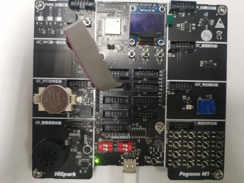

### 4.7.3 接口说明

#### 4.7.3.1 IoTI2cInit()

| **定义：**   | unsigned   int IoTI2cInit(unsigned int id, unsigned int baudrate); |
| ------------ | ------------------------------------------------------------ |
| **功能：**   | 以指定的波特率初始化I2C设备。                                |
| **参数：**   | id:I2C设备ID   <br/>baudrate：指定的I2C波特率                |
| **返回值：** | IOT_SUCCESS：初始化成功    IOT_FAILURE：初始化失败           |
| **依赖：**   | //base/iot_hardware/peripheral/interfaces/kits/iot_i2c.h     |

#### 4.7.3.2 IoTI2cDeinit()

| **定义：**   | unsigned   int IoTI2cDeinit(unsigned int id);            |
| ------------ | -------------------------------------------------------- |
| **功能：**   | 去初始化I2c设备                                          |
| **参数：**   | id：I2C设备ID                                            |
| **返回值：** | IOT_SUCCESS：去初始化成功    IOT_FAILURE：去初始化失败   |
| **依赖：**   | //base/iot_hardware/peripheral/interfaces/kits/iot_i2c.h |

#### 4.7.3.3 IoTI2cWrite()

| 定义：       | unsigned   int IoTI2cWrite(unsigned int id, unsigned short deviceAddr, <br/>const unsigned   char *data, unsigned int dataLen); |
| ------------ | ------------------------------------------------------------ |
| **功能：**   | 将数据写入I2C设备                                            |
| **参数：**   | id：I2C设备id   <br/>deviceAddr：I2C设备地址    <br/>data：指向要写入的数据的指针     <br/>dataLen：指向要写入的数据长度 |
| **返回值：** | IOT_SUCCESS：数据写入成功    IOT_FAILURE：数据写入失败       |
| **依赖：**   | //base/iot_hardware/peripheral/interfaces/kits/iot_i2c.h     |

#### 4.7.3.4 IoTI2cRead()

| **定义：**   | unsigned   int IoTI2cRead(unsigned int id, unsigned short deviceAddr, <br/>unsigned char   *data, unsigned int dataLen); |
| ------------ | ------------------------------------------------------------ |
| **功能：**   | 从I2C设备读取数据                                            |
| **参数：**   | id：I2C设备id       deviceAddr：I2C设备地址    <br/>data：表示指向要读取的数据的指针     dataLen：表示要读取的数据长度 |
| **返回值：** | IOT_SUCCESS：数据读取成功    IOT_FAILURE：数据读取失败       |
| **依赖：**   | //base/iot_hardware/peripheral/interfaces/kits/iot_i2c.h     |

#### 4.7.3.5 IoTI2cSetBaudrate()

| **定义：**   | unsigned   int IoTI2cSetBaudrate(unsigned int id, unsigned int baudrate); |
| ------------ | ------------------------------------------------------------ |
| **功能：**   | 设置I2C设备的波特率                                          |
| **参数：**   | id：I2C设备ID   <br/>baudrate：指定的I2C波特率口             |
| **返回值：** | IOT_SUCCESS：设置成功    IOT_FAILURE：设置失败               |
| **依赖：**   | //base/iot_hardware/peripheral/interfaces/kits/iot_i2c.h     |

### 4.7.4 实验流程

* 步骤一：hi3861_hdu_iot_application/src/vendor/hisilicon/hispark_pegasus/demo/nfc_demo文件夹复制到hi3861_hdu_iot_application/src/applications/sample/wifi-iot/app/目录下。

* 步骤二：修改applications/sample/wifi-iot/app/目录下的BUILD.gn，在features字段中添加nfc_demo:nfc_demo。注：第一个nfc_demo指的是需要编译的工程目录，第二个nfc_demo指的是applications/sample/wifi-iot/app/nfc_demo/BUILD.gn文件中的静态库，名称为nfc_demo。


```c
import("//build/lite/config/component/lite_component.gni")

lite_component("app") {
  features = [ "nfc_demo:nfc_demo", ]
}
```

* 步骤三：I2C通信原理：I2C通信中，主机通过时钟线SCL发送时钟信号，通过数据线SDA发送数据（包括从机地址、指令、数据包等），在发送完一帧数据后，需要等待从机的响应，才能继续发送下一帧数据，因此I2C属于同步通信。

  从硬件原理图可以分析出NFC与开发板板子通过 I2C0(SDA_GPIO13、SCL_GPIO14) 连接，通讯波特率为 400K,因此我们代码需要通过 I2C 的读写函数读回电池电量值，核心代码如方下所示:

  ```
  1  /*
  2   * Copyright (c) 2022 HiSilicon (Shanghai) Technologies CO., LIMITED.
  3   * Licensed under the Apache License, Version 2.0 (the "License");
  4   * you may not use this file except in compliance with the License.
  5   * You may obtain a copy of the License at
  6   *
  7   *     http://www.apache.org/licenses/LICENSE-2.0
  8   *
  9   * Unless required by applicable law or agreed to in writing, software
  10  * distributed under the License is distributed on an "AS IS" BASIS,
  11  * WITHOUT WARRANTIES OR CONDITIONS OF ANY KIND, either express or implied.
  12  * See the License for the specific language governing permissions and
  13  * limitations under the License.
  14  */
  15 
  16 #include <stdio.h>
  17 #include <unistd.h>
  18 #include "ohos_init.h"
  19 #include "cmsis_os2.h"
  20 #include "hi_stdlib.h"
  21 #include "iot_gpio_ex.h"
  22 #include "hi_time.h"
  23 #include "iot_gpio.h"
  24 #include "iot_watchdog.h"
  25 #include "iot_i2c.h"
  26 #include "iot_errno.h"
  27 #include "hi_i2c.h"
  28 #include "iot_gpio_ex.h"
  29 #include "ssd1306.h"
  30 #include "iot_i2c.h"
  31 #include "app_demo_nfc.h"
  32 
  33 unsigned char ndefFile[NFC_NDEF_MAX_LEN] = {
  34     // 微信
  35     0x03, 0x20,
  36     0xd4, 0x0f, 0x0e, 0x61, 0x6e, 0x64, 0x72, 0x6f,
  37     0x69, 0x64, 0x2e, 0x63, 0x6f, 0x6d, 0x3a, 0x70,
  38     0x6b, 0x67, 0x63, 0x6f, 0x6d, 0x2e, 0x74, 0x65,
  39     0x6e, 0x63, 0x65, 0x6e, 0x74, 0x2e, 0x6d, 0x6d,
  40 };
  41 
  42 static void PullUpCsn(void)
  43 {
  44     IoTGpioSetOutputVal(IOT_IO_NAME_GPIO_9, IOT_GPIO_VALUE1);
  45 }
  46 
  47 static void PullDownCsn(void)
  48 {
  49     IoTGpioSetOutputVal(IOT_IO_NAME_GPIO_9, IOT_GPIO_VALUE0);
  50 }
  51 
  52 void gpioInit(void)
  53 {
  54     /*
  55      * 初始化I2C设备0，并指定波特率为400k
  56      * Initialize I2C device 0 and specify the baud rate as 400k
  57      */
  58     IoTI2cInit(NFC_I2C_IDX, IOT_I2C_IDX_BAUDRATE);
  59     /*
  60      * 设置I2C设备0的波特率为400k
  61      * Set the baud rate of I2C device 0 to 400k
  62      */
  63     IoTI2cSetBaudrate(NFC_I2C_IDX, IOT_I2C_IDX_BAUDRATE);
  64     /*
  65      * 设置GPIO13的管脚复用关系为I2C0_SDA
  66      * Set the pin reuse relationship of GPIO13 to I2C0_ SDA
  67      */
  68     IoSetFunc(IOT_IO_NAME_GPIO_13, IOT_IO_FUNC_GPIO_13_I2C0_SDA);
  69     /*
  70      * 设置GPIO14的管脚复用关系为I2C0_SCL
  71      * Set the pin reuse relationship of GPIO14 to I2C0_ SCL
  72      */
  73     IoSetFunc(IOT_IO_NAME_GPIO_14, IOT_IO_FUNC_GPIO_14_I2C0_SCL);
  74 }
  75 
  76 static unsigned int C081NfcI2cWrite(unsigned char regHigh8bitCmd,
  77     unsigned char regLow8bitCmd, unsigned char* recvData, unsigned char sendLen)
  78 {
  79     unsigned int status = 0;
  80     IotI2cData c081NfcI2cWriteCmdAddr = { 0 };
  81     unsigned char sendUserCmd[64] = {regHigh8bitCmd, regLow8bitCmd};
  82 
  83     c081NfcI2cWriteCmdAddr.sendBuf = sendUserCmd;
  84     c081NfcI2cWriteCmdAddr.sendLen = 2 + sendLen; // 2代表两位地址长度，2 represents the two bit address length
  85     for (unsigned int i = 0; i < sendLen; i++) {
  86         sendUserCmd[ 2 + i] = *(recvData + i); // 2代表两位地址长度，2 represents the two bit address length
  87     }
  88     status = IoTI2cWrite(NFC_I2C_IDX, C081_NFC_WRITE_ADDR,
  89                          c081NfcI2cWriteCmdAddr.sendBuf, c081NfcI2cWriteCmdAddr.sendLen);
  90     if (status != IOT_SUCCESS) {
  91         printf("I2cWrite(%02X) failed, %u!\n", sendUserCmd[0], status);
  92         return status;
  93     }
  94     return IOT_SUCCESS;
  95 }
  96 
  97 /*
  98  * @berf EEPROM page write
  99  * @param unsigned char *pBuffer: Send data buff
  100 * @param unsigned short WriteAddr:Send register address
  101 * @param unsigned char datalen:Sending data length
  102 */
  103void EepWritePage(unsigned char *pBuffer, unsigned short WriteAddr, unsigned char datalen)
  104{
  105    unsigned int status;
  106    if (pBuffer == NULL) {
  107        printf("eepWritePage buffer is null\r\n");
  108    }
  109    PullDownCsn();
  110    /* 代表地址高8位和低8位，2代表发送的数据长度 */
  111    /* represents the high and low 8 bits of the address, and 2 represents the length of the data sent */
  112    status = C081NfcI2cWrite((unsigned char)((WriteAddr & 0xFF00) >> 8),
  113                             (unsigned char)(WriteAddr & 0x00FF), pBuffer, datalen);
  114    if (status != IOT_SUCCESS) {
  115        printf("write failed\r\n");
  116    }
  117    TaskMsleep(10); // The delay time must be 10ms
  118    PullUpCsn();
  119}
  120
  121/*
  122 * @berf write EEPROM
  123 * @param unsigned short addr:eeprom address
  124 * @param unsigned int len:Write data length
  125 * @param unsigned char *wbuf:write data buff
  126 */
  127void Fm11nt081dWriteEeprom(unsigned short baseAddr, unsigned int len, unsigned char *wbuf)
  128{
  129    unsigned char offset = 0;
  130    unsigned char *writeBuff = wbuf;
  131    unsigned int writeLen = len;
  132    unsigned short addr = baseAddr;
  133    if (writeBuff == NULL) {
  134        printf("write ndef is null\r\n");
  135        return;
  136    }
  137    if (addr < FM11_E2_USER_ADDR || addr >= FM11_E2_MAUNF_ADDR) {
  138        offset = FM11_E2_BLOCK_SIZE - (addr % FM11_E2_BLOCK_SIZE);
  139        if (writeLen > offset) {
  140            EepWritePage(writeBuff, addr, offset);
  141            addr += offset;
  142            writeBuff += offset;
  143            writeLen -= offset;
  144        } else {
  145            EepWritePage(writeBuff, addr, writeLen);
  146            writeLen = 0;
  147        }
  148    }
  149    while (writeLen) {
  150        if (writeLen >= FM11_E2_BLOCK_SIZE) {
  151            EepWritePage(writeBuff, addr, FM11_E2_BLOCK_SIZE);
  152            addr += FM11_E2_BLOCK_SIZE;
  153            writeBuff += FM11_E2_BLOCK_SIZE;
  154            writeLen -= FM11_E2_BLOCK_SIZE;
  155        } else {
  156            EepWritePage(writeBuff, addr, writeLen);
  157            writeLen = 0;
  158        }
  159    }
  160}
  161
  162/*
  163 * @berf i2c read
  164 * @param unsigned char reg_high_8bit_cmd:Transmit register value 8 bits high
  165 * @param unsigned char reg_low_8bit_cmd:Transmit register value low 8 bits
  166 * @param unsigned char* recv_data:Receive data buff
  167 * @param unsigned char send_len:Sending data length
  168 * @param unsigned char read_len:Length of received data
  169 */
  170unsigned int WriteRead(unsigned char regHigh8bitCmd, unsigned char regLow8bitCmd,
  171    unsigned char sendLen, unsigned char readLen)
  172{
  173    unsigned int status = 0;
  174    unsigned char recvData[888] = { 0 }; // 888代表recvData长度，888 stands for recvData length
  175    hi_i2c_data c081NfcI2cWriteCmdAddr = { 0 };
  176    unsigned char sendUserCmd[2] = {regHigh8bitCmd, regLow8bitCmd};
  177    memset_s(&recvData, sizeof(recvData), 0x0, sizeof(recvData));
  178
  179    c081NfcI2cWriteCmdAddr.send_buf = sendUserCmd;
  180    c081NfcI2cWriteCmdAddr.send_len = sendLen;
  181
  182    c081NfcI2cWriteCmdAddr.receive_buf = recvData;
  183    c081NfcI2cWriteCmdAddr.receive_len = readLen;
  184
  185    status = hi_i2c_writeread(NFC_I2C_IDX, C081_NFC_ADDR | I2C_RD, &c081NfcI2cWriteCmdAddr);
  186    if (status != IOT_SUCCESS) {
  187        printf("hi_i2c_writeread failed, %u!\n", status);
  188        return status;
  189    }
  190    return IOT_SUCCESS;
  191}
  192
  193/*
  194 * @berf read EEPROM
  195 * @param unsigned char *dataBuff:Read data and save it in buff
  196 * @param unsigned short ReadAddr:Read address
  197 * @param unsigned short len:Read length
  198 */
  199unsigned int Fm11nt081ReadEep(unsigned short ReadAddr, unsigned short len)
  200{
  201    unsigned int status;
  202    /* 左移8位代表地址高8位和低8位，2代表发送的数据长度 */
  203    /* represents the high and low 8 bits of the address, and 2 represents the length of the data sent */
  204    status = WriteRead((unsigned char)((ReadAddr & 0xFF00) >> 8), (unsigned char)(ReadAddr & 0x00FF), 2, len);
  205    if (status != IOT_SUCCESS) {
  206        return status;
  207    }
  208    return  IOT_SUCCESS;
  209}
  210
  211/* NFC chip configuration, usually do not call NFC init */
  212void NFCInit(void)
  213{
  214    // Chip default configuration，wbuf len 5
  215    unsigned char wbuf[5] = {NFC_REGISTER1, NFC_REGISTER2, NFC_REGISTER3, NFC_REGISTER4, NFC_REGISTER5};
  216    /* The CSN pin is masked when the byte is read and turned on when the EEP is written */
  217    hi_udelay(100); // 延时100us读写数据,wait 100us read write data
  218    Fm11nt081dWriteEeprom(NFC_EERROM_ONE_ADDR, 1, &wbuf[1]);
  219    Fm11nt081dWriteEeprom(NFC_EERROM_TWO_ADDR, 1, &wbuf[3]); // wbuf第3个
  220    Fm11nt081dWriteEeprom(NFC_EERROM_BASE_ADD, NFC_TOUTIAO_NDEF_LEN, ndefFile);
  221    PullDownCsn();
  222    Fm11nt081ReadEep(NFC_EERROM_BASE_ADD, READ_NFC_TOUTIAO_NDEF_LEN);
  223}
  224
  225/* app nfc demo */
  226void NFCDemoTask(void)
  227{
  228    ssd1306_Init();
  229    ssd1306_ClearOLED();
  230    ssd1306_SetCursor(25, 10); // x轴坐标为25，y轴坐标为10
  231    ssd1306_DrawString("Wechart", Font_7x10, White);
  232    ssd1306_UpdateScreen();
  233    NFCInit();
  234}
  235
  236void C081NFCExampleEntry(void)
  237{
  238    osThreadAttr_t attr;
  239    IoTWatchDogDisable();
  240    attr.name = "NFCDemoTask";
  241    attr.attr_bits = 0U;
  242    attr.cb_mem = NULL;
  243    attr.cb_size = 0U;
  244    attr.stack_mem = NULL;
  245    attr.stack_size = 5 * 1024; // 堆栈大小为5*1024，stack size 5*1024
  246    attr.priority = osPriorityNormal;
  247
  248    if (osThreadNew((osThreadFunc_t)NFCDemoTask, NULL, &attr) == NULL) {
  249        printf("[NFCDemoTask] Falied to create NFCDemoTask!\n");
  250    }
  251}
  252
  253APP_FEATURE_INIT(C081NFCExampleEntry);
  ```

- 步骤四：修改hi3861_hdu_iot_application/src/device/hisilicon/hispark_pegasus/sdk_liteos/build/config/usr_config.mk文件。在这个配置文件中打开I2C驱动宏。搜索字段CONFIG_I2C_SUPPORT ，并打开I2C。配置如下：

    ```
    # CONFIG_I2C_SUPPORT is not set
    CONFIG_I2C_SUPPORT=y
    ```

- 步骤五：点击DevEco Device Tool工具“Rebuild”按键，具体编译步骤参考“2.5章节 编译运行”。

    

- 步骤六：点击DevEco Device Tool工具“Upload”按键，等待提示（出现Connecting，please reset device...），手动进行开发板复位（按下开发板reset键），将程序烧录到开发板中。具体烧录步骤参考“2.6章节 “代码烧录”。

    

### 4.7.5 实验结果

  * 软件烧录成功后，使用串口工具连接好M1的串口（<font color='RedOrange'>**注意：这里以sscom为例，该工具需要自己百度下载，也可以使用Monitor工具，参考“2.7 章节 Monitor串口打印”**</font>)，按一下开发板的RESET按键复位开发板，烧录完成后，烧录完成后，板端上电和下电，用安卓手机NFC靠近NFC板时，可以拉起手机端微信APP（注意：手机需要解锁）。

  ### 4.7.6 扩展实验

* 手机NFC靠近板子自动匹配联网。

## 4.8  I2C温湿度系统设计实验

### 4.8.1 实验目的

​	本实验内容实现了实时检测环境温度和湿度，将结果显示到OLED屏幕。温湿度芯片手册（编号：C2827328，型号： AHT21）获取：https://so.szlcsc.com/global.html?k=aht21&hot-key=LM358DR2G，点击数据手册进行下载。

### 4.8.2 实验要求

  1.软件要求：VSCode，hi3861_hdu_iot_application(如果采用zip包下载，SDK名称为hi3861_hdu_iot_application-master，如果采用git下载SDK名称为hi3861_hdu_iot_application，此处以采用git下载为例）；

  2.硬件要求：微处理器一体化板；接线：R2-R2。硬件搭建要求如图所示。

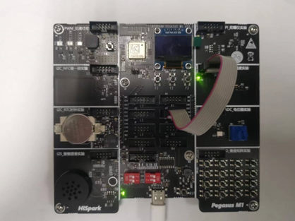

### 4.8.3 接口说明

#### 4.8.3.1 IoTI2cInit()

| **定义：**   | unsigned   int IoTI2cInit(unsigned int id, unsigned int baudrate); |
| ------------ | ------------------------------------------------------------ |
| **功能：**   | 以指定的波特率初始化I2C设备。                                |
| **参数：**   | id:I2C设备ID   <br/>baudrate：指定的I2C波特率                |
| **返回值：** | IOT_SUCCESS：初始化成功    IOT_FAILURE：初始化失败           |
| **依赖：**   | //base/iot_hardware/peripheral/interfaces/kits/iot_i2c.h     |

#### 4.8.3.2 IoTI2cDeinit()

| **定义：**   | unsigned   int IoTI2cDeinit(unsigned int id);            |
| ------------ | -------------------------------------------------------- |
| **功能：**   | 去初始化I2c设备                                          |
| **参数：**   | id：I2C设备ID                                            |
| **返回值：** | IOT_SUCCESS：去初始化成功    IOT_FAILURE：去初始化失败   |
| **依赖：**   | //base/iot_hardware/peripheral/interfaces/kits/iot_i2c.h |

#### 4.8.3.3 IoTI2cWrite()

| 定义：       | unsigned   int IoTI2cWrite(unsigned int id, unsigned short deviceAddr, <br/>const unsigned   char *data, unsigned int dataLen); |
| ------------ | ------------------------------------------------------------ |
| **功能：**   | 将数据写入I2C设备                                            |
| **参数：**   | id：I2C设备id   <br/>deviceAddr：I2C设备地址    <br/>data：指向要写入的数据的指针     <br/>dataLen：指向要写入的数据长度 |
| **返回值：** | IOT_SUCCESS：数据写入成功    IOT_FAILURE：数据写入失败       |
| **依赖：**   | //base/iot_hardware/peripheral/interfaces/kits/iot_i2c.h     |

#### 4.8.3.4 IoTI2cRead()

| **定义：**   | unsigned   int IoTI2cRead(unsigned int id, unsigned short deviceAddr, <br/>unsigned char   *data, unsigned int dataLen); |
| ------------ | ------------------------------------------------------------ |
| **功能：**   | 从I2C设备读取数据                                            |
| **参数：**   | id：I2C设备id       deviceAddr：I2C设备地址    <br/>data：表示指向要读取的数据的指针     dataLen：表示要读取的数据长度 |
| **返回值：** | IOT_SUCCESS：数据读取成功    IOT_FAILURE：数据读取失败       |
| **依赖：**   | //base/iot_hardware/peripheral/interfaces/kits/iot_i2c.h     |

#### 4.8.3.5 IoTI2cSetBaudrate()

| **定义：**   | unsigned   int IoTI2cSetBaudrate(unsigned int id, unsigned int baudrate); |
| ------------ | ------------------------------------------------------------ |
| **功能：**   | 设置I2C设备的波特率                                          |
| **参数：**   | id：I2C设备ID   <br/>baudrate：指定的I2C波特率口             |
| **返回值：** | IOT_SUCCESS：设置成功    IOT_FAILURE：设置失败               |
| **依赖：**   | //base/iot_hardware/peripheral/interfaces/kits/iot_i2c.h     |

### 4.8.4 实验流程

* 步骤一：hi3861_hdu_iot_application/src/vendor/hisilicon/hispark_pegasus/demo/environment_demo文件夹复制到hi3861_hdu_iot_application/src/applications/sample/wifi-iot/app/目录下。

* 步骤二：修改applications/sample/wifi-iot/app/目录下的BUILD.gn，在features字段中添加environment_demo:environmentDemo。注：第一个environment_demo指的是需要编译的工程目录，第二个environmentDemo指的是applications/sample/wifi-iot/app/environment_demo/BUILD.gn文件中的静态库，名称为environmentDemo。


```c
import("//build/lite/config/component/lite_component.gni")

lite_component("app") {
  features = [ "environment_demo:environmentDemo", ]
}
```

* 步骤三：I2C通信原理：I2C通信中，主机通过时钟线SCL发送时钟信号，通过数据线SDA发送数据（包括从机地址、指令、数据包等），在发送完一帧数据后，需要等待从机的响应，才能继续发送下一帧数据，因此I2C属于同步通信。

  从硬件原理图可以分析出温湿度传感器与开发板板子通过 I2C0(SDA_GPIO13、SCL_GPIO14) 连接，通讯波特率为 400K,因此我们代码需要通过 I2C 的读写函数读回电池电量值，核心代码如方下所示:

  ```
  1  /*
  2   * Copyright (c) 2022 HiSilicon (Shanghai) Technologies CO., LIMITED.
  3   * Licensed under the Apache License, Version 2.0 (the "License");
  4   * you may not use this file except in compliance with the License.
  5   * You may obtain a copy of the License at
  6   *
  7   *     http://www.apache.org/licenses/LICENSE-2.0
  8   *
  9   * Unless required by applicable law or agreed to in writing, software
  10  * distributed under the License is distributed on an "AS IS" BASIS,
  11  * WITHOUT WARRANTIES OR CONDITIONS OF ANY KIND, either express or implied.
  12  * See the License for the specific language governing permissions and
  13  * limitations under the License.
  14  */
  15 
  16 #include <stdio.h>
  17 #include <string.h>
  18 #include <unistd.h>
  19 
  20 #include <hi_i2c.h>
  21 #include <hi_errno.h>
  22 #include "aht20.h"
  23 
  24 #define AHT20_STARTUP_TIME     (20 * 1000) // 上电启动时间
  25 #define AHT20_CALIBRATION_TIME (40 * 1000) // 初始化（校准）时间
  26 #define AHT20_MEASURE_TIME     (75 * 1000) // 测量时间
  27 
  28 #define AHT20_DEVICE_ADDR   0x38
  29 #define AHT20_READ_ADDR     ((0x38 << 1) | 0x1)
  30 #define AHT20_WRITE_ADDR    ((0x38 << 1) | 0x0)
  31 
  32 #define AHT20_CMD_CALIBRATION       0xBE // 初始化（校准）命令
  33 #define AHT20_CMD_CALIBRATION_ARG0  0x08
  34 #define AHT20_CMD_CALIBRATION_ARG1  0x00
  35 
  36 /**
  37  * 传感器在采集时需要时间,主机发出测量指令（0xAC）后，延时75毫秒以上再读取转换后的数据并判断返回的状态位是否正常。
  38  * 若状态比特位[Bit7]为0代表数据可正常读取，为1时传感器为忙状态，主机需要等待数据处理完成。
  39  **/
  40 #define AHT20_CMD_TRIGGER       0xAC // 触发测量命令
  41 #define AHT20_CMD_TRIGGER_ARG0  0x33
  42 #define AHT20_CMD_TRIGGER_ARG1  0x00
  43 
  44 // 用于在无需关闭和再次打开电源的情况下，重新启动传感器系统，软复位所需时间不超过20 毫秒
  45 #define AHT20_CMD_RESET      0xBA // 软复位命令
  46 
  47 #define AHT20_CMD_STATUS     0x71 // 获取状态命令
  48 
  49 /**
  50  * STATUS 命令回复：
  51  * 1. 初始化后触发测量之前，STATUS 只回复 1B 状态值；
  52  * 2. 触发测量之后，STATUS 回复6B： 1B 状态值 + 2B 湿度 + 4b湿度 + 4b温度 + 2B 温度
  53  *      RH = Srh / 2^20 * 100%
  54  *      T  = St  / 2^20 * 200 - 50
  55  **/
  56 #define AHT20_STATUS_BUSY_SHIFT 7       // bit[7] Busy indication
  57 #define AHT20_STATUS_BUSY_MASK  (0x1 << AHT20_STATUS_BUSY_SHIFT)
  58 
  59 #define AHT20_STATUS_MODE_SHIFT 5       // bit[6:5] Mode Status
  60 #define AHT20_STATUS_MODE_MASK  (0x3 << AHT20_STATUS_MODE_SHIFT)
  61 
  62                                         // bit[4] Reserved
  63 #define AHT20_STATUS_CALI_SHIFT 3       // bit[3] CAL Enable
  64 #define AHT20_STATUS_CALI_MASK  (0x1 << AHT20_STATUS_CALI_SHIFT)  // bit[2:0] Reserved
  65 
  66 #define AHT20_STATUS_RESPONSE_MAX 6
  67 
  68 #define AHT20_RESLUTION            (1 << 20)  // 2^20
  69 
  70 #define AHT20_MAX_RETRY 10
  71 
  72 uint8_t aht20_status_busy(uint8_t status)
  73 {
  74     return ((status & AHT20_STATUS_BUSY_MASK) >> (AHT20_STATUS_BUSY_SHIFT));
  75 }
  76 
  77 uint8_t aht20_status_mode(uint8_t status)
  78 {
  79     return ((status & AHT20_STATUS_MODE_MASK) >> (AHT20_STATUS_MODE_SHIFT));
  80 }
  81 
  82 uint8_t aht20_status_cali(uint8_t status)
  83 {
  84     return ((status & AHT20_STATUS_CALI_MASK) >> (AHT20_STATUS_CALI_SHIFT));
  85 }
  86 
  87 static uint32_t AHT20_Read(uint8_t* buffer, uint32_t buffLen)
  88 {
  89     hi_i2c_data data = { 0 };
  90     data.receive_buf = buffer;
  91     data.receive_len = buffLen;
  92     uint32_t retval = hi_i2c_read(HI_I2C_IDX_0, AHT20_READ_ADDR, &data);
  93     if (retval != HI_ERR_SUCCESS) {
  94         printf("I2cRead() failed, %0X!\n", retval);
  95         return retval;
  96     }
  97     return HI_ERR_SUCCESS;
  98 }
  99 
  100static uint32_t AHT20_Write(uint8_t* buffer, uint32_t buffLen)
  101{
  102    hi_i2c_data data = { 0 };
  103    data.send_buf = buffer;
  104    data.send_len = buffLen;
  105    uint32_t retval = hi_i2c_write(HI_I2C_IDX_0, AHT20_WRITE_ADDR, &data);
  106    if (retval != HI_ERR_SUCCESS) {
  107        printf("I2cWrite(%02X) failed, %0X!\n", buffer[0], retval);
  108        return retval;
  109    }
  110    return HI_ERR_SUCCESS;
  111}
  112
  113// 发送获取状态命令
  114static uint32_t AHT20_StatusCommand(void)
  115{
  116    uint8_t statusCmd[] = { AHT20_CMD_STATUS };
  117    return AHT20_Write(statusCmd, sizeof(statusCmd));
  118}
  119
  120// 发送软复位命令
  121static uint32_t AHT20_ResetCommand(void)
  122{
  123    uint8_t resetCmd[] = {AHT20_CMD_RESET};
  124    return AHT20_Write(resetCmd, sizeof(resetCmd));
  125}
  126
  127// 发送初始化校准命令
  128static uint32_t AHT20_CalibrateCommand(void)
  129{
  130    uint8_t clibrateCmd[] = {AHT20_CMD_CALIBRATION, AHT20_CMD_CALIBRATION_ARG0, AHT20_CMD_CALIBRATION_ARG1};
  131    return AHT20_Write(clibrateCmd, sizeof(clibrateCmd));
  132}
  133
  134// 读取温湿度值之前， 首先要看状态字的校准使能位Bit[3]是否为 1(通过发送0x71可以获取一个字节的状态字)，
  135// 如果不为1，要发送0xBE命令(初始化)，此命令参数有两个字节， 第一个字节为0x08，第二个字节为0x00。
  136uint32_t AHT20_Calibrate(void)
  137{
  138    uint32_t retval = 0;
  139    uint8_t buffer[AHT20_STATUS_RESPONSE_MAX] = { AHT20_CMD_STATUS };
  140    memset_s(&buffer, sizeof(buffer), 0x0, sizeof(buffer));
  141    retval = AHT20_StatusCommand();
  142    if (retval != HI_ERR_SUCCESS) {
  143        return retval;
  144    }
  145
  146    retval = AHT20_Read(buffer, sizeof(buffer));
  147    if (retval != HI_ERR_SUCCESS) {
  148        return retval;
  149    }
  150
  151    if (aht20_status_busy(buffer[0]) || !aht20_status_cali(buffer[0])) {
  152        retval = AHT20_ResetCommand();
  153        if (retval != HI_ERR_SUCCESS) {
  154            return retval;
  155        }
  156        usleep(AHT20_STARTUP_TIME);
  157        retval = AHT20_CalibrateCommand();
  158        usleep(AHT20_CALIBRATION_TIME);
  159        return retval;
  160    }
  161
  162    return HI_ERR_SUCCESS;
  163}
  164
  165// 发送 触发测量 命令，开始测量
  166uint32_t AHT20_StartMeasure(void)
  167{
  168    uint8_t triggerCmd[] = {AHT20_CMD_TRIGGER, AHT20_CMD_TRIGGER_ARG0, AHT20_CMD_TRIGGER_ARG1};
  169    return AHT20_Write(triggerCmd, sizeof(triggerCmd));
  170}
  171
  172// 接收测量结果，拼接转换为标准值
  173uint32_t AHT20_GetMeasureResult(float* temp, float* humi)
  174{
  175    uint32_t retval = 0, i = 0;
  176    if (temp == NULL || humi == NULL) {
  177        return HI_ERR_SUCCESS;
  178    }
  179
  180    uint8_t buffer[AHT20_STATUS_RESPONSE_MAX] = { 0 };
  181    memset_s(&buffer, sizeof(buffer), 0x0, sizeof(buffer));
  182    retval = AHT20_Read(buffer, sizeof(buffer));  // recv status command result
  183    if (retval != HI_ERR_SUCCESS) {
  184        return retval;
  185    }
  186
  187    for (i = 0; aht20_status_busy(buffer[0]) && i < AHT20_MAX_RETRY; i++) {
  188        printf("AHT20 device busy, retry %d/%d!\r\n", i, AHT20_MAX_RETRY);
  189        usleep(AHT20_MEASURE_TIME);
  190        retval = AHT20_Read(buffer, sizeof(buffer));  // recv status command result
  191        if (retval != HI_ERR_SUCCESS) {
  192            return retval;
  193        }
  194    }
  195    if (i >= AHT20_MAX_RETRY) {
  196        printf("AHT20 device always busy!\r\n");
  197        return HI_ERR_SUCCESS;
  198    }
  199
  200    uint32_t humiRaw = buffer[1];
  201    humiRaw = (humiRaw << 8) | buffer[2]; // 左移8位或buff[2]得到数据，具体可以看芯片手册
  202    humiRaw = (humiRaw << 4) | ((buffer[3] & 0xF0) >> 4); // 左移4位或buff[3]得到数据，具体可以看芯片手册
  203    *humi = humiRaw / (float)AHT20_RESLUTION * 100; // 100量程
  204
  205    uint32_t tempRaw = buffer[3] & 0x0F;
  206    tempRaw = (tempRaw << 8) | buffer[4]; /*  左移8位或buff[4]得到数据，具体可以看芯片手册 */
  207    tempRaw = (tempRaw << 8) | buffer[5]; // 左移8位或buff[5]得到数据，具体可以看芯片手册
  208    *temp = tempRaw / (float)AHT20_RESLUTION * 200 - 50; /* 200 50量程 */
  209    // printf("humi = %05X, %f, temp= %05X, %f\r\n", humiRaw, *humi, tempRaw, *temp);
  210    return HI_ERR_SUCCESS;
  211}
  ```

* 步骤四：修改hi3861_hdu_iot_application/src/device/hisilicon/hispark_pegasus/sdk_liteos/build/config/usr_config.mk文件。在这个配置文件中打开I2C驱动宏。搜索字段CONFIG_I2C_SUPPORT ，并打开I2C。配置如下：

    ```
    # CONFIG_I2C_SUPPORT is not set
    CONFIG_I2C_SUPPORT=y
    ```

- 步骤五：点击DevEco Device Tool工具“Rebuild”按键，具体编译步骤参考“2.5章节 编译运行”。

  

- 步骤六：点击DevEco Device Tool工具“Upload”按键，等待提示（出现Connecting，please reset device...），手动进行开发板复位（按下开发板reset键），将程序烧录到开发板中。具体烧录步骤参考“2.6章节 “代码烧录”。

    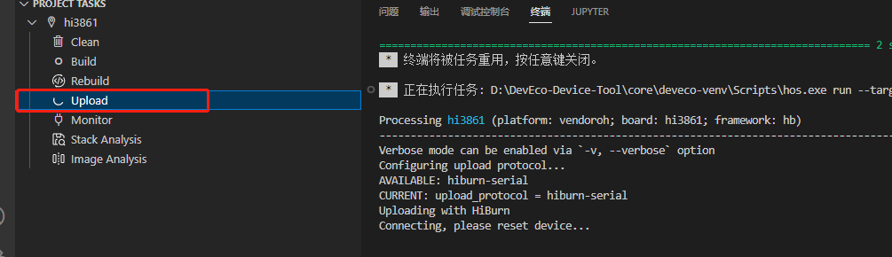

### 4.8.5 实验结果

* 软件烧录成功后，使用串口工具连接好M1的串口（（<font color='RedOrange'>**注意：这里以sscom为例，该工具需要自己百度下载，也可以使用Monitor工具，参考“2.7 章节 Monitor串口打印”**</font>)，按一下开发板的RESET按键复位开发板，烧录完成后，板上小屏幕实时显示环境温度和湿度。

  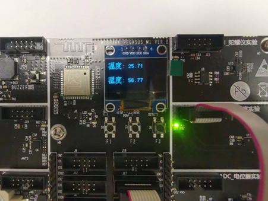

## 4.9  SPI陀螺仪实验

### 4.9.1 实验目的

​	通过SPI实时检测陀螺仪数据并显示到OLED屏幕上，同时每隔5S将最后一次数据写入到FLASH芯片里，在从FLASH芯片读取数据并显示到OELD屏幕上。陀螺仪芯片手册（编号：C94048，型号： LSM6DSMTR）获取：https://so.szlcsc.com/global.html?k=LSM6DSM&hot-key=LM358DR2G，点击数据手册进行下载。

| API介绍                                                      | 说明                          |
| ------------------------------------------------------------ | ----------------------------- |
| hi_u32  hi_i2c_init(hi_i2c_idx id, hi_u32 baudrate);         | 用指定的波特速率初始化I2C设备 |
| hi_u32  hi_i2c_set_baudrate(hi_i2c_idx id, hi_u32 baudrate); | 设置波特率                    |
| hi_u32  hi_i2c_write(hi_i2c_idx id, hi_u16 device_addr, const hi_i2c_data *i2c_data); | I2C写入数据                   |
| hi_u32  hi_i2c_read(hi_i2c_idx id, hi_u16 device_addr, const hi_i2c_data *i2c_data); | I2C读出数据                   |
| hi_u32  hi_spi_init(hi_spi_idx spi_id, hi_spi_cfg_init_param init_param, const hi_spi_cfg_basic_info  *param); | 初始化SPI                     |
| hi_u32  hi_spi_host_write(hi_spi_idx spi_id, hi_pvoid write_data, hi_u32 byte_len); | SPI写数据                     |
| hi_u32  hi_spi_host_read(hi_spi_idx spi_id, hi_pvoid read_data, hi_u32 byte_len); | SPI读数据                     |
| hi_u32  hi_spi_host_writeread(hi_spi_idx spi_id, hi_pvoid write_data, hi_pvoid read_data,  hi_u32 byte_len); | SPI读写数据                   |

### 4.9.2 实验要求

1.软件要求：VSCode，hi3861_hdu_iot_application(如果采用zip包下载，SDK名称为hi3861_hdu_iot_application-master，如果采用git下载SDK名称为hi3861_hdu_iot_application，此处以采用git下载为例）；

2.硬件要求：微处理器一体化板；接线：R1-R1。硬件搭建要求如图所示。

​    

### 4.9.4 实验流程

* 步骤一：hi3861_hdu_iot_application/src/vendor/hisilicon/hispark_pegasus/demo/gyro_demo文件夹复制到hi3861_hdu_iot_application/src/applications/sample/wifi-iot/app/目录下。

* 步骤二：修改applications/sample/wifi-iot/app/目录下的BUILD.gn，在features字段中添加gyro_demo:gyro_control。注：第一个gyro_demo指的是需要编译的工程目录，第二个gyro_control指的是applications/sample/wifi-iot/app/gyro_demo/BUILD.gn文件中的静态库，名称为gyro_control。


```c
import("//build/lite/config/component/lite_component.gni")

lite_component("app") {
  features = [ "gyro_demo:gyro_control", ]
}
```

* 步骤三：SPI包括极性，相性，主从设备，位宽，大小端格式，频率（这些都以从设备支持的为准）。由于SPI可以主与多个设备通信，通过CSS高低决定跟哪个设备通信。具体实现代码如下。

  ```
  1  /*
  2   * Copyright (c) 2022 HiSilicon (Shanghai) Technologies CO., LIMITED.
  3   * Licensed under the Apache License, Version 2.0 (the "License");
  4   * you may not use this file except in compliance with the License.
  5   * You may obtain a copy of the License at
  6   *
  7   *     http://www.apache.org/licenses/LICENSE-2.0
  8   *
  9   * Unless required by applicable law or agreed to in writing, software
  10  * distributed under the License is distributed on an "AS IS" BASIS,
  11  * WITHOUT WARRANTIES OR CONDITIONS OF ANY KIND, either express or implied.
  12  * See the License for the specific language governing permissions and
  13  * limitations under the License.
  14  */
  15 
  16 #include <hi_early_debug.h>
  17 #include <hi_task.h>
  18 #include <hi_types_base.h>
  19 #include <hi_spi.h>
  20 #include <hi_time.h>
  21 #include <../platform/drivers/spi/spi.h>
  22 #include <hi_gpio.h>
  23 #include <time.h>
  24 #include <hi_i2c.h>
  25 #include "hi_io.h"
  26 #include "hi_gpio.h"
  27 #include "math.h"
  28 #include "ohos_init.h"
  29 #include "cmsis_os2.h"
  30 #include "iot_gpio.h"
  31 #include "iot_gpio_ex.h"
  32 #include "ssd1306.h"
  33 #include "app_demo_spi_flash.h"
  34 #include "iot_i2c.h"
  35 #include "app_demo_spi_gyro.h"
  36 
  37 #define IOT_I2C_IDX_BAUDRATE (400 * 1000)
  38 #define SSD1306_I2C_IDX 0
  39 
  40 #define gyroKp                          (20.0f)     // 比例增益支配率收敛到加速度计/磁强计
  41 #define gyroKi                          (0.0004f)   // 积分增益支配率的陀螺仪偏见的衔接
  42 #define gyroHalfT                       (0.005f)    // 采样周期的一半
  43 #define PAI               3.14
  44 #define DEGREES           180
  45 
  46 float q0 = 1, q1 = 0, q2 = 0, q3 = 0;   // 四元数的元素，代表估计方向
  47 float exInt = 0, eyInt = 0, ezInt = 0;  // 按比例缩小积分误差
  48 float g_gyro_yaw, g_gyro_pitch, g_gyro_roll;                 // 偏航角，俯仰角，翻滚角
  49 static char line[32] = { 0 };
  50 static float yaw_conv = 0.0f;
  51 
  52 void GyroGpioInit(void)
  53 {
  54     IoSetFunc(IOT_IO_NAME_GPIO_10, IOT_IO_FUNC_GPIO_10_SPI0_CK);
  55     IoSetFunc(IOT_IO_NAME_GPIO_11, IOT_IO_FUNC_GPIO_11_SPI0_RXD); // SPI MISO 数据从从发到主
  56     IoSetFunc(IOT_IO_NAME_GPIO_9, IOT_IO_FUNC_GPIO_9_SPI0_TXD); // SPI MOSI 数据从主发到从
  57 
  58     IoSetFunc(IOT_IO_NAME_GPIO_12, IOT_IO_FUNC_GPIO_12_GPIO); // GYROcs片段
  59     IoTGpioSetDir(IOT_IO_NAME_GPIO_12, IOT_GPIO_DIR_OUT);
  60     IoTGpioSetOutputVal(IOT_IO_NAME_GPIO_12, IOT_GPIO_VALUE1);
  61 
  62     IoSetFunc(IOT_IO_NAME_GPIO_0, IOT_IO_FUNC_GPIO_0_GPIO); // FLASHcs片段
  63     IoTGpioSetDir(IOT_IO_NAME_GPIO_0, IOT_GPIO_DIR_OUT);
  64     IoTGpioSetOutputVal(IOT_IO_NAME_GPIO_0, IOT_GPIO_VALUE1);
  65 
  66     hi_io_set_driver_strength(HI_IO_NAME_GPIO_10, HI_IO_DRIVER_STRENGTH_2);
  67 }
  68 
  69 void LSM6DSL_Write_Reg(hi_spi_idx id, unsigned char addrdata, unsigned char writedata, unsigned int writelen)
  70 {
  71     unsigned char writebuff[2] = {addrdata, writedata};
  72     IoTGpioSetOutputVal(IOT_IO_NAME_GPIO_12, IOT_GPIO_VALUE0);  // 使能SPI传输
  73     int ret = hi_spi_host_write(id, &writebuff, 2);
  74     if (ret != HI_ERR_SUCCESS) {
  75         printf("spi write[%02X] fail! %x ", writebuff[0], ret);
  76     }
  77     IoTGpioSetOutputVal(IOT_IO_NAME_GPIO_12, IOT_GPIO_VALUE1);  // 禁止SPI传输
  78 }
  79 
  80 void LSM6DSL_Write_Read_Reg(hi_spi_idx id, unsigned char addrdata, unsigned char writedata,
  81                             unsigned char *readdata, unsigned int readdatalen)
  82 {
  83     int ret = 0;
  84     unsigned char writebuff[2] = {addrdata, writedata};
  85     IoTGpioSetOutputVal(IOT_IO_NAME_GPIO_12, IOT_GPIO_VALUE0);  // 使能SPI传输
  86     ret = memset_s(readdata, readdatalen + 1, 0x0, readdatalen);
  87     if (ret != EOK) {
  88         printf("memcpy_s failed, err = %d\n", ret);
  89     }
  90     ret = hi_spi_host_writeread(id, &writebuff, readdata, readdatalen);
  91     if (ret != HI_ERR_SUCCESS) {
  92         printf("spi read[%02X] fail! %x ", readdata[0], ret);
  93     }
  94     IoTGpioSetOutputVal(IOT_IO_NAME_GPIO_12, IOT_GPIO_VALUE1);  // 禁止SPI传输
  95 }
  96 
  97 unsigned char LSM6DSL_Read_Reg(hi_spi_idx id, unsigned char writedata,
  98                                unsigned char *readdata, unsigned int readdatalen)
  99 {
  100    int ret = 0;
  101    unsigned char resultdata;
  102    IoTGpioSetOutputVal(IOT_IO_NAME_GPIO_12, IOT_GPIO_VALUE0);  // 使能SPI传输
  103    ret = memset_s(readdata, readdatalen + 1, 0x0, readdatalen);
  104    if (ret != EOK) {
  105        printf("memcpy_s failed, err = %d\n", ret);
  106    }
  107    ret = hi_spi_host_writeread(id, &writedata, readdata, readdatalen);
  108    if (ret != HI_ERR_SUCCESS) {
  109        printf("spi read[%02X] fail! %x ", readdata[0], ret);
  110    }
  111    resultdata = readdata[1];
  112    // printf("resultdata = %02x]r]n", resultdata);
  113    IoTGpioSetOutputVal(IOT_IO_NAME_GPIO_12, IOT_GPIO_VALUE1);  // 禁止SPI传输
  114    return resultdata;
  115}
  116
  117void IMU_YAW_CAL(float gyroZ)
  118{
  119    int ret = 0;
  120    static float dt = 0.03; // 0.03代表300ms读取陀螺仪数据
  121    static float yaw = 0.0f, temp = 0.0f;
  122    // 除去零偏
  123    #if 0
  124    static int a = 0;
  125    a++;
  126    if (hi_get_seconds() <= 5) { // 5s
  127        printf("---------times-----------:%d\n", a);
  128    }
  129    #endif
  130    if (fabs(gyroZ) < 0.04) { // 0.04标准值
  131        temp = 0;
  132    } else {
  133        temp = gyroZ * dt;
  134    }
  135    yaw += temp;
  136    yaw_conv = yaw * 57.32; // 57.32 初始值
  137    // 360°一个循环
  138    if (fabs(yaw_conv) > 360.0f) {
  139        if ((yaw_conv) < 0) {
  140            yaw_conv += 360.0f;
  141        } else {
  142            yaw_conv -= 360.0f;
  143        }
  144    }
  145    // printf("Pitch:%.02f, Roll:%.02f, yaw:%.2f\n", g_gyro_pitch, g_gyro_roll, yaw_conv);
  146    ssd1306_SetCursor(0, 15); // 0为横坐标，15为纵坐标
  147    ret = snprintf_s(line, sizeof(line), sizeof(line), "Pitch:%.2f", g_gyro_pitch);
  148    if (ret == 0) {
  149        printf("Pitch failed\r\n");
  150    }
  151    ssd1306_DrawString(line, Font_7x10, White);
  152    ssd1306_SetCursor(0, 30); // 0为横坐标，30为纵坐标
  153    ret = snprintf_s(line, sizeof(line), sizeof(line), "Roll:%.2f", g_gyro_roll);
  154    if (ret == 0) {
  155        printf("Roll failed\r\n");
  156    }
  157    ssd1306_DrawString(line, Font_7x10, White);
  158    ssd1306_SetCursor(0, 0); // 0为横坐标，0为纵坐标
  159    ret = snprintf_s(line, sizeof(line), sizeof(line), "yaw:%.2f", yaw_conv);
  160    if (ret == 0) {
  161        printf("yaw failed\r\n");
  162    }
  163    ssd1306_DrawString(line, Font_7x10, White);
  164    ssd1306_UpdateScreen();
  165}
  166
  167void GetRoll(float atan2x, float atan2y)
  168{
  169    float atan2_x = atan2x;
  170    float atan2_y = atan2y;
  171    if (atan2_x > 0) {
  172        g_gyro_roll = atan(atan2_y / atan2_x) * DEGREES / PAI;
  173    } else if (atan2_x < 0 && atan2_y >= 0) {
  174        g_gyro_roll = atan(atan2_y / atan2_x) * DEGREES / PAI + DEGREES;
  175    } else if (atan2_x < 0 && atan2_y < 0) {
  176        g_gyro_roll = atan(atan2_y / atan2_x) * DEGREES / PAI - DEGREES;
  177    } else if (atan2_y > 0 && atan2_x == 0) {
  178        g_gyro_roll = 90; // 90°
  179    } else if (atan2_y < 0 && atan2_x == 0) {
  180        g_gyro_roll = -90; // -90°
  181    } else {
  182        printf("undefined\n");
  183    }
  184}
  185
  186void GetPitch(float atan2x, float atan2y)
  187{
  188    float atan2_x = atan2x;
  189    float atan2_y_pitch = atan2y;
  190    if (atan2_x > 0) {
  191        g_gyro_pitch = atan(atan2_y_pitch / atan2_x) * DEGREES / PAI;
  192    } else if (atan2_x < 0 && atan2_y_pitch >= 0) {
  193        g_gyro_pitch = atan(atan2_y_pitch / atan2_x) * DEGREES / PAI + DEGREES;
  194    } else if (atan2_x < 0 && atan2_y_pitch < 0) {
  195        g_gyro_pitch = atan(atan2_y_pitch / atan2_x) * DEGREES / PAI - DEGREES;
  196    } else if (atan2_y_pitch > 0 && atan2_x == 0) {
  197        g_gyro_pitch = 90; // 90°
  198    } else if (atan2_y_pitch <  0 && atan2_x == 0) {
  199        g_gyro_pitch = -90; // -90°
  200    } else {
  201        printf("undefined\n");
  202    }
  203}
  204
  205void IMU_Attitude_cal(float gcx, float gcy, float gcz, float acx, float acy, float acz)
  206{
  207    float norm;
  208    float vx, vy, vz;
  209    float ex, ey, ez;
  210    float atan2_x, atan2_y;
  211    float atan2_y_pitch;
  212    float ax = acx, ay = acy, az = acz;
  213    float gx = gcx, gy = gcy, gz = gcz;
  214
  215    // 把采集到的三轴加速度转化为单位向量，即向量除以模
  216    norm = (float)sqrt((float)(ax * ax + ay * ay + az * az));
  217    if (norm == 0) {
  218        printf("209 norm = 0,failed\n");
  219    }
  220    ax = ax / norm;
  221    ay = ay / norm;
  222    az = az / norm;
  223
  224    // 把四元素换算成方向余弦中的第三行的三个元素
  225    // vx、vy、vz其实就是上一次的欧拉角(四元数)机体参考坐标系换算出来的重力的单位向量
  226    vx = 2 * (q1 * q3 - q0 * q2); // 2计算系数
  227    vy = 2 * (q0 * q1 + q2 * q3); // 2计算系数
  228    vz = q0 * q0 - q1 * q1 - q2 * q2 + q3 * q3;
  229
  230    // 对向量叉乘，求出姿态误差
  231    // ex、ey、ez为三轴误差元素
  232    ex = (ay * vz - az * vy);
  233    ey = (az * vx - ax * vz);
  234    ez = (ax * vy - ay * vx);
  235
  236    // 叉乘向量仍旧是机体坐标系上的，而陀螺仪积分误差也是机体坐标系
  237    // 而且叉积的大小与陀螺仪误差成正比，正好拿来纠正陀螺
  238    exInt = exInt + ex * gyroKi;
  239    eyInt = eyInt + ey * gyroKi;
  240    ezInt = ezInt + ez * gyroKi;
  241
  242    // 调整后的陀螺仪测量
  243    gx = gx + gyroKp * ex + exInt;
  244    gy = gy + gyroKp * ey + eyInt;
  245    gz = gz + gyroKp * ez + ezInt;
  246
  247    // 使用一阶龙格库塔解四元数微分方程
  248    q0 = q0 + (-q1 * gx - q2 * gy - q3 * gz) * gyroHalfT;
  249    q1 = q1 + (q0 * gx + q2 * gz - q3 * gy) * gyroHalfT;
  250    q2 = q2 + (q0 * gy - q1 * gz + q3 * gx) * gyroHalfT;
  251    q3 = q3 + (q0 * gz + q1 * gy - q2 * gx) * gyroHalfT;
  252
  253    // 四元数归一化
  254    norm = sqrt(q0 * q0 + q1 * q1 + q2 * q2 + q3 * q3);
  255    if (norm == 0) {
  256        printf("247 norm = 0,failed\n");
  257    }
  258    q0 = q0 / norm;
  259    q1 = q1 / norm;
  260    q2 = q2 / norm;
  261    q3 = q3 / norm;
  262    
  263    // 计算姿态角，本文Roll为横滚角，Pitch为俯仰角
  264    atan2_x = -2 * q1 * q1 - 2 * q2 * q2 + 1; // 2 计算参数
  265    atan2_y = 2 * q2 * q3 + 2 * q0 * q1; // 2 计算参数
  266    GetRoll(atan2_x, atan2_y);
  267    // 俯仰角
  268    atan2_y_pitch = -2 * q1 * q3 + 2 * q0 * q2; // 2 计算参数
  269    GetPitch(atan2_x, atan2_y_pitch);
  270}
  271
  272void Lsm_Get_RawAcc(hi_spi_idx id, int a)
  273{
  274    unsigned char buf[12] = {0};
  275    short acc_x = 0, acc_y = 0, acc_z = 0;
  276    float acc_x_conv = 0, acc_y_conv = 0, acc_z_conv = 0;
  277    short ang_rate_x = 0, ang_rate_y = 0, ang_rate_z = 0;
  278    float ang_rate_x_conv = 0, ang_rate_y_conv = 0, ang_rate_z_conv = 0;
  279    float ang_rate_x_cal = 0, ang_rate_y_cal = 0, ang_rate_z_cal = 0;
  280    unsigned char read_buff[2] = { 0 };
  281    
  282    if((LSM6DSL_Read_Reg(id, LSM6DSL_STATUS_REG | SPI_READ, read_buff, READDATALEN) & 0x01) != 0) {
  283        buf[0]= LSM6DSL_Read_Reg(id, LSM6DSL_OUTX_H_XL | SPI_READ, read_buff, READDATALEN); // 陀螺仪数据第0位
  284        buf[1]= LSM6DSL_Read_Reg(id, LSM6DSL_OUTX_L_XL | SPI_READ, read_buff, READDATALEN); // 陀螺仪数据第1位
  285        buf[2]= LSM6DSL_Read_Reg(id, LSM6DSL_OUTY_H_XL | SPI_READ, read_buff, READDATALEN); // 陀螺仪数据第2位
  286        buf[3]= LSM6DSL_Read_Reg(id, LSM6DSL_OUTY_L_XL | SPI_READ, read_buff, READDATALEN); // 陀螺仪数据第3位
  287        buf[4]= LSM6DSL_Read_Reg(id, LSM6DSL_OUTZ_H_XL | SPI_READ, read_buff, READDATALEN); // 陀螺仪数据第4位
  288        buf[5]= LSM6DSL_Read_Reg(id, LSM6DSL_OUTZ_L_XL | SPI_READ, read_buff, READDATALEN); // 陀螺仪数据第5位
  289
  290        buf[6]= LSM6DSL_Read_Reg(id, LSM6DSL_OUTX_H_G | SPI_READ, read_buff, READDATALEN); // 陀螺仪数据第6位
  291        buf[7]= LSM6DSL_Read_Reg(id, LSM6DSL_OUTX_L_G | SPI_READ, read_buff, READDATALEN); // 陀螺仪数据第7位
  292        buf[8]= LSM6DSL_Read_Reg(id, LSM6DSL_OUTY_H_G | SPI_READ, read_buff, READDATALEN); // 陀螺仪数据第8位
  293        buf[9]= LSM6DSL_Read_Reg(id, LSM6DSL_OUTY_L_G | SPI_READ, read_buff, READDATALEN); // 陀螺仪数据第9位
  294        buf[10]= LSM6DSL_Read_Reg(id, LSM6DSL_OUTZ_H_G | SPI_READ, read_buff, READDATALEN); // 陀螺仪数据第10位
  295        buf[11]= LSM6DSL_Read_Reg(id, LSM6DSL_OUTZ_L_G | SPI_READ, read_buff, READDATALEN); // 陀螺仪数据第11位
  296
  297        ang_rate_x = (buf[6] << 8) | buf[7];  // 将buff6 右移8位在与上buff 7
  298        ang_rate_y = (buf[8] << 8)  | buf[9]; // 将buff8 右移8位在与上buff 9
  299        ang_rate_z = (buf[10] << 8)  | buf[11];  // 将buff10 右移8位在与上buff 11
  300
  301        acc_x = (buf[0] << 8) | buf[1];  // 将buff0 右移8位在与上buff 1
  302        acc_y = (buf[2] << 8) | buf[3];  // 将buff2 右移8位在与上buff 3
  303        acc_z = (buf[4] << 8) | buf[5];  // 将buff4 右移8位在与上buff 5
  304
  305        ang_rate_x_conv = PAI / 180.0 * ang_rate_x / 14.29; // 180.0代表度数 14.29量程
  306        ang_rate_y_conv = PAI / 180.0 * ang_rate_y / 14.29; // 180.0代表度数 14.29量程
  307        ang_rate_z_conv = PAI / 180.0 * ang_rate_z / 14.29; // 180.0代表度数 14.29量程
  308
  309        acc_x_conv = acc_x / 4098.36; // 4098.36量程
  310        acc_y_conv = acc_y / 4098.36; // 4098.36量程
  311        acc_z_conv = acc_z / 4098.36; // 4098.36量程
  312
  313        if (a % 1000 == 0) { // 1000次保存一次
  314            GD25Q40C_SPIFLASH_EraseSector(id, 0x000000); // 擦除芯片
  315            TaskMsleep(10); // 延时10ms
  316            GD25Q_SPIFLASH_WritePage(id, 0x000000, buf);
  317            TaskMsleep(10); // 延时10ms
  318            GD25Q_SPIFLASH_ReadBuffer(id, 0x000000);
  319            TaskMsleep(20); // 延时20ms
  320            ssd1306_SetCursor(0, 45); // 0为横坐标，45为纵坐标
  321            ssd1306_DrawString("save data to flash", Font_7x10, White);
  322        }
  323        IMU_Attitude_cal(ang_rate_x_conv, ang_rate_y_conv, ang_rate_z_conv, acc_x_conv, acc_y_conv, acc_z_conv);
  324        IMU_YAW_CAL(ang_rate_z_conv);
  325    }
  326}
  327
  328void Lsm6d3s_Init(hi_spi_idx id)
  329{
  330    hi_u8 readdata[1];
  331    hi_u8 read_buff[2] = { 0 };
  332    readdata[0]= LSM6DSL_Read_Reg(id, LSM6DSL_WHO_AM_I | SPI_READ, read_buff, READDATALEN);
  333    LSM6DSL_Write_Reg(id, LSM6DSL_CTRL3_C | SPI_WRITE, 0x34, READDATALEN); // 0x34 2 初始化陀螺仪
  334    LSM6DSL_Write_Reg(id, LSM6DSL_CTRL2_G | SPI_WRITE, 0X4C, READDATALEN); // 0x4c 2 角速度陀螺仪配置2000dps,104Hz
  335    LSM6DSL_Write_Reg(id, LSM6DSL_CTRL10_C | SPI_WRITE, 0x38, READDATALEN); // 0x38 2 timer en, pedo en, tilt en
  336    // 0x4F 2 加速度配置量程为8g,104Hz, lpf1_bw_sel=1, bw0_xl=1;
  337    LSM6DSL_Write_Reg(id, LSM6DSL_CTRL1_XL | SPI_WRITE, 0x4F, READDATALEN);
  338    LSM6DSL_Write_Reg(id, LSM6DSL_TAP_CFG | SPI_WRITE, 0x10, READDATALEN); // 0x10 2长度 LSM6DSL_TAP_CFG
  339    LSM6DSL_Write_Reg(id, LSM6DSL_WAKE_UP_DUR | SPI_WRITE, 0x00, READDATALEN); // 0x00 2长度 LSM6DSL_WAKE_UP_DUR
  340    LSM6DSL_Write_Reg(id, LSM6DSL_WAKE_UP_THS | SPI_WRITE, 0x02, READDATALEN); // 0x02 2长度 LSM6DSL_WAKE_UP_THS
  341    LSM6DSL_Write_Reg(id, LSM6DSL_TAP_THS_6D | SPI_WRITE, 0x40, READDATALEN); // 0x40 2长度 LSM6DSL_TAP_THS_6D
  342    LSM6DSL_Write_Reg(id, LSM6DSL_CTRL8_XL | SPI_WRITE, 0x01, READDATALEN); // 0x01 2长度 LSM6DSL_CTRL8_XL
  343    return HI_ERR_SUCCESS;
  344}
  345
  346void Oled_Desplay(void)
  347{
  348/*
  349     * 初始化I2C设备0，并指定波特率为400k
  350     * Initialize I2C device 0 and specify the baud rate as 400k
  351     */
  352    IoTI2cInit(SSD1306_I2C_IDX, IOT_I2C_IDX_BAUDRATE);
  353    /*
  354     * 设置I2C设备0的波特率为400k
  355     * Set the baud rate of I2C device 0 to 400k
  356     */
  357    IoTI2cSetBaudrate(SSD1306_I2C_IDX, IOT_I2C_IDX_BAUDRATE);
  358    /*
  359     * 设置GPIO13的管脚复用关系为I2C0_SDA
  360     * Set the pin reuse relationship of GPIO13 to I2C0_ SDA
  361     */
  362    IoSetFunc(IOT_IO_NAME_GPIO_13, IOT_IO_FUNC_GPIO_13_I2C0_SDA);
  363    /*
  364     * 设置GPIO14的管脚复用关系为I2C0_SCL
  365     * Set the pin reuse relationship of GPIO14 to I2C0_ SCL
  366     */
  367    IoSetFunc(IOT_IO_NAME_GPIO_14, IOT_IO_FUNC_GPIO_14_I2C0_SCL);
  368    ssd1306_Init();
  369    ssd1306_ClearOLED();
  370}
  371
  372void GyroTask(void)
  373{
  374    hi_u32 ret;
  375    int i = 1;
  376    hi_spi_idx id = HI_SPI_ID_0;
  377    hi_spi_deinit(id); /* if wake_up from deep sleep, should deinit first */
  378    hi_spi_cfg_basic_info spi_cfg_basic_info;
  379    spi_cfg_basic_info.cpha = 1;
  380    spi_cfg_basic_info.cpol = 1;
  381    spi_cfg_basic_info.data_width = HI_SPI_CFG_DATA_WIDTH_E_8BIT;
  382    spi_cfg_basic_info.endian = 0;
  383    spi_cfg_basic_info.fram_mode = 0;
  384    spi_cfg_basic_info.freq = SPI_FREQUENCY;
  385    hi_spi_cfg_init_param spi_init_param = {0};
  386    spi_init_param.is_slave = 0;
  387    ret = hi_spi_init(id, spi_init_param, &spi_cfg_basic_info); // 基本参数配置
  388    if (ret != HI_ERR_SUCCESS) {
  389        printf("SPI init fail! %x ", ret);
  390    }
  391    GyroGpioInit();
  392    Oled_Desplay();
  393    Lsm6d3s_Init(id);
  394    GD25Q40C_Init(id);
  395    while (1) {
  396        Lsm_Get_RawAcc(id, i);
  397        i++;
  398        TaskMsleep(10); // 延时10ms
  399    }
  400}
  401
  402static void GyroControlTask(void)
  403{
  404    osThreadAttr_t attr;
  405
  406    attr.name = "GyroCntrolDemo";
  407    attr.attr_bits = 0U;
  408    attr.cb_mem = NULL;
  409    attr.cb_size = 0U;
  410    attr.stack_mem = NULL;
  411    attr.stack_size = 1024 * 5; // 堆栈大小为1024 stack size 1024 * 5
  412    attr.priority = 25; // 优先级25
  413    if (osThreadNew((osThreadFunc_t)GyroTask, NULL, &attr) == NULL) {
  414        printf("[GyroExample] Failed to create GyroTask!\n");
  415    }
  416}
  417
  418APP_FEATURE_INIT(GyroControlTask);
  ```

* 步骤四：修改hi3861_hdu_iot_application/src/device/hisilicon/hispark_pegasus/sdk_liteos/build/config/usr_config.mk文件。在这个配置文件中打开I2C驱动宏。搜索字段CONFIG_SPI_SUPPORT ，并打开SPI。配置如下：

    ```
    # CONFIG_SPI_SUPPORT is not set
    CONFIG_SPI_SUPPORT=y
    ```

- 步骤五：点击DevEco Device Tool工具“Rebuild”按键，具体编译步骤参考“2.5章节 编译运行”。

    

- 步骤六：点击DevEco Device Tool工具“Upload”按键，等待提示（出现Connecting，please reset device...），手动进行开发板复位（按下开发板reset键），将程序烧录到开发板中。具体烧录步骤参考“2.6章节 ”代码烧录”。

    

### 4.9.5 实验结果

* 软件烧录成功后，使用串口工具连接好M1的串口（<font color='RedOrange'>**注意：这里以sscom为例，该工具需要自己百度下载，也可以使用Monitor工具，参考“2.7 章节 Monitor串口打印”**</font>)，按一下开发板的RESET按键复位开发板，烧录完成后，屏幕上显示陀螺仪俯仰角，方向角，滚动角。

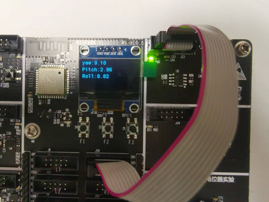

## 4.10 基于Histreaming的智慧交通灯

### 4.10.1 实验目的

​	通过按键控制交通灯板上红灯变到绿灯，同时通过手机控制红绿灯切换。

| API介绍                                                      | 说明                                                         |
| ------------------------------------------------------------ | ------------------------------------------------------------ |
| hi_u32  hi_i2c_init(hi_i2c_idx id, hi_u32 baudrate);         | 用指定的波特速率初始化I2C设备                                |
| hi_u32  hi_i2c_set_baudrate(hi_i2c_idx id, hi_u32 baudrate); | 设置波特率                                                   |
| hi_u32  hi_io_set_func(hi_io_name id, hi_u8 val);            | 配置某个IO口复用功能                                         |
| hi_u32  hi_gpio_set_dir(hi_gpio_idx id, hi_gpio_dir dir);    | 设置某个管脚GPIO方向                                         |
| hi_u32  hi_gpio_set_ouput_val(hi_gpio_idx id, hi_gpio_value val); | 设置单个GPIO管脚电平状态                                     |
| hi_u32  hi_adc_read(hi_adc_channel_index channel, hi_u16 *data,hi_adc_equ_model_sel  equ_model, hi_adc_cur_bais cur_bais, hi_u16 delay_cnt); | 从一个ADC通道读一个数据                                      |
| hi_u32  hi_gpio_register_isr_function(hi_gpio_idx id, hi_gpio_int_type int_type,  hi_gpio_int_polarity int_polarity, gpio_isr_callback func, hi_void *arg); | 使能某个GPIO口中断功能                                       |
| hi_u32  hi_pwm_init(hi_pwm_port port);                       | PWM初始化                                                    |
| hi_u32  hi_pwm_start(hi_pwm_port port, hi_u16 duty, hi_u16 freq); | 按配置的参数输出PWM信号。PWM信号占空比=duty/freq。频率=时钟源频率/freq |
| hi_u32  hi_i2c_write(hi_i2c_idx id, hi_u16 device_addr, const hi_i2c_data *i2c_data); | I2C写入数据                                                  |
| hi_u32  hi_i2c_read(hi_i2c_idx id, hi_u16 device_addr, const hi_i2c_data *i2c_data); | I2C读出数据                                                  |
| LinkPlatformGet                                              | 获得HiStreamingLinkLite组件对象                              |
| LinkPlatformFree                                             | 释放HiStreamingLinkLite组件对象                              |
| LinkServiceAgentFree                                         | 释放从设备列表中pop出来的LinkServiceAgent对象                |
| LinkAgentGet                                                 | 获得LinkAgent对象                                            |
| LinkAgentFree                                                | 释放LinkAgent对象                                            |
| QueryResultFree                                              | 释放设备列表QueryResult。同时也释放设备列表关联的LinkServiceAgent对象 |
| hi_wifi_softap_start                                         | 作为AP                                                       |
| netifapi_netif_find                                          | 按名称查找网络接口                                           |
| netifapi_dhcp_start                                          | 启动DHCP客户端                                               |
| netifapi_dhcp_stop                                           | 停止DHCP客户端                                               |

### 4.10.2 实验要求

1.软件要求：VSCode，hi3861_hdu_iot_application(如果采用zip包下载，SDK名称为hi3861_hdu_iot_application-master，如果采用git下载SDK名称为hi3861_hdu_iot_application，此处以采用git下载为例）；

2.硬件要求：微处理器一体化板；接线：L1-L1。硬件搭建要求如图所示。

​    

### 4.10.3 实验流程

* 步骤一：hi3861_hdu_iot_application/src/vendor/hisilicon/hispark_pegasus/demo/histreaming_demo文件夹复制到hi3861_hdu_iot_application/src/applications/sample/wifi-iot/app/目录下。

* 步骤二：修改applications/sample/wifi-iot/app/目录下的BUILD.gn，在features字段中添加histreaming_demo:appDemoTraffic。注：第一个histreaming_demo指的是需要编译的工程目录，第二个appDemoTraffic指的是applications/sample/wifi-iot/app/histreaming_demo/BUILD.gn文件中的静态库，名称为appDemoTraffic。


```c
import("//build/lite/config/component/lite_component.gni")

lite_component("app") {
  features = [ "histreaming_demo:appDemoTraffic", ]
}
```

* 步骤三：手机与板端通过hisreaming通信，手机端将数据发送给板端，板端接收后，解析数据，通过判断数据与字符串是否一致实现板端LED灯的转换。

  ```
  1  /*
  2   * Copyright (c) 2022 HiSilicon (Shanghai) Technologies CO., LIMITED.
  3   * Licensed under the Apache License, Version 2.0 (the "License");
  4   * you may not use this file except in compliance with the License.
  5   * You may obtain a copy of the License at
  6   *
  7   *     http://www.apache.org/licenses/LICENSE-2.0
  8   *
  9   * Unless required by applicable law or agreed to in writing, software
  10  * distributed under the License is distributed on an "AS IS" BASIS,
  11  * WITHOUT WARRANTIES OR CONDITIONS OF ANY KIND, either express or implied.
  12  * See the License for the specific language governing permissions and
  13  * limitations under the License.
  14  */
  15 
  16 // #ifdef CONFIG_HISTREAMING_SUPPORT
  17 #include <stdio.h>
  18 #include <stdlib.h>
  19 #include <memory.h>
  20 #include <hi_pwm.h>
  21 #include <hi_time.h>
  22 /* Link Header Files */
  23 #include <link_service.h>
  24 #include <link_platform.h>
  25 #include <histreaming.h>
  26 #include <hi_io.h>
  27 #include <hi_early_debug.h>
  28 #include <hi_gpio.h>
  29 #include <hi_task.h>
  30 #include <hi_types_base.h>
  31 #include "app_demo_multi_sample.h"
  32 #include "ssd1306_oled.h"
  33 #include "iot_gpio.h"
  34 
  35 #define HISTREAMING_TASK
  36 #ifdef HISTREAMING_TASK
  37 #define HISTREAMING_DEMO_TASK_STAK_SIZE (1024*8)
  38 #define HISTREAMING_DEMO_TASK_PRIORITY  25
  39 #define IO_FUNC_GPIO_OUT 0
  40 #define IOT_GPIO_INDEX_10 10
  41 #define IOT_GPIO_INDEX_11 11
  42 #define IOT_GPIO_INDEX_12 12
  43 hi_u32 g_histreamingDemoTaskId = 0;
  44 #endif
  45 
  46 static hi_void HistreamingTrafficLightControl(const char* property, char* value);
  47 
  48 static void HistreamingManualControlModule(const char* property, char* value)
  49 {
  50     if (strcmp(property, "tl_s") == 0) {
  51         if (strcmp(value, "red_on") == 0) {
  52             OledShowStr(OLED_X_POSITION_0, OLED_Y_POSITION_7, "1.Red On       ",
  53                         OLED_DISPLAY_STRING_TYPE_1);  /* 0, 7, xx, 1 */
  54             GpioControl(IOT_GPIO_INDEX_10, IOT_GPIO_INDEX_10,
  55                         IOT_GPIO_DIR_OUT, IOT_GPIO_VALUE1, IO_FUNC_GPIO_OUT);
  56             GpioControl(IOT_GPIO_INDEX_11, IOT_GPIO_INDEX_11,
  57                         IOT_GPIO_DIR_OUT, IOT_GPIO_VALUE0, IO_FUNC_GPIO_OUT);
  58         }
  59         if (strcmp(value, "yellow_on") == 0) {
  60             OledShowStr(OLED_X_POSITION_0, OLED_Y_POSITION_7, "2.Yellow On     ",
  61                         OLED_DISPLAY_STRING_TYPE_1); /* 0, 7, xx, 1 */
  62             GpioControl(IOT_GPIO_INDEX_10, IOT_GPIO_INDEX_10,
  63                         IOT_GPIO_DIR_OUT, IOT_GPIO_VALUE0, IO_FUNC_GPIO_OUT);
  64             GpioControl(IOT_GPIO_INDEX_12, IOT_GPIO_INDEX_12,
  65                         IOT_GPIO_DIR_OUT, IOT_GPIO_VALUE1, IO_FUNC_GPIO_OUT);
  66         }
  67         if (strcmp(value, "green_on") == 0) {
  68             OledShowStr(OLED_X_POSITION_0, OLED_Y_POSITION_7, "3.Green On      ",
  69                         OLED_DISPLAY_STRING_TYPE_1); /* 0, 7, xx, 1 */
  70             GpioControl(IOT_GPIO_INDEX_12, IOT_GPIO_INDEX_12,
  71                         IOT_GPIO_DIR_OUT, IOT_GPIO_VALUE0, IO_FUNC_GPIO_OUT);
  72             GpioControl(IOT_GPIO_INDEX_11, IOT_GPIO_INDEX_11,
  73                         IOT_GPIO_DIR_OUT, IOT_GPIO_VALUE1, IO_FUNC_GPIO_OUT);
  74         }
  75     }
  76 }
  77 static void HistreamingAutoModule(const char* property, char* value)
  78 {
  79     if (strcmp(property, "tla_s") == 0) {
  80         if (strcmp(value, "tla") == 0) {
  81             int ret = SetKeyStatus(TRAFFIC_AUTO_MODE);
  82             if (ret != TRAFFIC_AUTO_MODE) {
  83                 return;
  84             }
  85         }
  86     }
  87 }
  88 
  89 static void HistreamingHumanModuleNormal(const char* property, char* value)
  90 {
  91     if (strcmp(property, "tlh_s") == 0) {
  92         if (strcmp(value, "tlh") == 0) {
  93             int rc = SetKeyType(TRAFFIC_NORMAL_TYPE);
  94             if (rc != TRAFFIC_NORMAL_TYPE) {
  95                 return;
  96             }
  97             int ret = SetKeyStatus(TRAFFIC_HUMAN_MODE);
  98             if (ret != TRAFFIC_HUMAN_MODE) {
  99                 return;
  100            }
  101        }
  102    }
  103}
  104
  105static hi_u32 HistreamingTrafficLightReturnMainMenu(const char* property, char* value)
  106{
  107    if (strcmp(property, "tlr_s") == 0) {
  108        if (strcmp(value, "tlr") == 0) {
  109            int ret = SetKeyStatus(TRAFFIC_RETURN_MODE);
  110            if (ret != TRAFFIC_RETURN_MODE) {
  111                return;
  112            }
  113            return HI_ERR_SUCCESS;
  114        }
  115    }
  116}
  117
  118
  119/* histreaming traffic light function control */
  120static hi_void HistreamingTrafficLightControl(const char* property, char* value)
  121{
  122    /* manual control module */
  123    HistreamingManualControlModule(property, value);
  124    /* auto module */
  125    HistreamingAutoModule(property, value);
  126    // /* human module normal */
  127    HistreamingHumanModuleNormal(property, value);
  128    HistreamingTrafficLightReturnMainMenu(property, value);
  129}
  130
  131static int GetStatusValue(const struct LinkService* ar, const char* property, const char* value, int len)
  132{
  133    (void)(ar);
  134    char *status = "Opend";
  135
  136    printf("Receive property: %s(value=%s[%d])\n", property, value, len);
  137
  138    if (strcmp(property, "Status") == 0) {
  139        (void)strcpy_s(value, strlen(status) + 1, "Opend"); /* 1: '\0' lenght */
  140    }
  141    /*
  142     * if Ok return 0,
  143     * Otherwise, any error, return StatusFailure
  144     */
  145    return 0;
  146}
  147/* recv from app cmd */
  148static int ModifyStatus(const struct LinkService* ar, const char* property, const char* value, int len)
  149{
  150    int ret;
  151    (void)(ar);
  152    printf("-----------$$$$$$$$$$$$\n");
  153
  154    if (property == NULL || value == NULL) {
  155        return -1;
  156    }
  157    /* modify status property */
  158    /* traffic light module */
  159    HistreamingTrafficLightControl(property, value);
  160    /* traffic light return main menu */
  161    ret = HistreamingTrafficLightReturnMainMenu(property, value);
  162    if (ret != 0) {
  163        printf("HistreamingTrafficLightReturnMainMenu Failed\r\n");
  164    }
  165    printf("Receive property: %s(value=%s[%d])\n", property, value, len);
  166    /*
  167     * if Ok return 0,
  168     * Otherwise, any error, return StatusFailure
  169     */
  170    return 0;
  171}
  172
  173/*
  174 * It is a Wifi IoT device
  175 */
  176static const char* g_wifiStaType = "Light";
  177static const char* GetDeviceType(const struct LinkService* ar)
  178{
  179    (void)(ar);
  180
  181    return g_wifiStaType;
  182}
  183
  184static void *g_linkPlatform = NULL;
  185
  186void* HistreamingOpen(void)
  187{
  188    LinkService* wifiIot = 0;
  189    LinkPlatform* link = 0;
  190
  191    wifiIot = (LinkService*)malloc(sizeof(LinkService));
  192    if (!wifiIot) {
  193        printf("malloc wifiIot failure\n");
  194        return NULL;
  195    }
  196
  197    wifiIot->get    = GetStatusValue;
  198    wifiIot->modify = ModifyStatus;
  199    wifiIot->type = GetDeviceType;
  200    link = LinkPlatformGet();
  201    if (!link) {
  202        printf("get link failure\n");
  203    }
  204
  205    if (link->addLinkService(link, wifiIot, 1) != 0) {
  206        HistreamingClose(link);
  207        return NULL;
  208    }
  209    if (link->open(link) != 0) {
  210        HistreamingClose(link);
  211        return NULL;
  212    }
  213    /* cache link ptr */
  214    g_linkPlatform = (void*)(link);
  215#ifdef HISTREAMING_TASK
  216    hi_task_delete(g_histreamingDemoTaskId);
  217#endif
  218    hi_free(0, wifiIot);
  219    return (void*)link;
  220}
  221
  222void HistreamingClose(const char *link)
  223{
  224    LinkPlatform *linkPlatform = (LinkPlatform*)(link);
  225    if (!linkPlatform) {
  226        return;
  227    }
  228
  229    linkPlatform->close(linkPlatform);
  230
  231    if (linkPlatform != NULL) {
  232        LinkPlatformFree(linkPlatform);
  233    }
  234}
  235#ifdef HISTREAMING_TASK
  236hi_void HistreamingDemo(hi_void)
  237{
  238    hi_u32 ret;
  239    hi_task_attr histreaming = {0};
  240    histreaming.stack_size = HISTREAMING_DEMO_TASK_STAK_SIZE;
  241    histreaming.task_prio = HISTREAMING_DEMO_TASK_PRIORITY;
  242    histreaming.task_name = "histreaming_demo";
  243    ret = hi_task_create(&g_histreamingDemoTaskId, &histreaming, HistreamingOpen, HI_NULL);
  244    if (ret != HI_ERR_SUCCESS) {
  245        printf("Falied to create histreaming demo task!\n");
  246    }
  247}
  248#endif
  249// #endif
  ```

* 步骤四：修改hi3861_hdu_iot_application/src/device/hisilicon/hispark_pegasus/sdk_liteos/build/config/usr_config.mk文件。在这个配置文件中打开I2C驱动宏。搜索字段CONFIG_I2C_SUPPORT ，并打开I2C。配置如下：

    ```
    # CONFIG_I2C_SUPPORT is not set
    CONFIG_I2C_SUPPORT=y
    ```
- 步骤五：点击DevEco Device Tool工具“Rebuild”按键，具体编译步骤参考“2.5章节 编译运行”。

    

- 步骤六：点击DevEco Device Tool工具“Upload”按键，等待提示（出现Connecting，please reset device...），手动进行开发板复位（按下开发板reset键），将程序烧录到开发板中。具体烧录步骤参考“2.6章节 “代码烧录”。

  
  
- 步骤七：在手机端装Histreaming APP（APP可以在IOT/histreaming_control/app下获取），同时可以在https://gitee.com/leo593362220/shistreaming下载获取源码（需要自己学习如何开发APP，并自己编译）。
  
- 步骤八：手机端连接Hi3861主板的热点。wifi热点名字格式为”Hisilicon“,可以自己设定。
  
- 步骤九：点击图标 打开手机已经安装的app，点击“局域网”，如果打开APP后没有马上出现“已绑定设备”，请往下滑不断刷新，直到出现绑定设备即可。如下图所示。
  
    
  
    
  
- 步骤十：点击“局域网”进去后，可以看到“Colorful_Light”、“Traffic_Light”等界面，点击app界面的“Traffic_Light”，进去之后可以看到“Control_Module”、“AutoModule”等，这时点击“Control_Module”，进去之后，连续点击button，即可看到控制设备侧的灯在切换。如下图所示。
  
    
    
    

### 4.10.4 实验结果

  * 软件烧录成功后，使用串口工具连接好M1的串口（<font color='RedOrange'>**注意：这里以sscom为例，该工具需要自己百度下载，也可以使用Monitor工具，参考“2.7 章节 Monitor串口打印”**</font>)，按一下开发板的RESET按键复位开发板，烧录完成后，Control Mode模式效果如图所示。


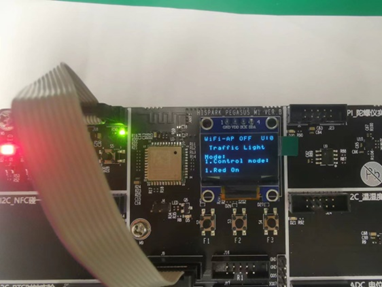

### 4.10.5 扩展实验

* 学生可以在此实验基础上，实现手机控制OLED屏幕显示温度和湿度。

# 5 创新扩展实验

## 5.1 无线数据传输系统设计实验

### 5.1.1 实验目的

实现手机端APP将常见图片转换为点阵图片，通过wifi发送给核心板，在oled屏幕上显示出来点阵图片。

### 5.1.2 实验要求

1.软件要求：VSCode，hi3861_hdu_iot_application(如果采用zip包下载，SDK名称为hi3861_hdu_iot_application-master，如果采用git下载SDK名称为hi3861_hdu_iot_application，此处以采用git下载为例）；

2.硬件要求：微处理器一体化板；

## 5.2 NFC碰一碰博物馆导览实验

### 5.2.1 实验目的

实现了游客在参观博物馆时，只需要将手机靠近标签，就可以直接唤醒展品信息的页面，减少了参观展览时人群在某一展板前拥挤的问题。重新布展时，直接改写标签内容，实现信息更新，减少了重新设计、打印展板造成的时间和资源消耗量。

### 5.2.2 实验要求

1.软件要求：VSCode，hi3861_hdu_iot_application(如果采用zip包下载，SDK名称为hi3861_hdu_iot_application-master，如果采用git下载SDK名称为hi3861_hdu_iot_application，此处以采用git下载为例）；

2.硬件要求：微处理器一体化板；

## 5.3 智能打卡机系统设计实验

### 5.3.1 实验目的

实现了在上班上学时，将手机靠近标签，可以实现姓名，打卡时间显示，实现实时打卡。

### 5.3.2 实验要求

1.软软件要求：VSCode，hi3861_hdu_iot_application(如果采用zip包下载，SDK名称为hi3861_hdu_iot_application-master，如果采用git下载SDK名称为hi3861_hdu_iot_application，此处以采用git下载为例）；

2.硬件要求：微处理器一体化板；
